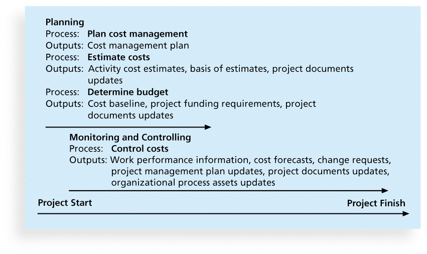
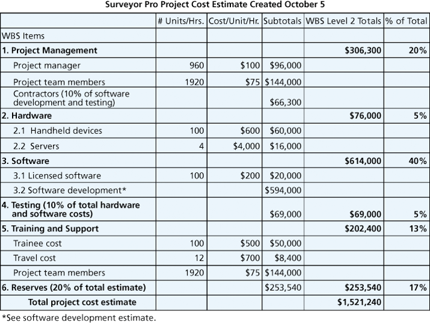
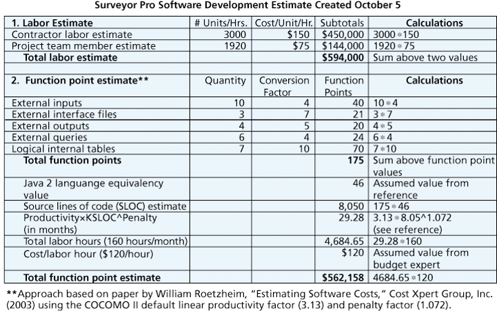
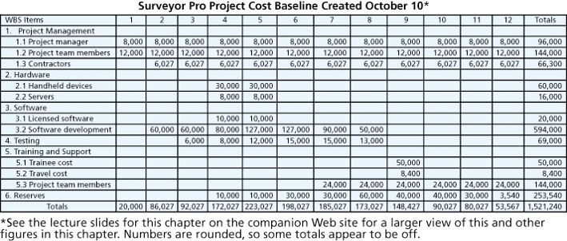
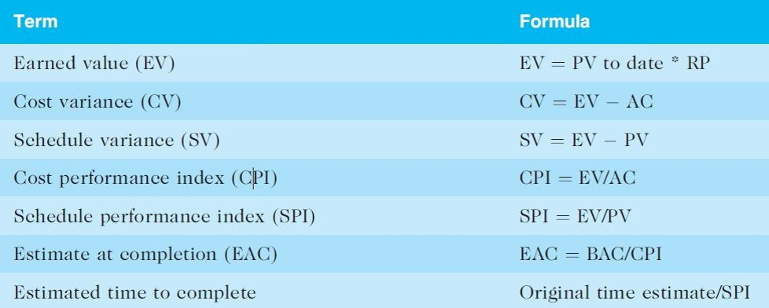

## Project Cost Management	[Back](./../projectManagement.md)

-  **Overrun** is the additional percentage or dollar amount by which actual costs exceed estimates.
- **Project cost management** includes the processes required to ensure that the project is completed within an approved budget.

### 1. Processes

1. Planning cost management
    - To use expert judgment, analytical techniques, and meetings to develop the cost management plan.
2. Estimating costs  
    - Types:
        - **Rough Order of Magnitude(ROM)**: often **3~5 years** before.
        - **Budgetary**: often **1~2 years** before.
        - **Definitive**: often less than **1 year**.
    - Tools:
        - **Analogous** or **top-down estimates**: use the actual cost of a previous, similar project as the basis for estimating the cost of the current project.
        - **Bottom-up estimates**: involve estimating individual work items or activities and summing them to get a project total.
        - **Parametric modeling(參數化建模)** uses project characteristics (parameters) in a mathematical model to estimate project costs. 
3. Determining the budget
    - Cost budgeting involves allocating the project cost estimate to individual work items over time.
    - The **WBS** is a required input to the cost budgeting process since it defines the work items to produce a **cost baseline**. 
4. Controlling costs

### 2. Basic Principles of Cost Management

- **Profits** are revenues(收入) minus expenditures(支出).
- **Profit margin(利润率)** is the ratio of revenues to profits.
- **Life cycle costing** considers the total cost of ownership, or development plus support costs, for a project.
- **Cash flow analysis** determines the estimated annual costs and benefits for a project and the resulting annual cash flow.
- **Learning curve theory** states that when many items are produced repetitively, the unit cost of those items decreases in a regular pattern as more units are produced.
- Reserves are dollars included in a cost estimate to mitigate(降低) cost risk by allowing for future situations that are difficult to predict.
    - **Contingency(偶然性) reserves** allow for future situations that may be partially planned for (sometimes called **known unknowns**) and are included in the project cost baseline.
    - **Management reserves** allow for future situations that are unpredictable (sometimes called **unknown unknowns**).

### 3. Definitions

- **Tangible(有形的) costs** or benefits are those costs or benefits that an organization can easily measure in dollars.
- **Intangible costs** or benefits are costs or benefits that are difficult to measure in monetary(貨幣的) terms.

- **Direct costs** are costs that can be directly related to producing the products and services of the project.
- **Indirect costs** are costs that are not directly related to the products or services of the project, but are indirectly related to performing the project.

- **Sunk cost(沉沒成本)** is money that has been spent in the past. (When deciding what projects to invest in or continue, you should not include sunk costs)

### 4. Measured Values

- **Earned Value Management(EVM)** is a project performance measurement technique that integrates scope, time, and cost data.
- **Planned value(PV)**, formerly called the budgeted cost of work scheduled(BCWS), also called the budget, is that portion of the approved total cost estimate planned to be spent on an activity during a given period.
- **Actual cost(AC)**, formerly called actual cost of work performed(ACWP), is the total of direct and indirect costs incurred in accomplishing work on an activity during a given period.
- **Earned value(EV)**, formerly called the budgeted cost of work performed(BCWP), is an estimate of the value of the physical work actually completed.

- **Rate of performance(RP)** is the ratio of actual work completed to the percentage of work planned to have been completed at any given time during the life of the project or activity.

- rules:
    - CPI(EV/AC) and SPI(EV/PV) less than 100% indicate problems. (Problems mean the project is costing more than planned (**over budget**) or taking longer than planned (**behind schedule**)
    - the **Estimate At Completion(EAC)** is an estimate of what it will cost to complete the project based on performance to date.
    - the **Budget At Completion(BAC)** is the original total budget for the project.
    

### 5. Portfolio Management

- Five levels for project portfolio management:
    - Put all your projects in one database
    - Prioritize the projects in your database
    - Divide your projects into two or three budgets based on type of investment
    - Automate the repository
    - Apply modern portfolio theory, including risk-return tools that map project risk on a curve(曲線)

### 6. Q&A

- Work performance information and cost forecasts are main outputs of the which process?
    - cost budgeting
    - cost control
    - cost estimating
    - cost pricing

> answer: <strong>*cost control.*</strong>

- Soles is a footwear company which has recently set up its store in Ambrosia. To manufacture its products, Soles incurs a range of different costs. Which of the following would be an example of an indirect cost?
    - Cost of machines to produce shoes
    - Electricity used to run its factories
    - Salary paid to factory workers
    - Cost of leather used to manufacture shoes

> answer: <strong>*Electricity used to run its factories.*</strong>

- Which of the following is true of contingency reserves?
    - They allow for future situations that can be partially planned for.
    - They are not included in a cost baseline.
    - They are also known as unknown unknowns.
    - They allow for dollar amounts to be used to cover existing, fixed costs.

> answer: <strong>*They allow for future situations that can be partially planned for.*</strong>

- Which of the following is true of bottom-up estimates?
    - They are based on the actual cost of a previous, similar project.
    - They are most accurate when they involve large, extensive work items.
    - They are also known as parametric estimating.
    - They are time-intensive and expensive to develop.

> answer: <strong>*They are time-intensive and expensive to develop.*</strong>

- Which of the following is most likely to be a reason for inaccuracies in information technology cost estimates?
    - Estimates take a long time to be worked out.
    - Human beings are biased toward overestimation.
    - People lack estimating experience.
    - Only software development provides the scope for estimates to be accurate.

> answer: <strong>*People lack estimating experience.*</strong>

- Which of the following is an output of the process of controlling costs?
    - Cost forecasts
    - Basis of estimates
    - Project funding requirements
    - Scope baselines

> answer: <strong>*Cost forecasts.*</strong>

- Which of the following is an input of the process of controlling costs?
    - Cost forecasts
    - Change requests
    - Work performance data
    - Scope baseline

> answer: <strong>*Work performance data.*</strong>
