## Project Human Resource Management	[Back](./../projectManagement.md)

### 1. Processes

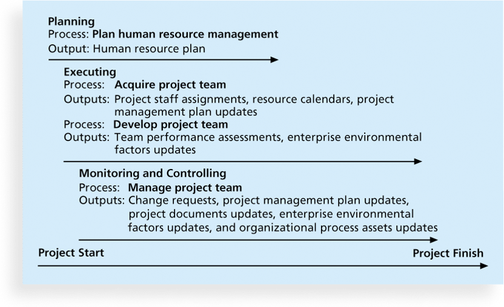

1. Planning human resource management
    - **Empathic(神入的) listening** is listening with the intent to understand.
    - **Rapport** is a relation of harmony, conformity(遵從), accord(一致), or affinity(喜好) and is important for communication.
    - **Mirroring** is the matching of certain behaviors of the other person, a technique to help establish rapport.
    - Developing the Human Resource Plan
        - Involves identifying and documenting project roles, responsibilities, and reporting relationships.
        - Contents include:
            - project organizational charts
            - staffing management plan
                - A **staffing management plan** describes when and how people will be added to and taken off the project team.
            - responsibility assignment matrixes(RAM)
                - A **responsibility assignment matrix (RAM)** is a matrix that maps the work of the project as described in the **WBS** to the people responsible for performing the work as described in the **OBS**. 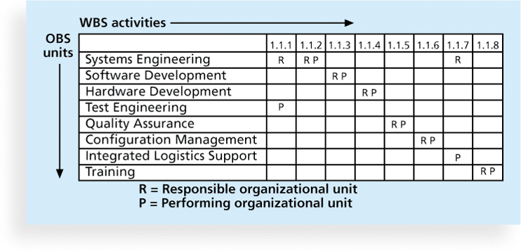
            - resource histograms 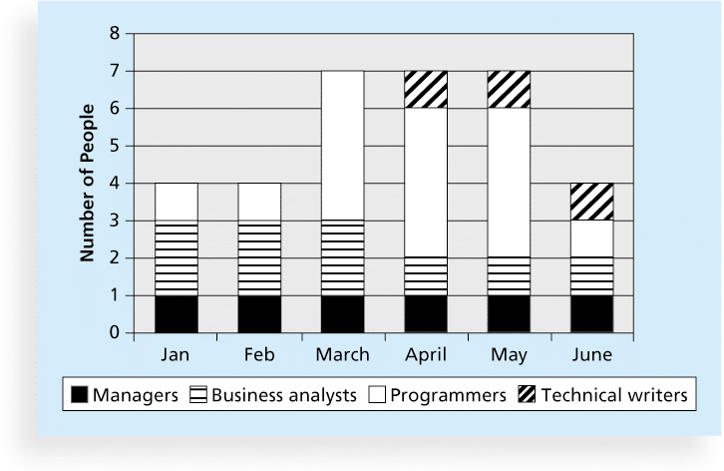
                - A **resource histogram** is a column chart that shows the number of resources assigned to a project over time. 
            - RACI charts 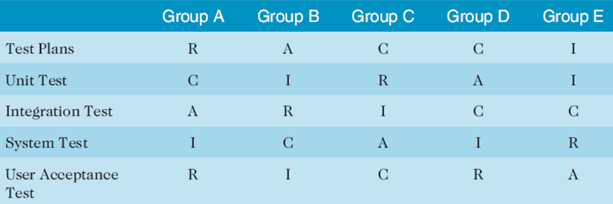 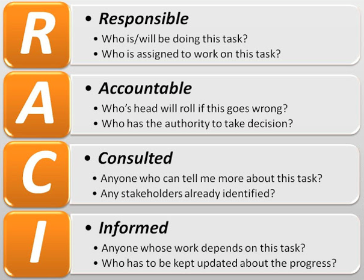
                - R: responsibility
                - A: accountability(責任)
                - C: consultation(諮詢)
                - I: informed
2. Acquiring the project team
    - **Resource loading** refers to the amount of individual resources an existing schedule requires during specific time periods.
    - **Overallocation** means more resources than are available are assigned to perform work at a given time.
    - **Resource leveling** is a technique for resolving resource conflicts by delaying tasks. 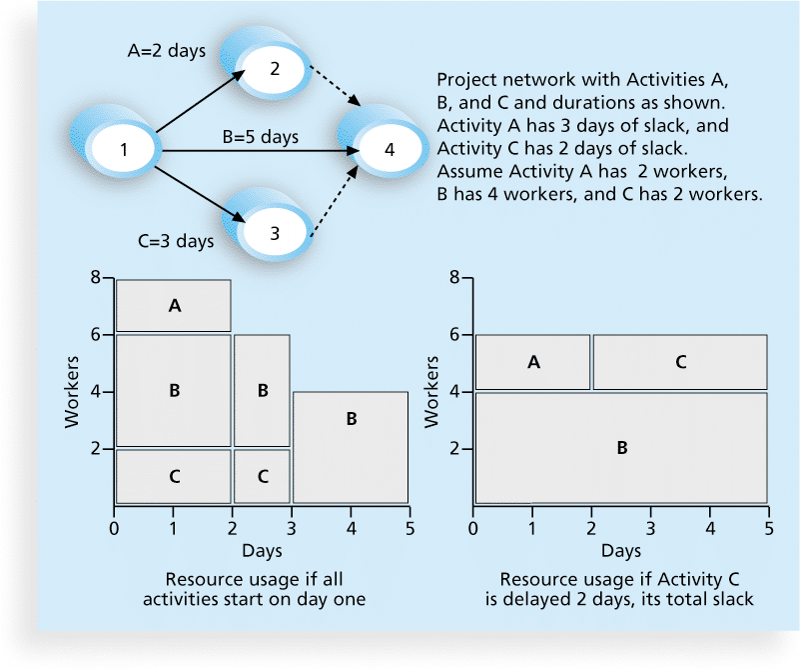
3. Developing the project team
4. Managing the project team

### 2. Intrinsic and Extrinsic Motivation

- **Intrinsic(內在的) motivation** causes people to participate in an activity for their own enjoyment.
- **Extrinsic(外在的) motivation** causes people to do something for a reward or to avoid a penalty.

### 3. Maslow's Hierarchy of Needs

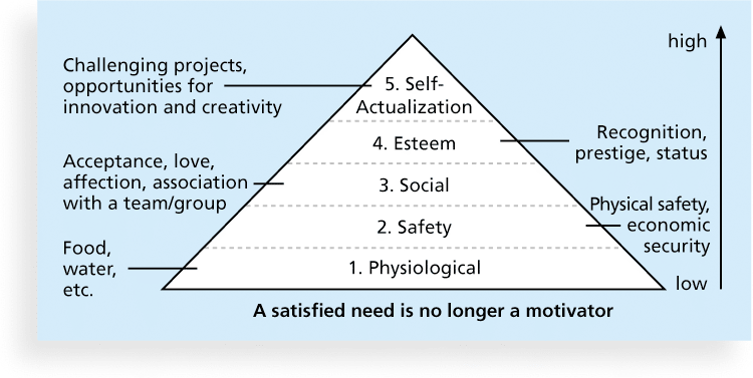

### 4. Herzberg's Motivational and Hygiene Factors

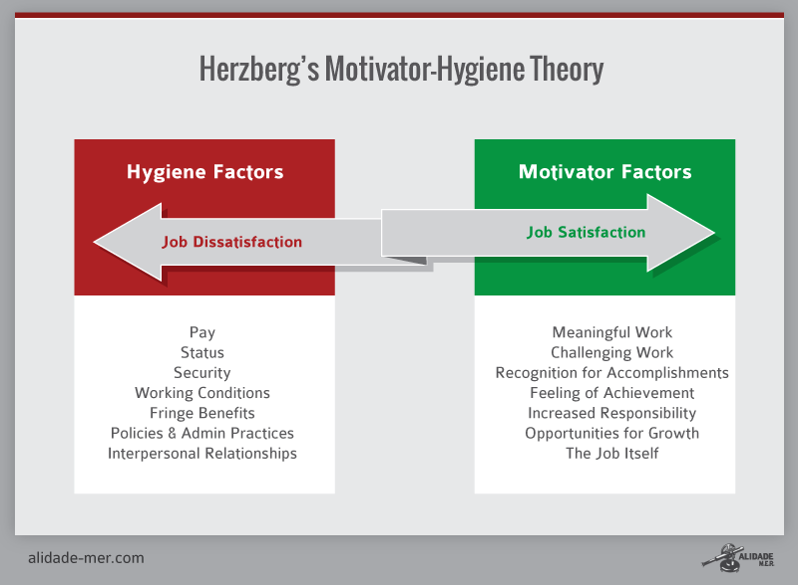

- **motivational factors**: achievement, recognition, the work itself, responsibility, advancement, and growth, which produce job satisfaction.
- **hygiene(健康) factors**: cause dissatisfaction if not present, but do not motivate workers to do more.  Examples include larger salaries, more supervision, and a more attractive work environment.

### 5. McClelland's Acquired-Needs Theory

- **Achievement(nAch)**: Achievers like challenging projects with achievable goals and lots of feedback.
- **Affiliation(nAff, 加入)**: People with high nAff desire harmonious relationships and need to feel accepted by others, so managers should try to create a cooperative work environment for them.
- **Power(nPow)**: People with a need for power desire either personal power (not good) or institutional(機構的) power (good for the organization).  Provide institutional power seekers with management opportunities.

### 6. McGregor's Theory X and Y

- **Theory X**: assumes workers dislike and avoid work, so managers must use coercion(脅迫), threats and various control schemes to get workers to meet objectives.
- **Theory Y**: assumes individuals consider work as natural as play or rest and enjoy the satisfaction of esteem(尊重) and self-actualization needs.
- **Theory Z**: introduced in 1981 by William Ouchi and is based on the Japanese approach to motivating workers, emphasizing trust, quality, collective decision making, and cultural values.

### 7. Thamhain and Wilemon's Influence and Power

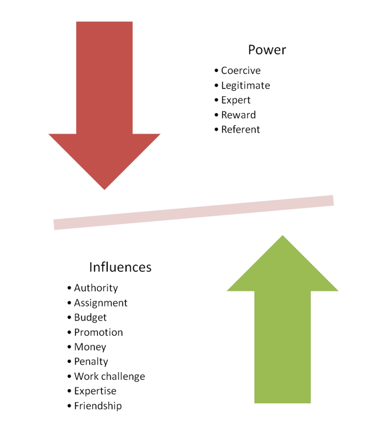

### 8. Convey's 7 Habits

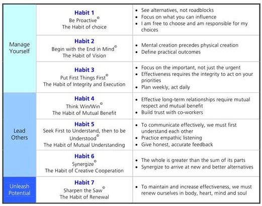

### 9. Conflict Handling Modes

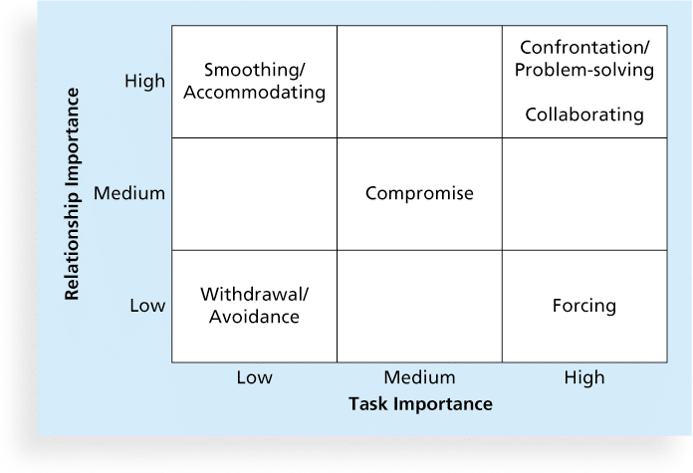

- **Confrontation(對抗)**: Directly face a conflict using a problem-solving approach
- **Compromise(妥協)**: Use a give-and-take approach
- **Smoothing**: De-emphasize areas of difference and emphasize areas of agreement
- **Forcing**: The win-lose approach
- **Withdrawal**: Retreat or withdraw from an actual or potential disagreement
- **Collaborating**: Decision makers incorporate different  viewpoints and insights to develop consensus( 共識) and commitment

### 10. Q&A

- What involves assigning the needed personnel to work on the project?
    - Planning human resource management
    - Acquiring the project team
    - Developing the project team
    - Managing the project team

> answer: <strong>*Acquiring the project team.*</strong>

- Key outputs of which process are project staff assignments, resource calendars, and project management plan updates?
    - managing the project team
    - developing the project team
    - acquiring the project team
    - planning the human resource plan

> answer: <strong>*acquiring the project team.*</strong>

- Recognizing an employee as the "Star Performer of the Month" would be satisfying which need of the Maslow's hierarchy of needs.
    - esteem
    - physiological
    - self-actualization
    - safety
    
> answer: <strong>*esteem.*</strong>

- The bottom four needs in Maslow's structure are referred to as which needs?
    - self-actualization
    - safety
    - deficiency
    - growth
    
> answer: <strong>*deficiency.*</strong>

- People with a high need for which seek to excel and tend to avoid both low-risk and high-risk situations to improve their chances for achieving something worthwhile?
    - affiliation
    - power
    - security
    - achievement
    
> answer: <strong>*achievement.*</strong>

- What presents subjects with a series of ambiguous pictures and asks them to develop a spontaneous story for each picture, assuming they will project their own needs into the story?
    - RAM
    - TAT
    - MBTI
    - RACI

> answer: <strong>*TAT.*</strong>

- What emphasizes things such as job rotation, broadening of skills, generalization versus specialization, and the need for continuous training of workers?
    - Theory W
    - Theory Y
    - Theory X
    - Theory Z
    
> answer: <strong>*Theory Z.*</strong>

- According to Thamhain and Wilemon, what is the legitimate hierarchical right to issue orders?
    - authority
    - expertise
    - achievement
    - self-actualization
    
> answer: <strong>*authority.*</strong>

- According to Thamhain and Wilemon, what is the ability to improve a worker's position?
    - penalty
    - expertise
    - assignment
    - promotion
    
> answer: <strong>*promotion.*</strong>

- What involves using incentives to induce people to do things.
    - Legitimate power
    - Reward power
    - Coercive power
    - Referent power
    
> answer: <strong>*Reward power.*</strong>

- The first step in the framework for defining and assigning work is what?
    - defining how the work will be accomplished
    - breaking down the work into manageable elements
    - finalizing the project requirements
    - assigning work responsibilities

> answer: <strong>*finalizing the project requirements.*</strong>

- What is a column chart that shows the number of resources assigned to a project over time?
    - responsibility assignment matrix
    - RACI charts
    - resource histogram
    - organizational breakdown structure

> answer: <strong>*resource histogram.*</strong>

- What refers to the amount of individual resources an existing schedule requires during specific time periods?
    - Resource loading
    - Resource histogram
    - Resource leveling
    - Resource logs

> answer: <strong>*Resource loading.*</strong>

- What is a technique for resolving resource conflicts by delaying tasks?
    - Resource loading
    - Resource allocation
    - Resource leveling
    - Resource histogram

> answer: <strong>*Resource leveling.*</strong>

- In the MBTI, which dimension relates to the manner in which you gather information?
    - Extrovert/Introvert
    - Judgment/Perception
    - Thinking/Feeling
    - Sensation/Intuition

> answer: <strong>*Sensation/Intuition.*</strong>

- Psychologist David Merril describes what as reactive and task-oriented?
    - "Expressives"
    - "Analyticals"
    - "Drivers"
    - "Amiables"

> answer: <strong>*"Analyticals".*</strong>

- According to Blake and Mouton, project managers who use which method use a give-and take-approach to resolving conflicts?
    - smoothing
    - confrontation
    - forcing
    - compromise

> answer: <strong>*compromise.*</strong>

- According to Lencioni, which of the following qualities is present in organizations that succeed?
    - Commitment
    - Accountability
    - Autonomy
    - Teamwork

> answer: <strong>*Teamwork.*</strong>
