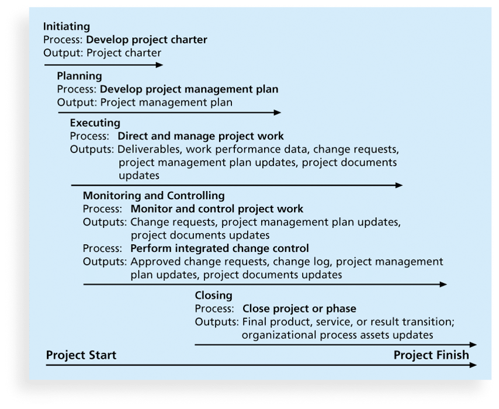
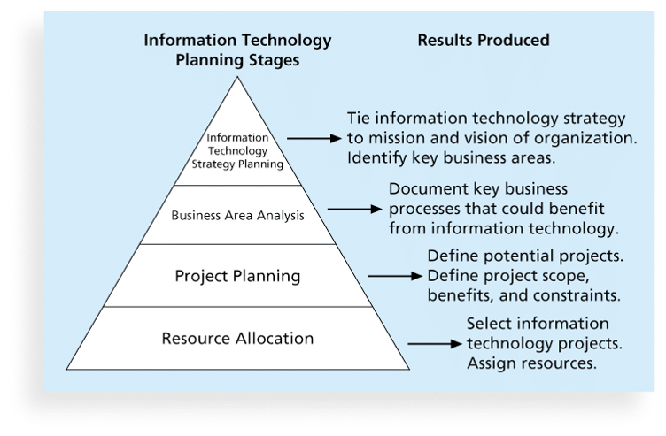
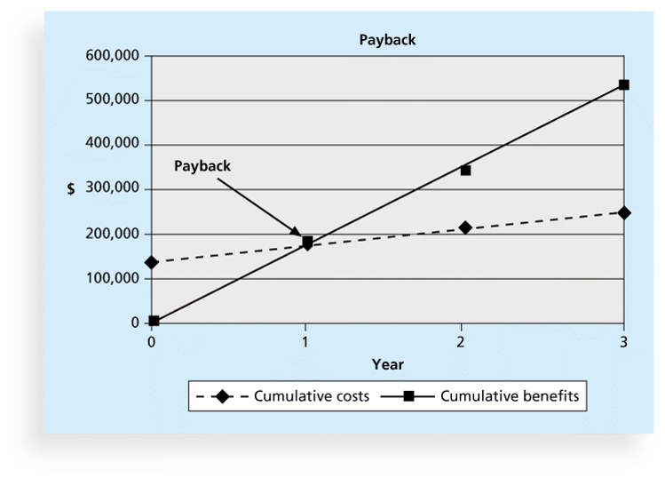
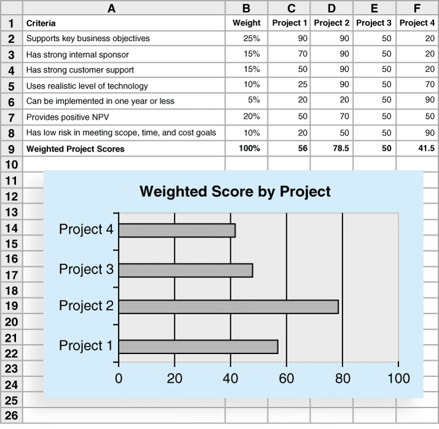

## Project Integration Management	[Back](./../projectManagement.md)

### 1. Processes

1. Developing the project charter(憲章)
    - a document that formally recognizes(承認) the existence of a project and provides direction(指導) on the project's objectives and management.
    - you should have the follow things as input:
        - a project statement of work
        - a business case
        - agreements
        - enterprise environmental factors
        - organizational process assets
2. Developing the project management plan.
    - **Common elements**:
        - introduction or overview of the project
        - description of how the project is organized
        - management and technical processes used on the project
        - work to be done, schedule and budget information
3. Directing and managing project work.
    - Execution tools:
        - Expert judgment
        - Meetings
        - Project management information systems
4. Monitoring and controlling project work.
    - Collecting measuring
    - Disseminating(宣傳)
5. Performing integrated change control
    - 3 main objectives:
        - Influencing the factors that create changes to ensure that changes are beneficial
        - Determining that a change has occured
        - Managing actual changes as they occur
    - Change control:
        - a **Change Control System** describes when and how offical project documents and work may be changed and describes who is authorized to make changes and how to make it.
        - a **Change Control Bord(CCB)** is a formal group of people responsible for approving or rejecting changes on a project.
    - Making timely(及時的) changes:
        - 48-hour policy
6. Closing the project or phase

### 2. SWOT analysis

- Strengths(優勢)
- Weaknesses(劣勢)
- Opportunities(機遇)
- Threats(威脅)

### 3. Planning Stages

- Methods for selecting projects:
    - focusing on board organizational needs.
        - 3 criterias:
            - there is a **need** for the project
            - there are **funds(儲備)** available
            - there is a strong **will** to make it succeed
    - categorizing(分類) information technology projects.
        - focus on addressing:
            - a problem
            - an opportunity
            - a directive(指令)
        - focus on time
            - how long it takes
            - when it's needed
        - focus on the priority
    - performing net present value or other financial analysis.
        - **Net Present Value(NPV)** analysis
            - 淨現值
            - `NPV = Benifits - Costs`
        - **Return on Investment(ROI)** analysis
            - 投資回報率
            - `ROI = (Benifits - Costs) / Costs`
        - **Payback** analysis
            - 回本
            - **Payback Period**: the amount of time to recoup(收回)
            
    - using a weighted scoring model 

### 4. Q&A

- What stage of information technology planning outlines business processes that are central to achieving strategic goals and helps determine which ones could most benefit from information technology?
    - project planning
    - business area analysis
    - resource allocation
    - information technology strategy planning
    
> answer: <strong>*business area analysis.*</strong>

- In what stage of selecting information technology projects, organizations select information technology projects?
    - project planning
    - business area analysis
    - resource allocation
    - information technology strategy planning
    
> answer: <strong>*resource allocation.*</strong>

- Which of the following is true of return on investment or ROI?
    - It is always a percentage.
    - It is the result of adding the project costs to the profits.
    - It is always a positive number.
    - The lower it is, the better.
    
> answer: <strong>*It is always a percentage.*</strong>

- A project's internal rate of return can be determined by finding what discount rate results in an NPV of _____ for the project?
    - zero
    - a hundred percent
    - one
    - fifty percent

> answer: <strong>*zero.*</strong>

- Which is a document that recognizes the existence of a project and provides direction on the project's objectives and management?
    - stakeholder register
    - directive
    - risk register
    - project charter
    
> answer: <strong>*project charter.*</strong>

- The business case includes information on what?
    - the business need for the project
    - the project objective, high-level requirements, and time and cost goals
    - relevant government or industry standards
    - policies, procedures, guidelines, and systems that influence a project's success

> answer: <strong>*the project objective, high-level requirements, and time and cost goals.*</strong>

- Which of the following is a proactive process undertaken to reduce the probability of negative consequences associated with project risks?
    - Performance reports
    - Defect repairs
    - Preventive actions
    - Corrective actions

> answer: <strong>*Preventive actions.*</strong>

- An IT company revises its process parameters in response to complaints from vendors that products were not ready on time. This would be an example of what?
    - cost forecasting
    - defect repairs
    - a preventive action
    - a corrective action

> answer: <strong>*a corrective action.*</strong>

- What involves identifying and controlling the functional and physical design characteristics of products and their support documentation, and ensures that the descriptions of the project's products are correct and complete.
    - NPV analysis
    - Configuration management
    - Project management information systems
    - Project time management

> answer: <strong>*Configuration management.*</strong>
