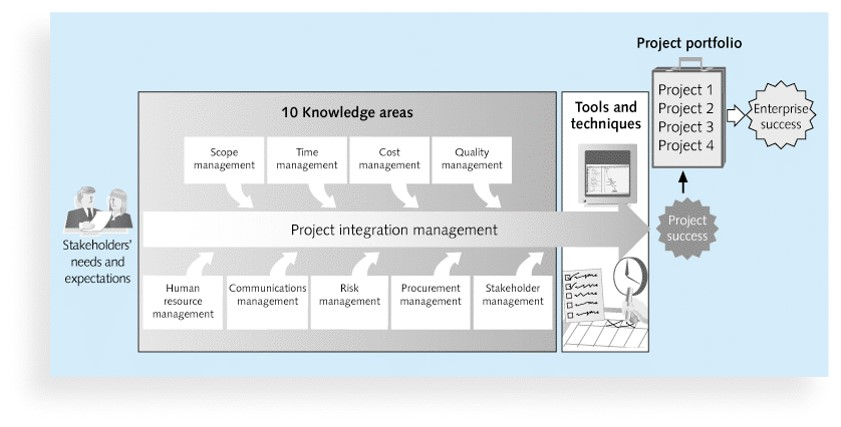

## Introduction	[Back](./../projectManagement.md)

### 1. Importance of project management

- A 1995 Standish Group study (CHAOS) found that only 16.2% of IT projects were successful in meeting scope, time, and cost goals; over 31% of IT projects were canceled before completion.
- A PricewaterhouseCoopers study found that overall half of all projects fail and only 2.5% of corporations consistently meet their targets for scope, time, and cost goals for all types of project.
- Advantages of using formal project management:
	- Better control of financial, physical, and human resources
	- Improved customer relations
	- Shorter development times
	- Lower costs
	- Higher quality and increased reliability
	- Higher profit margins(利益邊際)
	- Improved productivity
	- Better internal coordination
	- Higher worker morale(士氣)

### 2. Definitons

- **Projects**: 
    - projects are **unique**.
	- operations(業務) is work done to sustain(支撐) the business.
	- end when: 
		- their objectives have been reached
		- the project has been terminated.
	- can be large or small, and take a long or short time to complete.
- **Stakeholders**: the people involved in of affected by project activities.
	- the project sponsor
	- the project manager
	- the project team
	- support staff
	- customers
	- users
	- suppliers
	- opponents(競爭對手) to the project

### 3. The triple constraint

- there is a **triple constraint** of project management:
	- Scope:
		- What work will be done as part of the project?
		- What unique product, service or result does the  customer or sponsor expect from the project?
		- How will the scope verified(證實)?
	- Cost:
		- What should it cost to complete the project?
		- What is the project's budget?
		- How will costs be tracked?
		- Who can authorize changes to the budget?
	- Time:
		- How long it take to complete the project?
		- What is the project's schedule?
		- How will the team track actual schedule performance?
		- Who can approve changes to the schedule?
- **quadruple constraint** includes **quality** as well.

### 4. The frameswork of project integration management

- Knowledge Areas(KA):
	- **Stakeholders(有權益關係者) Management**: Helps you identify and manage relationship with people who can impact(衝擊) or who get impacted by the project.
	- **Procurement(採購) Management**: If at all some part of yor project work is to be done by an expert seller, this KA has all the know-how(專業知識) of how to deal with it.
	- **Risk Management**: There will be plenty of threats as well as opportunities. Identify them. Analyze them. Prepare for them. When they do happen, address and control them!
	- **Communication Management**: Helps you keep all stakeholders in the know. Distribute right information to the right people at the right time.
	- **Human Resources Management**: People, People, People! A crucial(至關重要的) element of success for any project. And, most challenging for the Project Manager. Why? Because dealing with people needs great deal of interpersonal(人際) skills!
	- **Integration Management**(the start point): integrating processes covers from Initiating to Closing of the project or phase.
	- **Scope Management**: Helps you understand stakeholders' expectations out of the project. (very crucial)
	- **Time Management**: You will be able to identify project activities, identify dependencies, estimate ther resource and durations are estimated, and create project schedure right here!
	- **Cost Management**: Address all type of costs - *direct & indirect costs*, related to quality, resources, risks and procurement.
	- **Quality Management**: Figure out what is needed to ensure that project produces PSR(*product*/*service*/*result*) that is in line with stakeholders' expectations - not more, not less!

### 5. Factors to help projects succeed

- User involvement
- Executive support(行政支持)
- Clear business objectives
- Emotional maturity(情感成熟度)
- Optimizing scope(樂觀領域)
- Agile process
- Project mangement expertice(專業知識)
- Skilled resources
- Execution
- Tools and infrastructure(基礎設施)

### 6. Q&A

- What is the difference between projects and operations?

> answer: <strong>*Projects are temporary endeavors whereas an organization's operations are ongoing in nature.*</strong>

- Which project management knowledge areas is an overarching function that affects and is affected by the different knowledge areas?

> answer: <strong>*Project Integration Management*</strong>

- Is checklist a tool used in quality management?

> answer: <strong>*Yes.*</strong>

- Which of the following tools can best hep in efficient communication management?
    - Kick-off meetings
    - Requests for quotes
    - Impact matrices
    - Fast tracking

> answer: <strong>*Kick-off meetings.*</strong>

- What is the difference between project management and portfolio management?

> answer: <strong>*Project management addresses specific short-term goals whereas portfolio management focuses on long-term goals.*</strong>

- Martha works as a project manager at a bank. Due to certain changes in external factors, Martha needs to make a few alterations in the tactical goals of her project. In such a scenario, which of the following will best help Martha cope with the change?
    - Negotiation
    - Project environment knowledge
    - Motivation
    - Soft skills

> answer: <strong>*Project environment knowledge.*</strong>

- Which is the organizational group responsible for coordinating the project management function throughout an organization?

> answer: <strong>*Project Management Office.*</strong>

- Which of the following provides certification as a Project Management Professional?
    - PMS
    - PMI
    - PMC
    - PMP

> answer: <strong>*PMI.*</strong>

- Which of the following refers to a set of principles that guides decision making based on personal values of what is considered right and wrong?
    - Ethics
    - Civics
    - Laws
    - Politics

> answer: <strong>*Ethics.*</strong>
