## Process Groups	[Back](./../projectManagement.md)

- a **process** is a series of actions directed toward a particular result.

### 1. Five processes

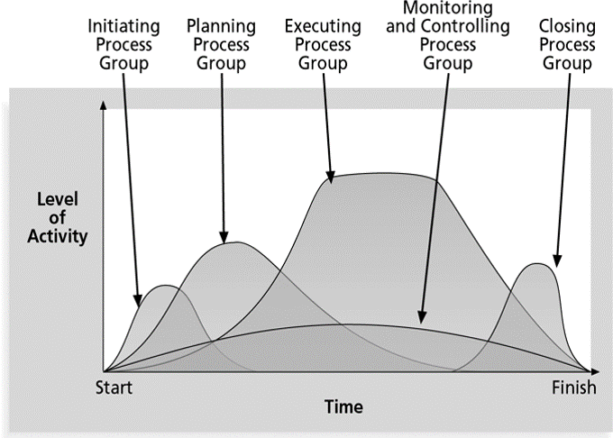

- **Initiating Processes**: to initiate a project
    - developing a project charter(憲章) which includes key project information and stakeholder signatures(署名): 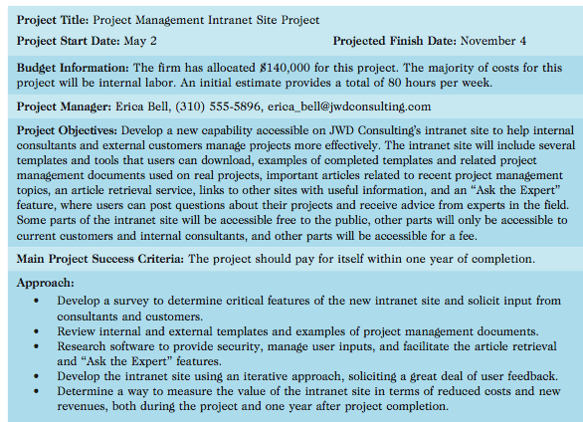 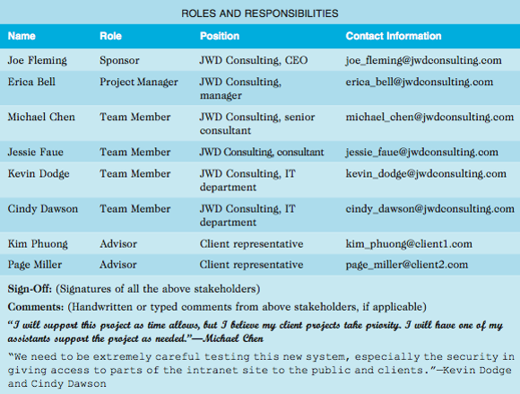
    - identifying stakeholders, and having the stakeholders registers: 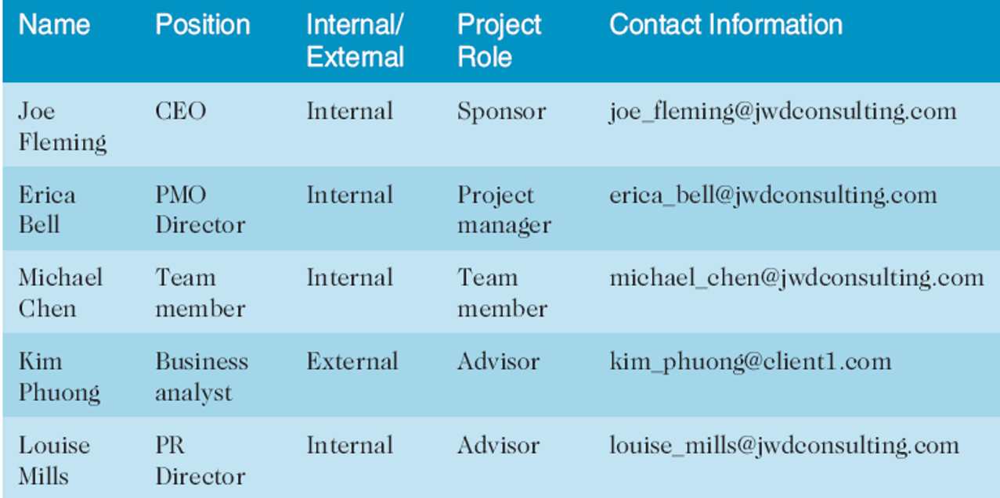
    - starting a kick-off meeting(啟動會議), and the agenda is shown as follow: 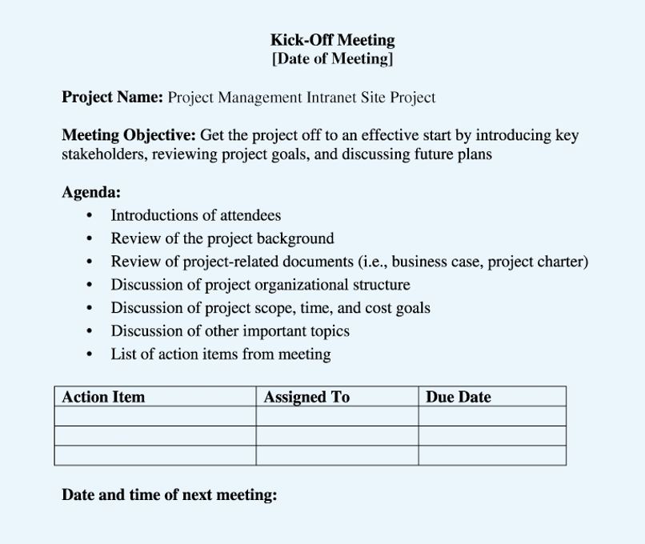
- **Planning Processes**: to plan how to complete the project
    - key ouputs:
        - a team contract(合同)
        - a projec scope statement
        - a Work Breakdown Structure(WBS)
        - a project schedule(Gantt Chart)
        - a list or prioritized risks
- **Executing Processes**: to execute the plan
    - a milestone report can be helpful: 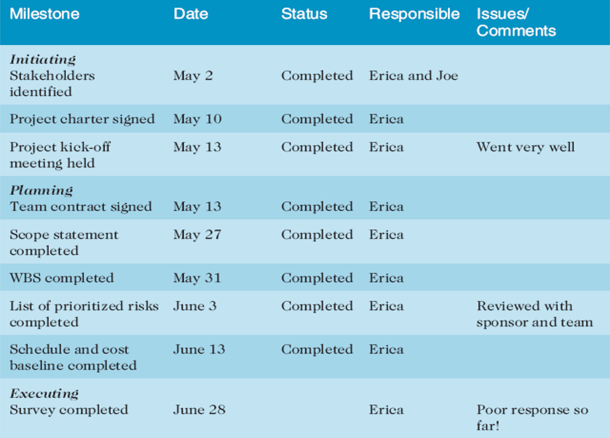
- **Monitoring and Controlling Processes**: to monitor and control the whole processes
    - outputs:
        - performance reports
        - change requests
        - updates o various plans
- **Closing Processes**: to close the project
    - outputs:
        - project files
        - lessons-learned(經驗教訓) reports 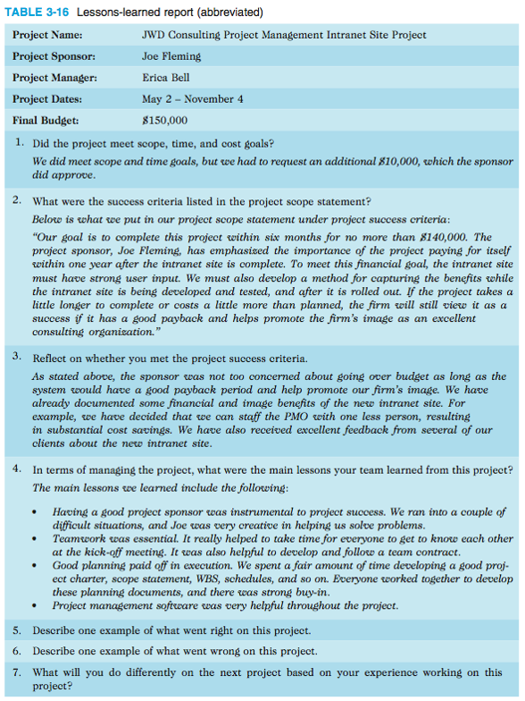
        - part of organizational process assets(資產)
- Alpha project managers will spend more time on **Planning**.

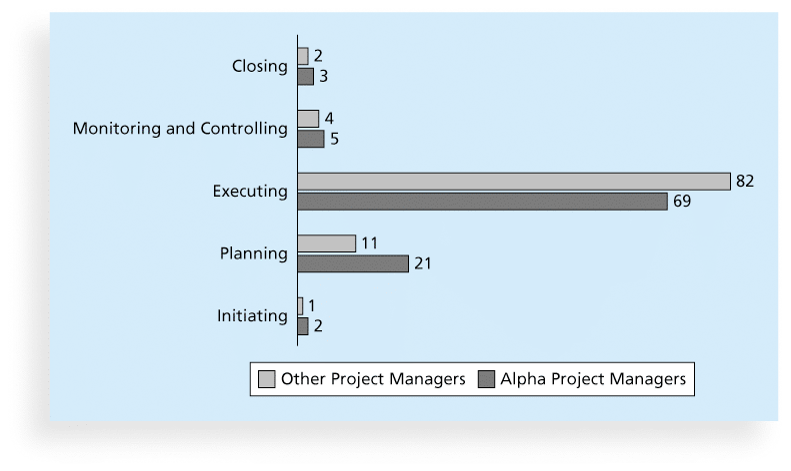

### 2. Process Groups and Knowledge Area Mapping

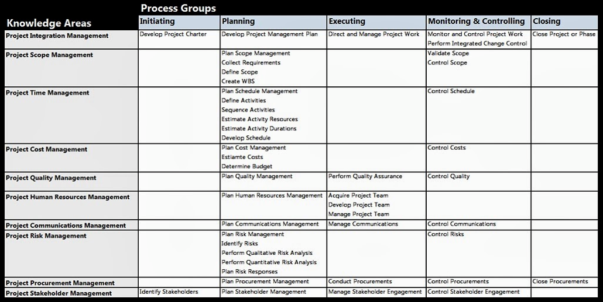

### 3. Methodology

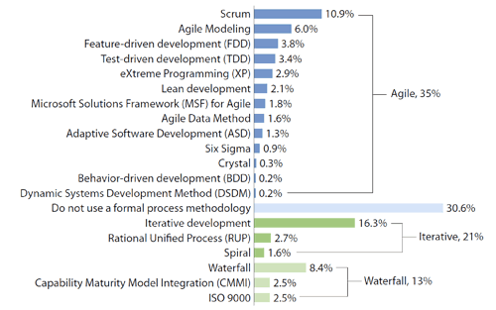

- a **methodology**: to describe how things should be done
- a **standard**: to describe what should be done
- **PRINCE2**, **Agile**, **RUP** and **Six Sigma** provide different project management methodologies.
    - **PRINCE2**: defines 45 separate sub-processes and organizes these into 8 process groups as follows:
        - Starting up a project
        - Planning
        - Initiating a project
        - Directing a project
        - Controlling a project
        - Managing product delivery
        - Managing stage boundaries
        - Closing a project
    - **Rational Unified Process(RUP)**:
        - Business Modelling
        - Requirements
        - Analysis & Design
        - Implementation
        - Test
        - Deployment

### 4. Business Case(商業論證)

- a **business case** is to capture the reasoning for initiating a project or task. It should include information as follow:
    - Introduction/background
    - Business objective
    - Current situation and problem/opportunity statement
    - Critical assumptions and constraints
    - Analysis of options and recommendation
    - Preliminary(初步的) project requirements
    - Budget estimate and financial analysis
    - Schedule estimate
    - Potential risks
    - Exhibits

### 5. Scrume Documenting

- roles:
    - **Product Owner**
    - **ScrumMaster(PM)**
    - **Scrum Team or Develoment Team**
- artifacts
    - **Product Backlog**: a list of features prioritized by business value. 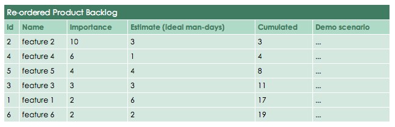
    - **Sprint Backlog**: the highest-priority items from the product backlog to be completed within a sprint. 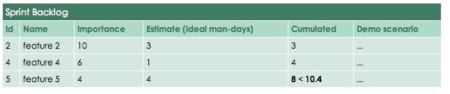
    - **Burndown Chart(竣工情況圖)**: a chart to show the work situation within in a sprint on a day-by-day basis. 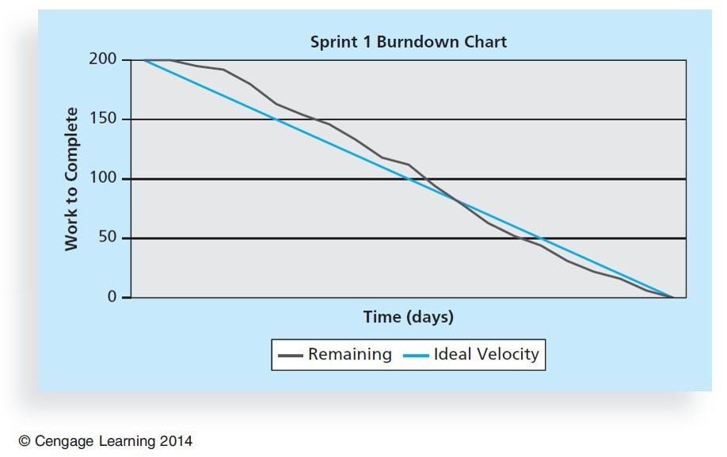

### 6. Q&A

- Which processes include devising and maintaining a workable scheme to ensure that the project addresses the organization's needs?
    - Initiating
    - Executing
    - Planning
    - Monitoring and controlling

> answer: <strong>*Planning.*</strong>

- The project integration management knowledge area maps to the which process group through the activities of developing project charters?
    - initiating
    - executing
    - planning
    - monitoring and controlling

> answer: <strong>*initiating.*</strong>

- The project cost management knowledge area maps to the which process group through the activities of estimating costs and budget determination?
    - initiating
    - executing
    - planning
    - monitoring and controlling

> answer: <strong>*planning.*</strong>

- What is an iterative software development process that focuses on team productivity and delivers software best practices to all team members?
    - Agile Unified Process
    - Rational Unified Process
    - Dynamic Systems Development Method
    - Six Sigma

> answer: <strong>*RUP.*</strong>

- One of the main outputs of the initiation process is what?
    - creating the work breakdown structure
    - developing the project charter
    - selecting the project manager
    - identifying the project sponsor

> answer: <strong>*developing the project charter.*</strong>

- Which provides a basis for creating the project schedule and performing earned value management for measuring and forecasting project performance?
    - scope statement
    - work breakdown structure
    - cost management plan
    - project charter

> answer: <strong>*WBS.*</strong>

- Which are an output of the executing process of project integration management.
    - Deliverables
    - Resource calendars
    - Issue logs
    - Enterprise environmental factor updates
    
> answer: <strong>*Deliverables.*</strong>

- Which of the following project parameters would be compatible with the use of the agile approach? 
    - Projects with inexperienced and dispersed teams
    - Projects with clear-up front requirements
    - Projects that have a fairly rigid completion date
    - Projects that have more flexible scheduling
    
> answer: <strong>*Projects that have more flexible scheduling.*</strong>

- The improvement of  the product and process in the Scrum method is discussed at the what?
    - sprint reflection meeting
    - kick-off meeting
    - sprint review meeting
    - daily Scrum meeting

> answer: <strong>*sprint reflection meeting.*</strong>

- A what is usually not necessary to the Scrum method.

> answer: <strong>*team contract.*</strong>
