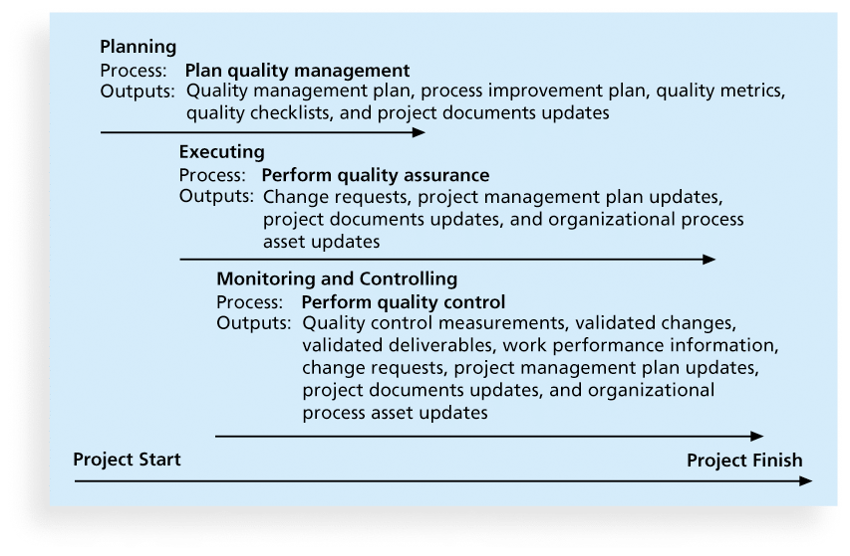
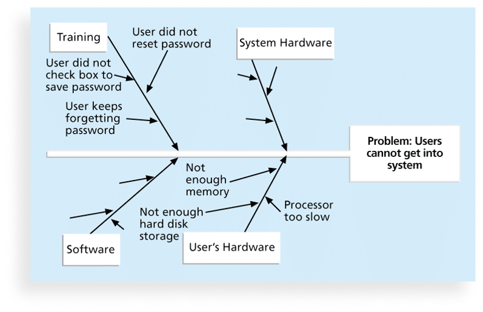
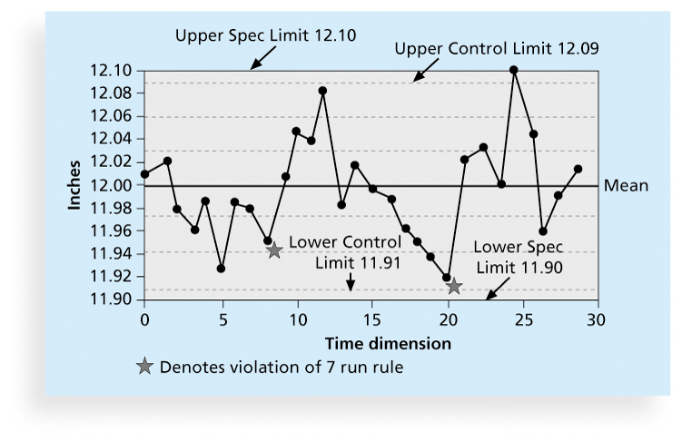
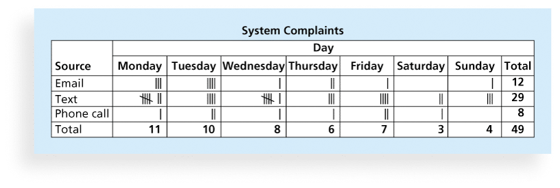
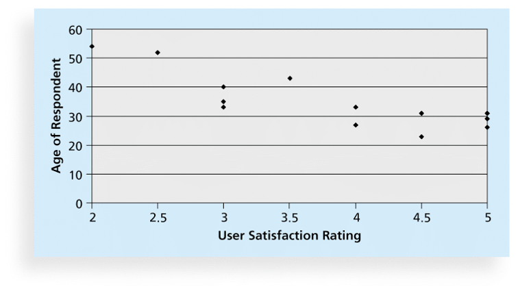
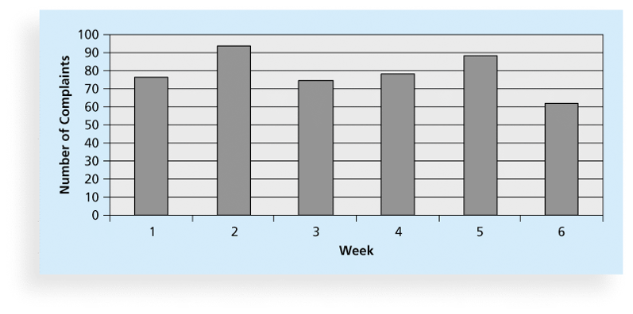
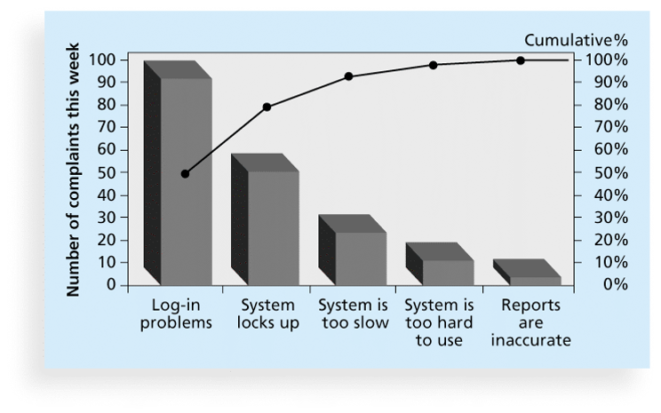
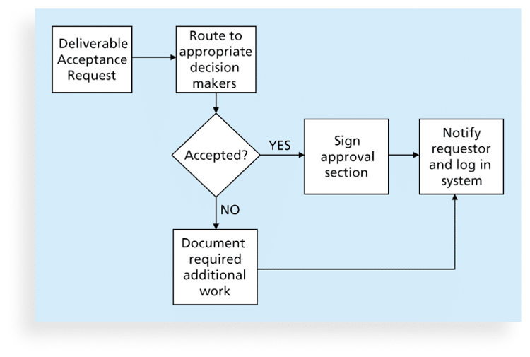
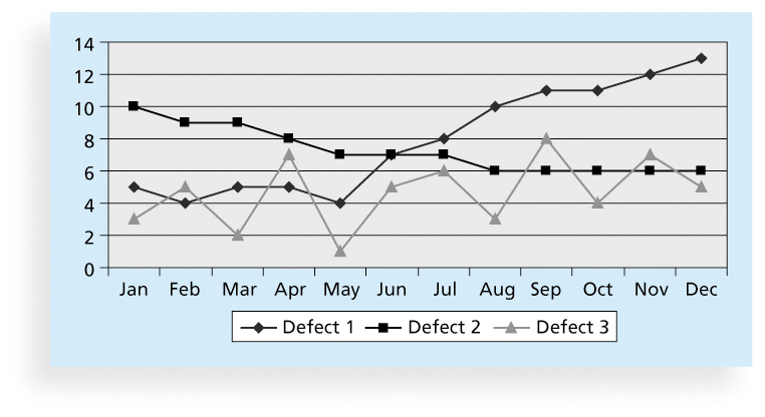
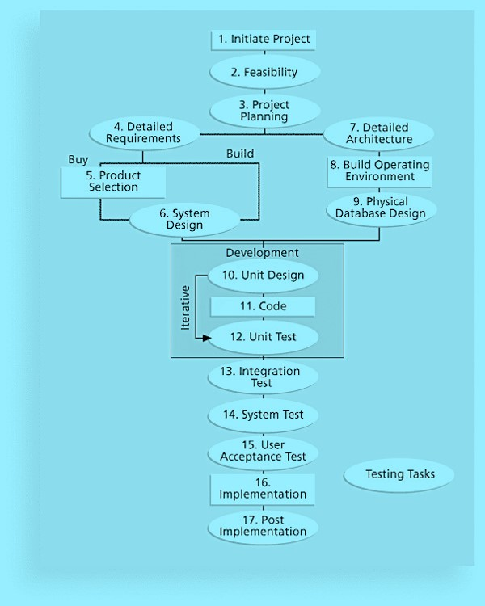

## Project Quality Management	[Back](./../projectManagement.md)

- ISO defines **quality** as "the degree to which a set of inherent characteristics fulfills requirements".
- Other experts define as:
    - **Conformance(一致) to requirements**
    - **Fitness to use**

### 1. Processes

1. Planning quality management
    - Scope Aspects of IT Projects:
        - Functionality
        - Features
        - System outputs
        - Performance
        - Reliability
        - Maintainability
    - Project managers are ultimately(最終) responsible for quality management on their projects.
2. Performing quality assurance
    - **Quality assurance** includes all the activities related to satisfying the relevant quality standards for a project.
    - **Benchmarking(基準)** generates ideas for quality improvements by comparing specific project practices or product characteristics to those of other projects or products within or outside the performing organization.
    - A **quality audit** is a structured review of specific quality management activities that help identify lessons learned that could improve performance on current or future projects.
3. Performing quality control

### 2. Cause-and-Effect Diagrams

- **Cause-and-effect diagrams** trace complaints about quality problems back to the responsible production operations. (Also called **fishbone diagrams** or **Ishikawa diagrams**)

### 3. Quality Control Charts

- A **control chart** is a graphic display of data that illustrates the results of a process over time.
- The main purpose of using control charts is to prevent defects(缺陷) rather than to detect or reject them.

### 4. Checksheet

- A **checksheet** is used to collect and analyze data. (Also called **tally sheet** or **checklist**)

### 5. Scatter Diagrams

- A **scatter diagram** helps to show if there is a relationship between two variables.
- The closer data points are to a diagonal line(对角线), the more closely the two variables are related.

### 6. Histograms

- A **histogram** is a bar graph of a distribution of variables.
- Each bar represents an attribute or characteristic of a problem or situation, and the height of the bar represents its frequency.

### 7. Pareto Charts

- A **Pareto chart** is a histogram that can help you identify and prioritize problem areas.
- **Pareto analysis** is also called the 80-20 rule, meaning that 80 percent of problems are often due to 20 percent of the causes.

### 8. Flowcharts

- **Flowcharts** are graphic displays of the logic and flow of processes that help you analyze how problems occur and how processes can be improved.

### 9. Run Charts

- A **run chart** displays the history and pattern of variation of a process over time. 

### 10. Testing

- **Unit testing** tests each individual component (often a program) to ensure it is as defect-free as possible.
- **Integration testing** occurs between unit and system testing to test functionally grouped components.
- **System testing** tests the entire system as one entity.
- **User acceptance testing** is an independent test performed by end users prior to accepting the delivered system.

- Watts S. Humphrey, a renowned expert on software quality, defines a **software defect** as anything that must be changed before delivery of the program.

### 11. Maturity Models

- **Maturity models** are frameworks for helping organizations improve their processes and systems.
    - The **Software Quality Function Deployment Model** focuses on defining user requirements and planning software projects.
    - The Software Engineering Institute's **Capability Maturity Model Integration** is a process improvement approach that provides organizations with the essential elements of effective processes.

### 12. CMMI Levels

- **CMMI Levels** is a formal standard to identify the quality of a software companies.
    - 0: Incomplete
    - 1: Performed
    - 2: Maged
    - 3: Defined (**government projects baseline**)
    - 4: Quantitatively Managed
    - 5: Optimizing

### 13. Q&A

- What is a standard of measurement in quality management?
    - milestone
    - merge
    - metric
    - matrix

> answer: <strong>*metric.*</strong>

- What is the degree to which a system performs its intended function?
    - Reliability
    - Maintainability
    - Validity
    - Functionality

> answer: <strong>*Functionality.*</strong>

- What are the system's special characteristics that appeal to users.
    - Features
    - Yields
    - Outputs
    - Metrics

> answer: <strong>*Features.*</strong>

- What generates ideas for quality improvements by comparing specific project practices or product characteristics to those of other projects or products within or outside the performing organization?
    - Prototyping
    - Mind mapping
    - Systems thinking
    - Benchmarking

> answer: <strong>*Benchmarking.*</strong>

- What refers to action taken to bring rejected items into compliance with product requirements or specifications or other stakeholder expectations?
    - A process adjustment
    - An acceptance decision
    - Rework
    - Validation

> answer: <strong>*Rework.*</strong>

- What correct(s) or prevent(s) further quality problems based on quality control measurements?
    - Process adjustments
    - Acceptance decisions
    - Rework
    - Decomposition

> answer: <strong>*Process adjustments.*</strong>

- What is a graphic display of data that illustrates the results of a process over time?
    - statistical sampling chart
    - Six Sigma chart
    - Pareto chart
    - control chart

> answer: <strong>*control chart.*</strong>

- What help users to identify the vital few contributors that account for most quality problems in a system?
    - Gantt charts
    - Control charts
    - Pareto charts
    - Tracking Gantt charts

> answer: <strong>*Pareto charts.*</strong>

- What involves choosing part of a population of interest for inspection?
    - Statistical sampling
    - System testing
    - Conformance
    - Fitness for use

> answer: <strong>*Statistical sampling.*</strong>

- Six Sigma's target for perfection is the achievement of no more than how many defects, errors, or mistakes per million opportunities?
    - 1.34
    - 34
    - 3.4
    - 13.4

> answer: <strong>*3.4.*</strong>

- Important tools used in which phase of the DMAIC process include a project charter, a description of customer requirements, process maps, and Voice of the Customer(VOC) data?
    - define
    - analyze
    - measure
    - improve

> answer: <strong>*define*</strong>

- What is a bell-shaped curve that is symmetrical regarding the average value of the population (the data being analyzed)?
    - skewed distribution
    - bimodal distribution
    - normal distribution
    - degenerate distribution

> answer: <strong>*normal distribution*</strong>

- What is a measure of quality control equal to 1 fault in 1 million opportunities problems.
    - ISO 9000
    - seven run rule
    - six 9s of quality rule
    - Six Sigma rule

> answer: <strong>*six 9s of quality rule*</strong>

- Which of the following is one of Deming‘s 14 Points for Management?
    - An organization should increase dependence on inspection to achieve quality.
    - Minimize total cost by working with multiple suppliers rather than a single supplier.
    - Award business based on price tag alone rather than on other considerations.
    - Eliminate the annual rating or merit system.

> answer: <strong>*Eliminate the annual rating or merit system.*</strong>

- One of Juran's ten steps to quality improvement states that:
    - an organization should minimize top management involvement in the achievement of individual employee goals.
    - an organization should build awareness of the need and opportunity for improvement.
    - an organization should entrust improvement to individual employees rather than appointing teams or facilitators.
    - an organization should avoid "keeping score" in order to achieve an overall atmosphere of quality improvement.

> answer: <strong>*an organization should build awareness of the need and opportunity for improvement.*</strong>

- Who wrote Quality Is Free in 1979 and is best known for suggesting that organizations strive for zero defects?
    - Juran
    - Crosby
    - Ishikawa
    - Deming

> answer: <strong>*Crosby.*</strong>

- What is the cost of evaluating processes and their outputs to ensure that a project is error-free or within an acceptable error range?
    - Prevention cost
    - Internal failure cost
    - Appraisal cost
    - External failure cost

> answer: <strong>*Appraisal cost.*</strong>

- What is a cost that relates to all errors not detected and not corrected before delivery to the customer?
    - Prevention cost
    - Internal failure cost
    - Appraisal cost
    - External failure cost

> answer: <strong>*External failure cost.*</strong>

- What helps integrate traditionally separate organizational functions, set process improvement goals and priorities, provide guidance for quality processes, and provide a point of reference for appraising current processes?
    - SQFD
    - OPM3
    - MTBI
    - CMMI

> answer: <strong>*CMMI.*</strong>
