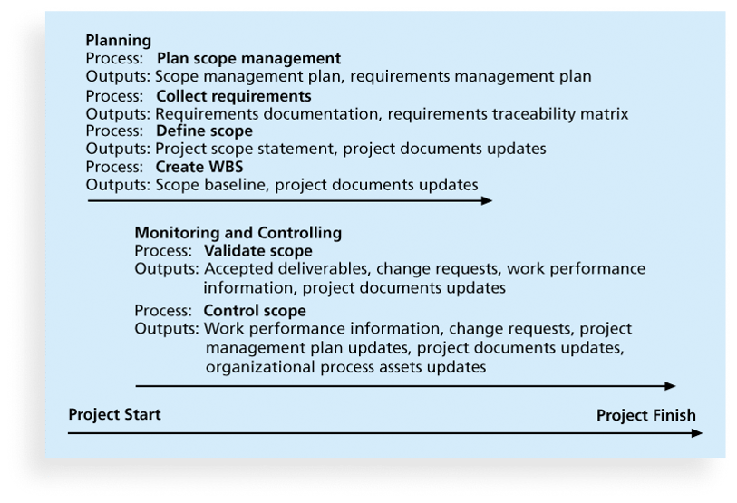
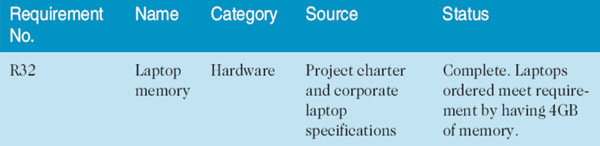
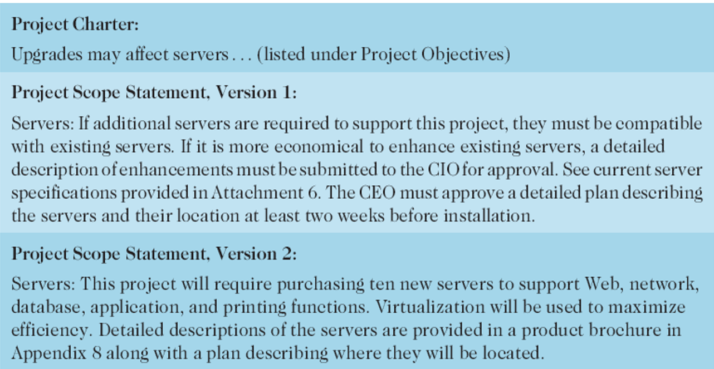
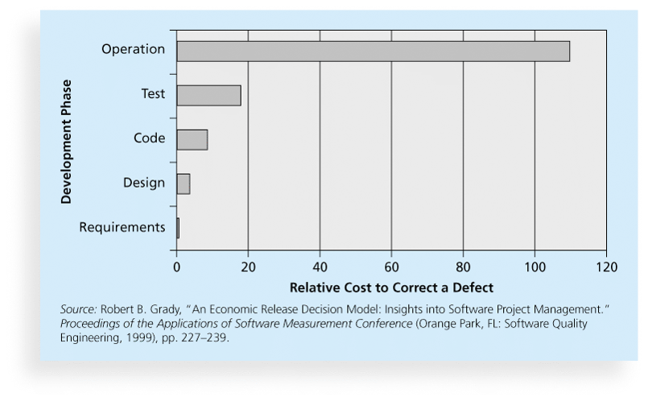
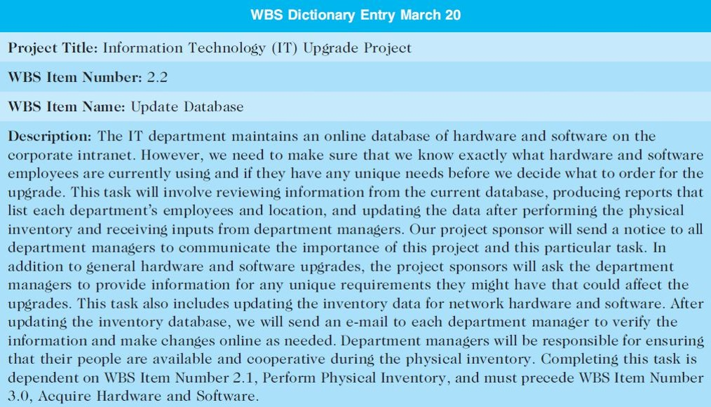

## Project Scope Management	[Back](./../projectManagement.md)

### 1. Definition

- **Scope** refers to all the work involved in creating the products of the project and the processes used to create them.
- A **deliverable** is a product produced as part of a project, such as hardware or software, planning documents, or meeting minutes(會議紀要)
- **Project scope management** includes the processes involved in defining and controlling what is or is not included in a project

### 2. Processes

1. Plan scope management
    - To use **expert judgment** to develop the scope management plan.
2. Collect requirements
    - To use **expert judgment** to develop the requirements management plan.
    - For some IT projects, it is helpful to divide requirements development into categories called elicitation(抽出), analysis, specification, and validation.
    - It is important to use an iterative(迭代的) approach to defining requirements since they are often unclear early in a project.
    - A **requirements traceability matrix (RTM, 需求追溯模型)** is a table that lists requirements, various attributes of each requirement, and the status of the requirements to ensure that all requirements are addressed. 
3. Define scope
    - **Project scope statements** should include at least a product scope description, product user acceptance criteria(用戶接受標準), and detailed information on all project deliverables.  
4. Create WBS
    - A **Work breakdown structure(WBS)** is a deliverable-oriented grouping of the work involved in a project that defines the total scope of the project.
    - **Decomposition(分解)** is subdividing(細分) project deliverables into smaller pieces.
    - A **work package(工作包)** is a task at the lowest level of the WBS.
    - The **scope baseline** includes the approved project scope statement and its associated WBS and WBS dictionary.
5. Validate scope
    - **Scope validation** involves formal acceptance of the completed project deliverables. (Acceptance is often achieved by a customer inspection and then sign-off on key deliverables)
6. Control scope
    - Scope control involves controlling changes to the project scope.
    - **Variance** is the difference between planned and actual performance.

### 2. Cost of correcting

### 3. Approaches to develope WBS

- **Analog approach(類比法)**: Review WBSs of similar projects and tailor to(適應) your project.
- **Top-down approach(自上而下法)**: Start with the largest items of the project and break them down.
- **Bottom-up approach(自底向上法)**: Start with the specific tasks and roll them up.
- **Mind-mapping approach**: a technique that uses branches radiating out(分流) from a core idea to structure thoughts and ideas.

### 4. WBS Dictionary

- A **WBS dictionary** is a document that describes detailed information about each WBS item.

### 5 Q&A

- What involves defining and documenting the features and functions of the products produced during the project as well as the processes used for creating them?
    - Collecting requirements
    - Controlling scope
    - Defining scope
    - Validating scope

> answer: <strong>*Collecting requirements.*</strong>

- What documents how project needs will be analyzed, documented, and managed.
    - requirements traceability matrix
    - WBS
    - requirements management plan
    - project scope statement

> answer: <strong>*requirements management plan.*</strong>

- Generating ideas by comparing specific project practices or product characteristics to those of other projects or products inside or outside the performing organization is known as what?
    - variance
    - prototyping
    - benchmarking
    - decomposition

> answer: <strong>*benchmarking.*</strong>

- Which is a deliverable-oriented grouping of the work involved in a project that defines the total scope of the project?
    - project charter
    - project scope statement
    - business case
    - work breakdown structure

> answer: <strong>*WBS.*</strong>

- Which should list and describe all of the deliverables required for the project?
    - project charter
    - WBS
    - scope statement
    - Gantt chart

> answer: <strong>*scope statement.*</strong>

- What refers to the process of developing a working replica of the system or some aspect of the system?
    - Prototyping
    - Decomposition
    - Variance
    - Use case modeling

> answer: <strong>*Prototyping.*</strong>
