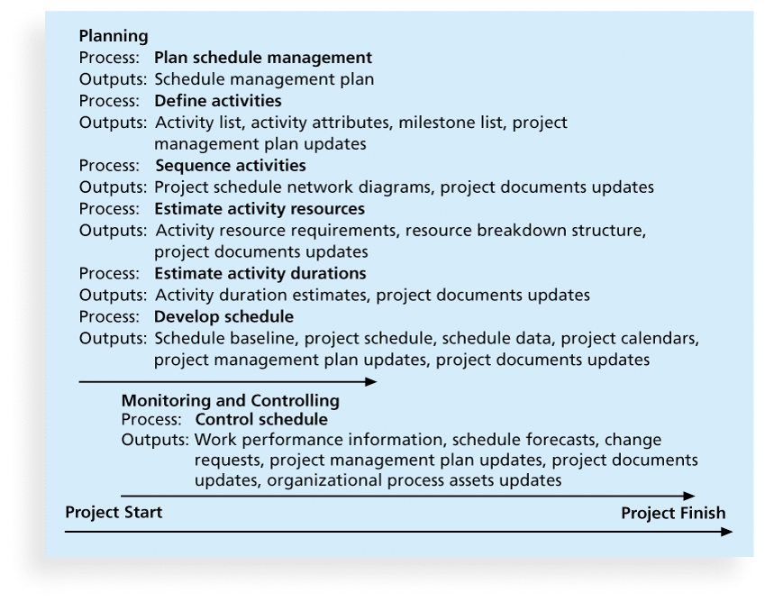
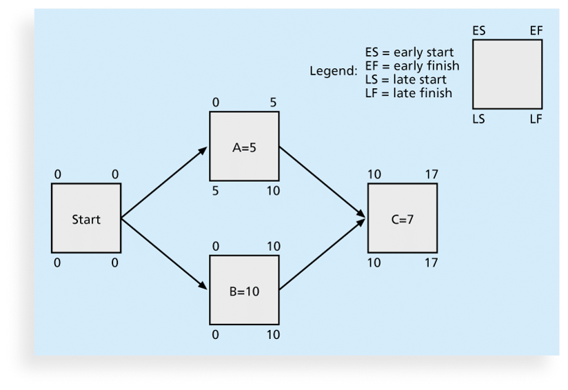
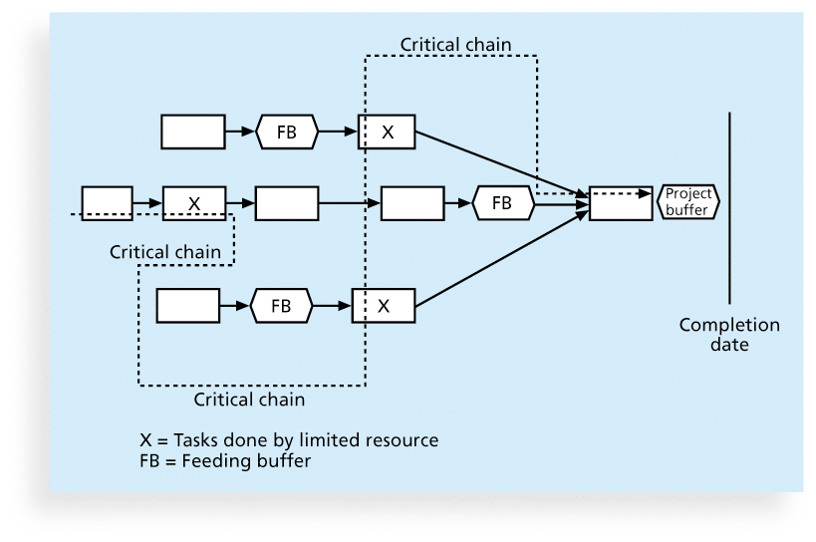

## Project Time Management	[Back](./../projectManagement.md)

### 1. Processes

1. Planning schedule management
    - A schedule management plan includes:
        - Project schedule model development
        - The scheduling methodology
        - Level of Accuracy and units of measure
        - Control thresholds(臨界值)
        - Rules of performance measurement
        - Reporting formats
        - Process descriptions
2. Defining activities
    - An **activity** or **task** is an element of work normally found on the work breakdown structure (WBS) that has an expected duration, a cost, and resource requirements
3. Sequencing activities
    - A **dependency** or **relationship** is the sequencing of project activities or tasks.
    - 3 types of dependencies:
        - **Mandatory dependencies(強制性依賴關係)**: inherent(固有的) in the nature of the work being performed on a project, sometimes referred to as hard logic.
        - **Discretionary dependencies(自由依賴關係)**: defined by the project team,  sometimes referred to as soft logic and should be used with care since they may limit later scheduling options.
        - **External dependencies**: involve relationships between project and non-project activities.
4. Estimating activity resources
    - **Resources**: people, equipment, and materials.
    - A **resource breakdown structure** is a hierarchical(分層的) structure that identifies the project's resources by category and type.
5. Estimating activity duration
    - **Duration** includes the actual amount of time worked on an activity plus elapsed(流逝的) time.
    - **Effort** is the number of workdays or work hours required to complete a task.
    - **Three-point estimates** are needed for PERT and Monte Carlo simulations(蒙特卡洛模擬).
6. Developing the schedule
    - tools:
        - **Gantt Charts**
        - **Critical Path Analysis**
        - **Critical Chain Scheduling**
        - **PERT Analysis**
7. Controlling the schedule

### 2. Activity Lists and Attributes

- An **activity list** is a tabulation(表格) of activities to be included on a project schedule that includes:
    - the activity name
    - an activity identifier or number
    - a brief description of the activity
- **Activity attributes** provide more information such as predecessors(前人), successors(繼承人), logical relationships, leads and lags(落後時間), resource requirements, constraints, imposed(強制的) dates, and assumptions related to the activity.

### 3. Milestones

- A **milestone** is a significant event that normally has no duration.
- Milestones should be 'SMART':
    - Specific
    - Mesuarable
    - Assignable
    - Realistic
    - Time-framed(時間有限的)

### 4. Network Diagrams

- A **network diagram** is a schematic(圖解的) display of the logical relationships among, or sequencing of, project activities.
    - **Arrow Diagramming Method(ADM)**: also called activity-on-arrow(AOA) network diagrams.
        - **Bursts(分開)** occur when a single node is followed by two or more activities.
        - A **merge(匯合)** occurs when two or more nodes precede(在...前面) a single node.
    - **Precedence Diagramming Method(PDM)**: activities are represented by boxes while relationships are represented by arrows.

### 5. Task Dependency Types

- **finish-to-start**(A finish-to-start B): B cannot start until A finishes.
- **start-to-start**(A start-to-start B): B cannot start until A starts
- **finsh-to-finish**(A finsh-to-finish B): B cannot finish until A finishes.
- **start-to-finish**(A start-to-finish B): B cannot finish until A starts.

### 6. Gantt Charts

- **Gantt Charts** provide a standard format for displaying project schedule information by listing project activities and their corresponding start and finish dates in a calendar format.
- Symbols:
    - a black diamond(◆): a milestone
    - a thick black bar: a summary task
    - a lighter horizontal bar: durations of tasks
    - an arrow: dependencies between tasks
- Symbols of **Tracking Gantt Charts**
    - a black horizontal bar: actual dates.
    - a lighter horizontal bar: planned dates.
    - a hollow(空心) diamond(◇): a slipped milestone

### 7. Critical Path Method(CPM)

- **CPM** is a network diagramming technique used to predict total project duration. A **critical path** for a project is the series of activities that determines the **earliest** time by which the project can be. completed.
- **Slack(鬆弛)** or **float** is the amount of time an activity may be delayed without delaying a succeeding activity or the project finish date.
- **Forward pass**: determines early start and finish dates.
- **Backward pass**: determines late start and finish dates.

### 8. Definities

- The **Theory of Constraints** is based on the fact that any complex system at any point in time often has only one aspect or constraint that limits its ability to achieve more of its goal.
- **Multitasking** occurs when a resource works on more than one task at a time.
- **Murphy's Law** states that if something can go wrong, it will.

### 9. ritical Chain

- a method of scheduling that considers limited resources when creating a project schedule and includes buffers to protect the project completion date.
- a **project buffer** or additional time added before the project's due date.
- **feeding buffers** or additional time added before tasks on the critical path.

### 10. Program Evaluation and Review Technique(PERT)

- **PERT** is a network analysis technique used to estimate project duration when there is a high degree of uncertainty about the individual activity duration estimates.
- PERT weighted average:
    - PERT weighted average = (**optimistic time** + 4 * **most likely time** + **pessimistic time**) / 6

### 11. Q&A

- Which of the following processes in project time management involves identifying the specific tasks that the project team members and stakeholders must perform to produce the project deliverables?
    - Defining activities
    - Developing the schedule
    - Sequencing activities
    - Estimating activity durations

> answer: <strong>*Defining activities.*</strong>

- In project time management, which of the following processes generate the main outputs of an activity list, activity attributes, and a milestone list?
    - Sequencing activities
    - Resource estimating activities
    - Defining activities
    - Estimating activity durations

> answer: <strong>*Defining activities.*</strong>

- Which of the following documents is most likely to include planned project start and end dates which serve as the starting points for a detailed schedule?
    - Resource breakdown structure
    - Organizational process assets update
    - Milestones list
    - Project charter

> answer: <strong>*Project charter.*</strong>

- In project time management, the main goal of what is to ensure that the project team has complete understanding of all the work they must do as part of the project scope so they can start scheduling the work.
    - defining activities
    - estimating activity resources
    - estimating activity durations
    - controlling the schedule

> answer: <strong>*defining activities.*</strong>

- Which dependencies are sometimes referred to as soft logic and should be used with care because they may limit later scheduling options?
    - Mandatory
    - External
    - Discretionary
    - Inherent

> answer: <strong>*Discretionary.*</strong>

- Which of the following is true of dummy activities?
    - They have long durations.
    - They have a large range of resources.
    - They show logical relationships between activities
    - They have limited time periods.

> answer: <strong>*They show logical relationships between activities.*</strong>

- Which of the following is one of the main outputs of estimating activity resources process?
    - Project documents update
    - Work breakdown structure
    - Milestone list
    - Activity duration estimate

> answer: <strong>*Project documents update.*</strong>

- After working with key stakeholders to define activities and calculate their resources, the next process in project time management is to what?
    - develop the schedule.
    - determine their dependencies.
    - control the schedule.
    - estimate the duration of activities.

> answer: <strong>*estimate the duration of activities.*</strong>

- Which of the following is a network diagramming technique used primarily to predict total project duration?
    - Gantt chart
    - Resource breakdown structure
    - Critical path analysis
    - Arrow diagramming method

> answer: <strong>*Critical path analysis.*</strong>

- What is the amount of time an activity can be delayed from its early start without delaying the planned project finish date?
    - Total slack
    - Backward pass
    - Free float
    - Forward pass

> answer: <strong>*Total slack.*</strong>

- The technique for making cost and schedule trade-offs to obtain the greatest amount of schedule compression for the least incremental cost is known as what?
    - dependency
    - critical chain scheduling
    - crashing
    - feeding buffers

> answer: <strong>*crashing.*</strong>

- Which of the following techniques involve doing activities in parallel that one would normally do in sequence?
    - Critical chain scheduling
    - Fast tracking
    - Crashing
    - PERT analysis

> answer: <strong>*Fast tracking.*</strong>

- A similarity between the crashing technique and the fast tracking technique is what?
    - both spread out tasks over a long period of time to ensure the quality of work is maintained.
    - both can shorten the time needed to finish a project.
    - both invariably result in increases in total project costs.
    - both are network diagramming techniques used primarily to predict total project duration.

> answer: <strong>*both can shorten the time needed to finish a project.*</strong>

- What states that work expands to fill the time allowed.
    - Murphy's Law
    - Parkinson's Law
    - Miller's Law
    - Einstein's Law

> answer: <strong>*Parkinson's Law.*</strong>
