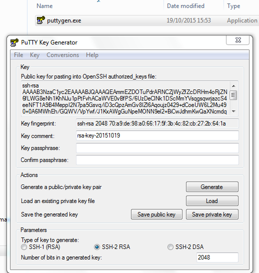

## How to set ssh with asymmetric keys on servers [Back](./qa.md)

### 1. Generate asymmetric keys **private/public**

#### Linux/Mac

```bash
ssh-keygen -t ed25519 -o -a 100 -C "comment here"
ssh-keygen -t rsa -b 4096 -o -a 100 -C "comment here"
```

- **t**: types of key
- **C**: used to tag who the certification belongs to
- **passphrase**: the password to protect private key, which can be empty.

*Notice that: In general, keys will be saved in the `.ssh` directory of the root, in which `id_rsa` is the private one while `id_rsa.pub` is the public one*

#### Windows

In Windows, we can use **PuTTY** to generate private/public keys:



SSH-2 RSA is the default type of keys and number of bits should be **4096** nowadays.

**Public Key**: please copy the key in the top box

### 2. Configure ssh on servers

Generally, servers will use SSH logging in servers provided by OpenSSH, and we should configure it with modifying `sshd_config`

In CentOS and Ubuntu, this file should be in `/etc/ssh/`

```bash
vim /etc/ssh/sshd_config
```

#### Port

Port is **22** by default, and it's suggested that we should change it to a number between **2001** and **65534**

*Notice that: after changing the port, you should add new port to the white list when firewall is opened like iptables or FirewallD in CentOS*

```bash
firewall-cmd --zone=public --add-port=2222/tcp --permanent
```

#### Protocol

In general, we should not use **protocol 1** without any special reason:

```bash
# /etc/ssh/sshd_config
Protocol 2
```

#### Login

Prevent logging in with empty password:

```
PermitEmptyPasswords no
```

Allows user groups when the server is used by more than one person:

```bash
# /etc/ssh/sshd_config
# AllowUsers user1 user2
AllowGroups ssh-users
```

Here is the way to create a group and add users into it:

```bash
groupdd ssh-user
usermod -a -G ssh-user <username>
```

To avoid that users have set a wrong priority for some important files, which will result in prevention from logging  in:

```bash
# /etc/ssh/sshd_config
StrictModes no
```

Allow logging in with keys:

```bash
# /etc/ssh/sshd_config
RSAAuthentication yes
PubkeyAuthentication yes
AuthorizedKeysFile %h/.ssh/authorized_keys
```

#### Optional

Prevent logging in with passwords:

```bash
# /etc/ssh/sshd_config
PasswordAuthentication no
ChallengeResponseAuthentication no
```

*Notice that: this way will make you trouble with locking you out of the server*

Ask for detailed logs:

```bash
# /etc/ssh/sshd_config
LogLevel VERBOSE
```

Allow SFTP like FileZilla to log in:

```bash
# /etc/ssh/sshd_config
Subsystem sftp /usr/local/ssh/libexec/sftp-server
```

### 3. Import public keys into servers

For the first key

```bash
scp ~/.ssh/server_rsa.pub root@<host>:~/.ssh/authorized_keys
```

For next/multiple keys

```bash
scp root@<host>:.ssh/authorized_keys ~/.ssh

cat ~/.ssh/server_rsa.pub >> ~/.ssh/authorized_keys

scp ~/.ssh/authorized_keys root@<host>:~/.ssh/authorized_keys

# or

ssh-copy-id -i ~/.ssh/server_rsa.pub root@<host>
```

```bash
# /root/.ssh/authorized_keys
ssh-rsa AAAAB3NzaC1yc2EAAAADAQABAAACAQDPXJQwmoTAuSysd7wdX6QUyZLzKmwPZ+suk2En//rO+jqISSxFxvODVvxlJKdFuh7QpRSNhsY3QX6phknajo/oY+AFFhSS2RaNgTuLzAhi2gROIjy3sDCzgnDwotrwfugcFvhXXdPWRm2D8HbUfkmcrcYSDaJGYyB99vbJ3I6HMomxOgO8uo3i+LjESN7UX6bjFr5LNqPJ3zohXCF6HVKUdZ5nqeqFcfd1DZvb5pWyOkDr8ko0Br0n+zmMM/A5DlIgUh3zM9jn/CYHU2y2mPRa8jfZAhka1FxCu4AvJWZXsv/70o/cqDR5fqHsc8thiHpemJ4TTppqfKlXcOAhk1VdZV7BY7jyRX47kd21vZOolVmNSJ7i5reIAyPhLzXQrPhci9E1ol+OLQEywiPDfHOwnqmfjmxZJamOjGSzoWKrY/Yg3iC02/aua5uOOXGZVP71d12X9Fy7wdjwWh3vaHj23OeY020H4ffvp2xhd099T5sdL30Q5FCJ92E5d048WOILpRMeKE4e3pBvpygnjR9MqEtAOPTp7P4bw00WmJumQO4GqIDOMK80IxJ1OdLB2/awVaAXOB1HddKiCAR7XeBKqMcOJ+K3feyotFrujczNvp89EDWs1WSZ/ViXkX5dKxqHg+ErB4t8SITpc/BDvlWUg37GzTShh5uJlOes1qcDHQ== aleen's key
```

#### Mac

In Mac, you can directly log in with:

```bash
ssh root@<host>
```

#### Ubuntu

In Ubuntu, you'll find the error **Error: Agent admitted failure to sign using the key**, it means that your client is not yet managing the key, and you should add it as follow to log in:

```bash
SSH_AUTH_SOCK=0 ssh -i ~/.ssh/server_rsa root@<host>
```

#### Windows

- PuTTY:
    - double clicked to open putty
    - input **IP**, **Port** in the right side box *Basic options for you PuTTY session*, and then click **SSH**, and enter a name like **ssh-to-server** to **Save**.
    - click **Connection**, **SSH**, **Auth** in the left side box *Category* and **Browse** the private key you generate in the right side, and click **Open**
    - enter user name **root** to log in
- FileZilla:
    - open FileZilla and click **Edit** > **Settings**
    - choose SFTP in the left side and browse the private key with the button **Add key file**
    - set your SFTP with IP, Port, Protocol which should be SFTP - SSH File Transfer Protocol and, Logon Type, which should be Normal
    - then connect with the name root and a empty password