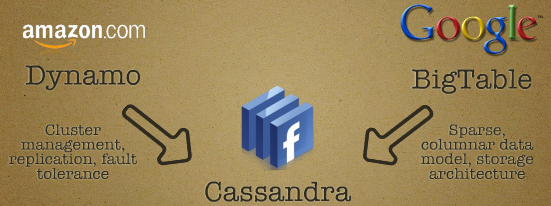

## What is Cassandra [Back](./qa.md)

- **Cassandra** is a ideal database used for social network. It combines **Dynamo** of *Amazon* with **BitTable** of *Google*, which is based on Column Family(列簇).

