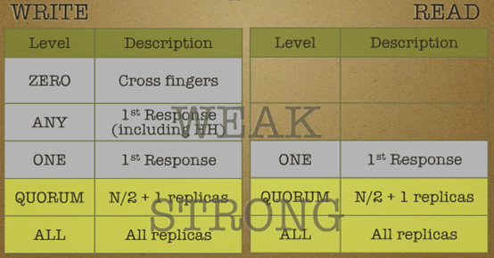

## What is Cassandra [Back](./qa.md)


- **Cassandra** is a ideal database used for social network. It combines **Dynamo** of *Amazon* with **BitTable** of *Google*, which is based on Column Family(列簇).
- Official Suggestion: The Apache Cassandra database is the right choice when you need scalability(可擴展性) and high availability without compromising performance.
- Some characteristics:
    - **Dynamo**:
        - Symmetric(對稱的) P2P framework
            - Without special node(solving the problem of SPOF(單點失效))
        - Distributed Management based on Gossip
        - Store data with distributed hash tables.
            - pluggable partition(可插拔分區)
            - pluggable topologies(可插拔拓撲)
            - pluggable store strategies(可插拔存放策略)
        - Configurable(eventual consistency)
    - **BigTable**:
        - Column Family Data Model
            - configurable, 2-levels maps, super column family
        - SSTable
            - Append-only commit log
            - Memtable(buffer and sort)
            - Unmodifiable SSTable files
        - Integrated **Hadoop**

#### Data Model

- **Column**: the minimum components of a data, and it's composed of **Name**, **Value**, and **Timestamp**.
- *Notice: name and value should be byte[], which a string of any length.*

```json
{
    "name": "email",
    "value": "aleen42@vip.qq.com",
    "timestamp": 1455517240
}
```

- **SuperColumn**: the name is same as Column, while the value is a set of columns. In additionally, they don't have timestamps.

```json
{
    "name": "addresses",
    "value": {
        "street": { "name": "street", "value": "xxx xxx xxx Road", "timestamp": 1455517515 },
        "city": { "name": "city", "value": "Foshan", "timestamp": 1455517515 },
        "zip": { "name": "zip", "value": "528031", "timestamp": 1455517515 }
    }
}
```

- Both **SuperColumn Family** and **Column Family** describe a set of SuperColumn and Column.
- Sorting:
    - *Notice: in Cassandra, data is sorted by Column name by default.*
    - Configurable:
        - Set `CompareWith` Attribute (Column Family)
        - Set CompareSubColumnsWith (SuperColumn Family)
    - Value for configuration:
        - BytesType
        - UTF8Type
        - LexicalUUIDType
        - TimeUUIDType
        - AsciiType
        - Column name

#### Partition Strategies

- In Cassandra, **Token** is the key point for partitions, and there is a unique token for each node, describing the range of data in which. All the tokens will be stored as a ring(Cassandra Ring), and use hash value to calculate.
- There are 3 strategies for partitions in Cassandra:
    - Random Partitioner:
        - Token will be a BitInteger(0 ~ 2<sup>127</sup>), mapped with hash. (In Cassandra, it will take a 128 bits MD5 absolute value, which contains a sign bit)
        - In a in-extreme(極端的) situation, it can map **2<sup>127</sup> + 1** nodes.
        - *Notice: it's not supported that searching data with key in this strategic.*
    - Order Preserving Partitioner(ordered):
        - Token will be a string.
        - It depends on the key to certain which nodes to be chosen
        - *Notice: without Initial Token, system will take a 16 bits random strings which contain numbers and alphabets as the token.*
    - Collating Order Preserving Partitioner(ordered):
        - Token will be a byte.
        - Configurable sorting in different languages(**en_US** by default)
- Partition strategies and Token(including Initial Token) can be set in the file **storage-conf.xml**.

#### Bloom Filter

- Bloom Filter is a random data structure, saving huge space by sacrificing precision. (This structure cannot be applied to applications which are sensitive to accuracy.)
- In Cassandra, each key-value pair will use one byte to complete Bloom Filter.
- Read more details in [Wikipedia](https://en.wikipedia.org/wiki/Bloom_filter)

#### Storage Strategies

- In Cassandra, data will be stored in the local file system of each node with 3 strategic to copy data:
    - Simple Strategy(RackUnaware Strategy): copies will be saved in the next several nodes behind this node.
    - OldNetwork Topology Strategy(RackAware Strategy): one copy will be saved in a different node, while other **N - 2** copies will be saved in other machines in the same node.
    - Network Topology Strategy: M copies will be saved in different nodes, while **N - M - 1** copies will be saved in different machines of the same node.
- Storage mechanisms:
    - Commit Log: Cassandra will log records when writing data like HBase. After logging, data will be written into memtable and flushed into the SSTable, which is read-only once written into. (*In Cassandra, there is no random write*)
    - Memtable: when data has reached the size of a block, it will be flushed into the disk, and stored as SSTable.
    - SSTable: it's read-only and one CF will be corresponding with several SSTable. Bloom Filter will be used to justify which SSTable the key belongs to.
        - Compaction used in Cassandra:
            - Garbage Collect: delete the data which is really signed.
            - Merge SSTable in the same CF.
            - Generate a Merkle Tree.
- Read more details in [IBM documents](http://www.ibm.com/developerworks/cn/opensource/os-cn-cassandraxu2)

#### Sniffing(嗅探)

- Sniffing is mainly used to calculate the distance between different host to tell Cassandra what the topology looks like. There are 3 strategies to configure:
    - org.apache.cassandra.locator.SimpleSnitch: logical distance(the difference between Cassandra Ring)
    - org.apache.cassandra.locator.RackInferringSnitch: the distance depends on rack(the third 8 bits in IP) and data center(the second 8 bits in IP)
    - org.apache.cassandra.locator.PropertyFileSnitch: the distance depends on rack and data center, which
are both configured in the configuration file, **cassandra-topology.properties**.

#### Consistency

- Eventual Consistency is used in Cassandra. Users can choose different level of consistency to use.



- *Notice: the level of consistency depends on the number of copies instead of the number of nodes.*

###### Quorum NRW

- N: means the number of copies once(In generally, **N > 3** in a distributed system to ensure fault-tolerance)
- R: means the minimum of nodes which is successful to read once
- W: means the minimum of nodes which is successful to write once
- In Quorum, consistency will be strong when **W + R > N**, but availability will be low.
- In Quorum, consistency will be weak when **W + R <= N**, but availability will be high. (This will be used generally when eventual consistency is guaranteed)

- In Cassandra, there are 4 methodologies to ensure eventual consistency:
    - Anti-Entropy(逆熵): the mothod used to check consistency called [Merkle Tree](https://en.wikipedia.org/wiki/Merkle_tree).
    - Read Repair: repair in the case that finding it's not consistent when reading data from key A and all the copies of key A.
        - ONE: return a recent copy immediately, and repair in the background. (The first data you read will not be the latest one)
        - QUORUM: return a copy when there is no problems after checking more than half of all copies, and check remaining copies and repair if necessary in the background.
        - ALL: return a copy when there is no problems after checking all.
    - Hinted Handoff(提示提交): write to a relay node when the target is offline, and the relay node will wait for the target to complete writing.
    - Distributed Delete: Cassandra will sign a hint to the object which is deleted by other nodes, and this object will be collected when doing Garbage Collect at the fixed time.
