## How to set up Dlib in the Visual Studio 2013 [Back](./qa.md)

### Introduction

- According to the offical [**document**](http://dlib.net/), we will know that Dlib is a modern C++ toolkit containing **machine learning algorithms** and tools for creating complex software in C++ to solve real world problems. It is open source software and licensed under the Boost Software License.
- Examples of Dlib:
	- 3D Point Cloud
	- Face Detection
	- ...

- With the reason that the [**document**](http://dlib.net/compile.html) about how to compile is too old to use for the Visual Studio 2013, here I have written a document to describe how can we setup Dlib in the version 2013 without CMake.

### Proccess

- Version: Visual Studio 2013 (with update 4)
- The most important things to do before the follow steps is to get your own **Visual Studio 2013** first.

##### 1. Set up the properties

- In this step, you'll need to find out the Property Manager. Here you can see the screen shot of both English Version and Chinese one.
	- en:   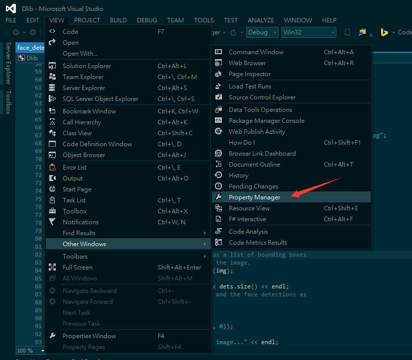
	- zh:   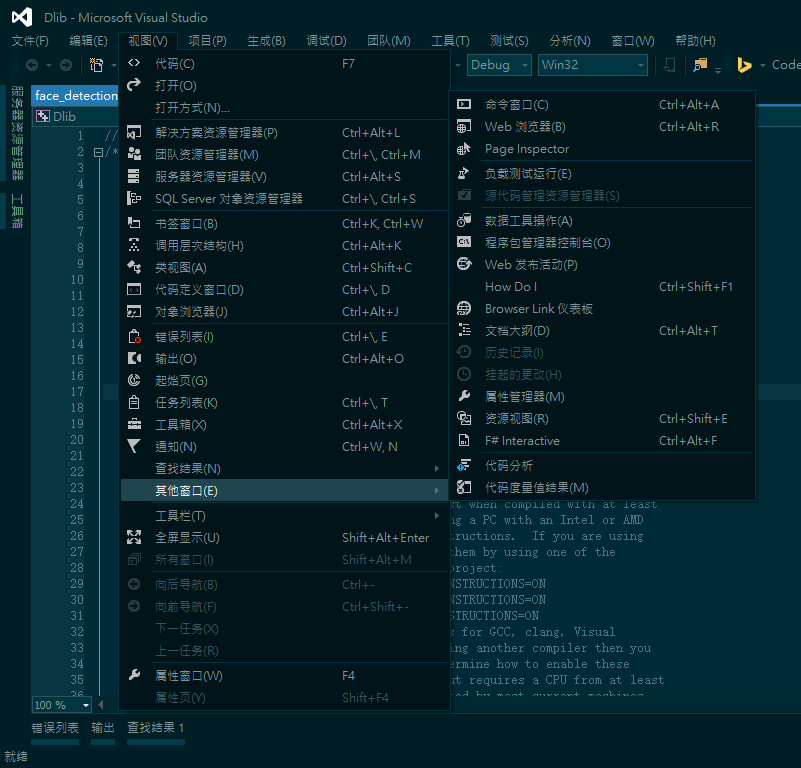
- And then, you'll see that the manager will appear in your right bars, maybe when it's not for you, you can find it in other bars.
	- en:   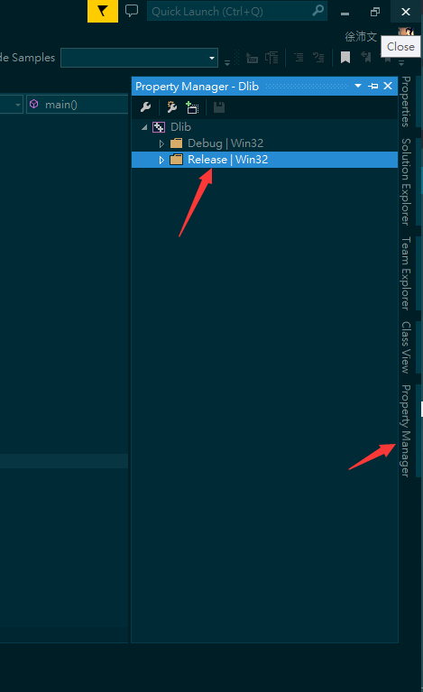
	- zh:   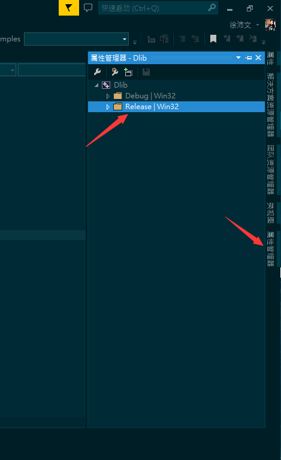
- Open the project, you'll see two directory named **Debug|Win32** and **Release|Win32**. So in the next step, you should click each with right button of your mouse to **Add New Project Property Sheet**.
	- en:   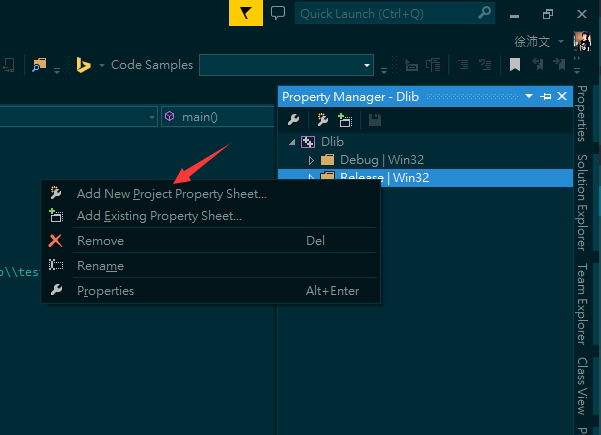
	- zh:   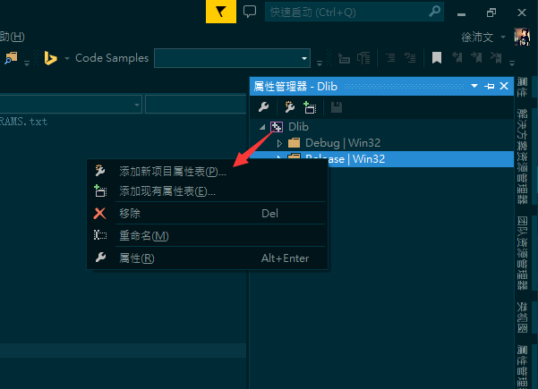
- Here, you can see that I have created sheets for each directory, **dlib_debug** and **dlib_release**. What you should do is to find out **Common Properties** > **VC++ Directories**, and setup two properties, **Include Directories** and **Library Directories**.
	- en:   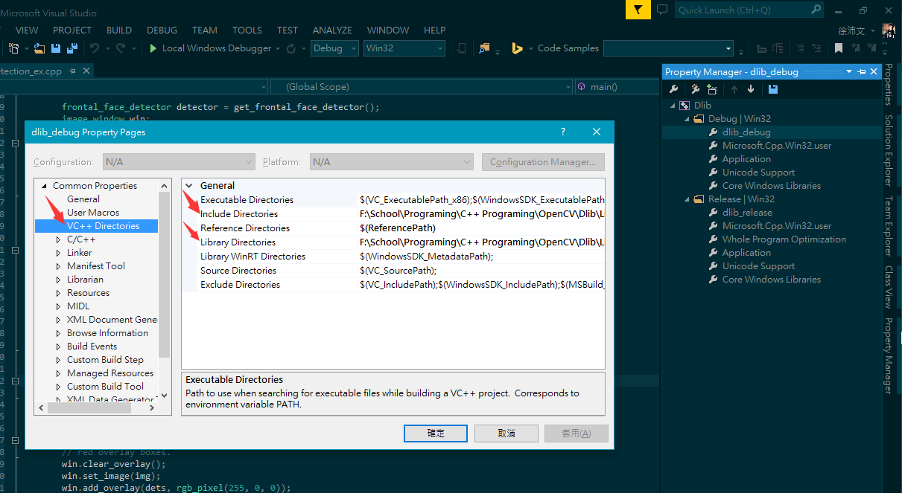
	- zh:   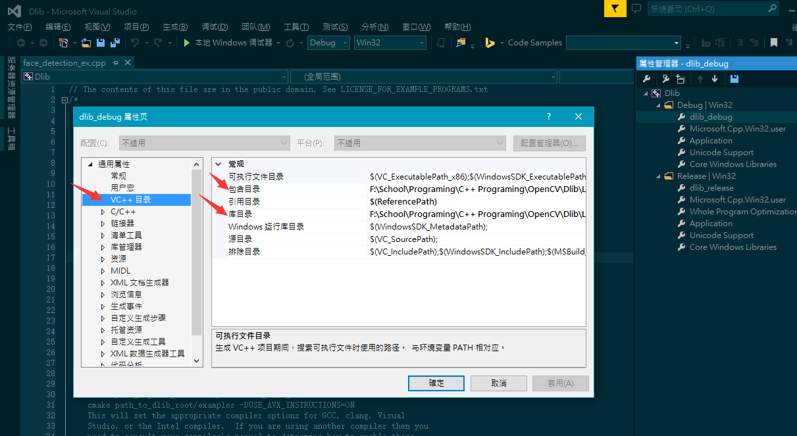
- The path you should set for your own is shown as follows(the path of dlib source files for me is *F:\School\Programing\C++ Programing\OpenCV\Dlib\Lib\dlib*, and of course you can use relative path):
	- en:   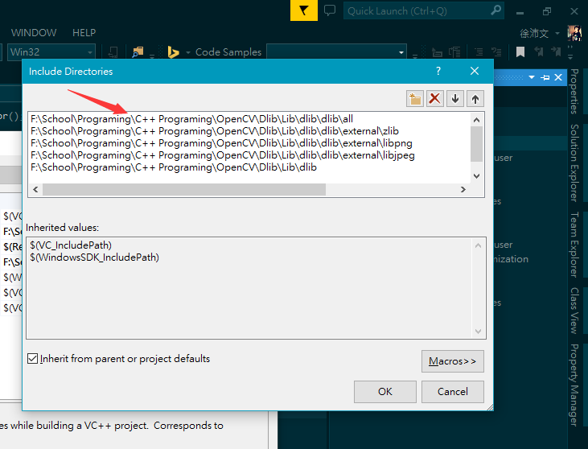 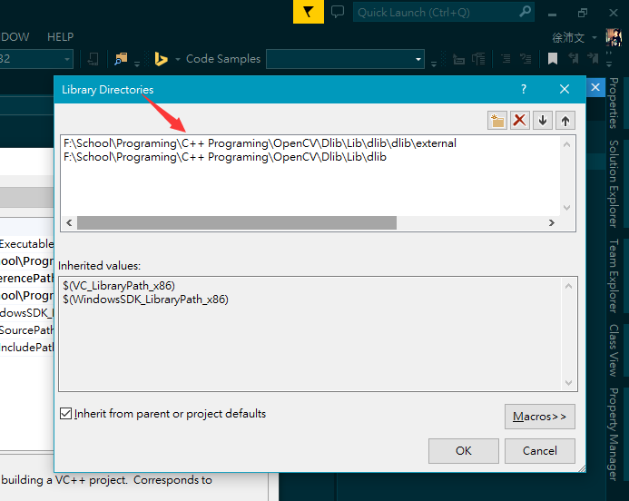
	- zh:   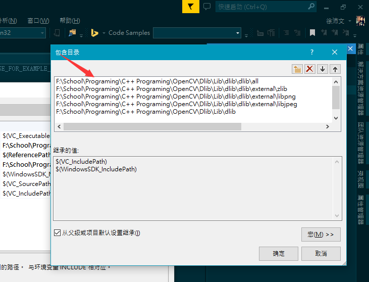 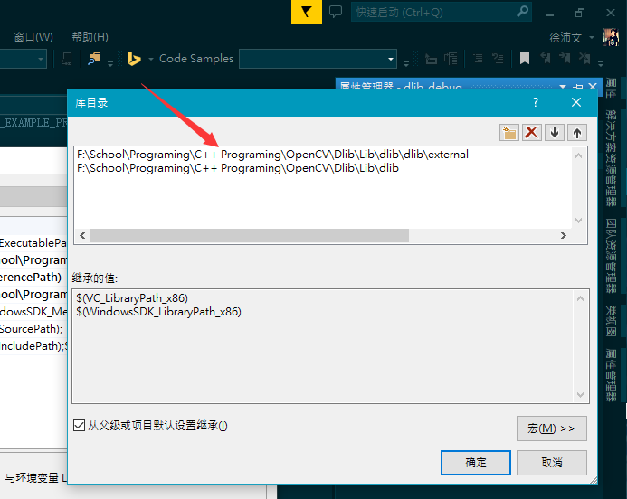
- In additionally, you should set up the preprocessor globaly for all the projects using Dlib.
	- en:   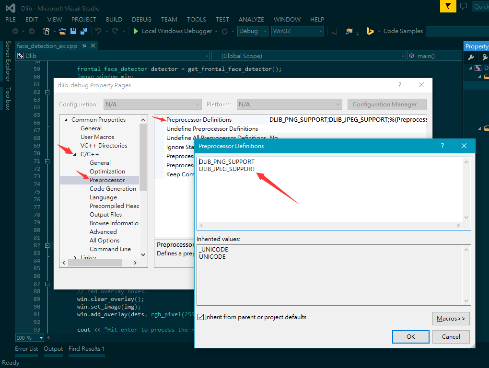
	- zh:   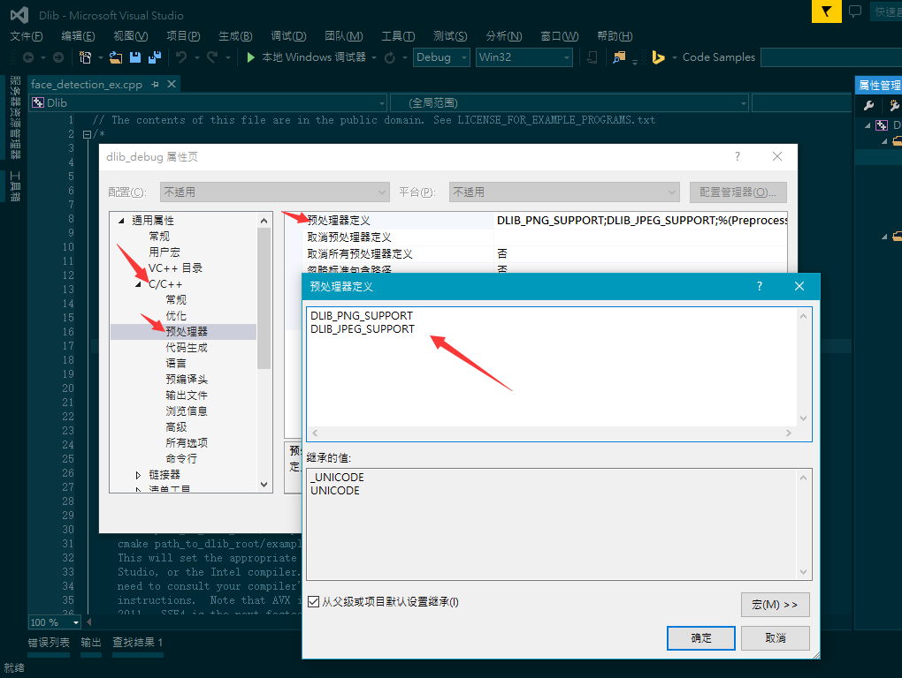
- *Notice that **dlib_release** should be setup like **dlib_debug**.*

##### 2. Include source.cpp

- For all projects using Dlib, the things you should do before is to include the source.cpp. Without it, Visual Studio will have given out some errors like *cannot parse the external link*.
	- en:   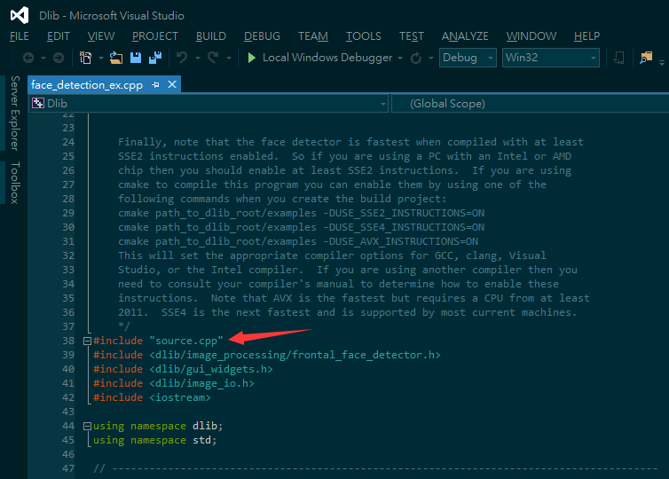
	- zh:   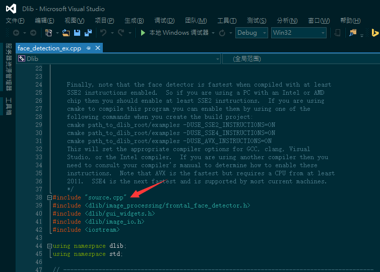

##### 3. Import all the external src files

- The last thing to do is to import all the external file from *dlib\external*. For clear structures, you can create some directories to distinguish them as what I did.
- Firstly, add existed items to the Source File Directory of your project.
	- en:   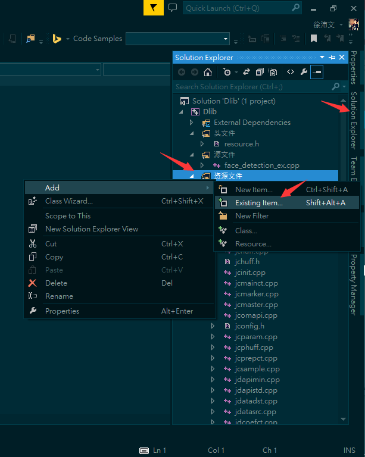
	- zh:   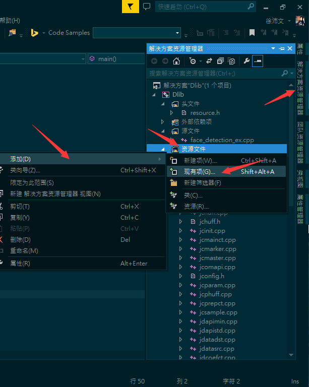
- And then choose all the files from *dlib\external* to add.
	- en:   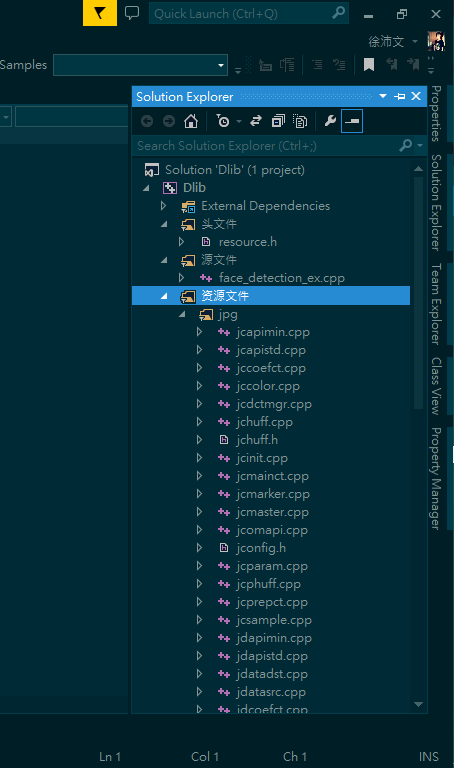
	- zh:   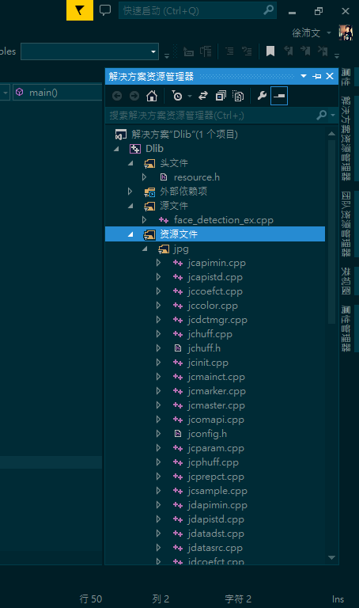
- Finally, the dlib can be used after all those things have been done.
