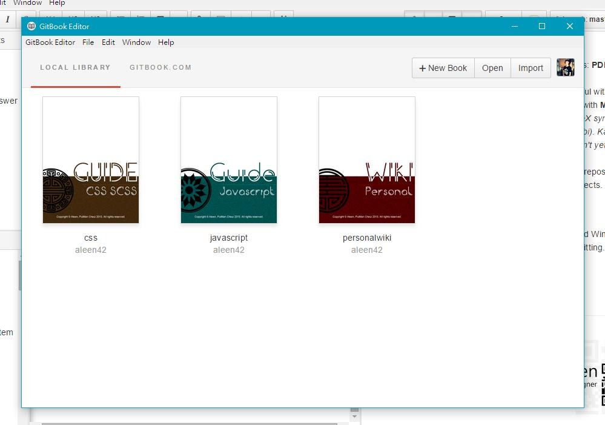

## How to use Gitbook to write something [Back](./qa.md)

#### Introduction

&#160; &#160; &#160; &#160;Firstly, you must know what **Gitbook** is. To put it simple, Gitbook is used as a repository based on [**Git**](./../git/git.md) like Github. The difference point is that Gitbook is usally used for wrting some document or you can also write a book. Anyway, you can see as a cloud to store your writing works, and contorl the books' version by commands. For more details, you can look at the official [**documents**](https://help.gitbook.com/).
 
&#160; &#160; &#160; &#160;With the reason that using it well, I just wrote down this document to be used after when necessnary, as a note.

#### The purpose of using Gitbook

- You can generate your books with the follow formats: **PDF**, **ePub**, **mobi** or just a **website**.
- You can use **Markdown** to make your works beautiful with formal layout.
- You can use **TeX** to add mathematical expressions with **MathJax** or **KaTeX**. (*Notice that: MathJax supports the entire TeX syntax, but the output is not perfect on ebooks (PDF, ePub and Mobi). KaTeX renders perfectly on all formats (web and ebooks), but doesn't yet support all the syntax.*)
- Because Gitbook can be used to connect to Github repositories, it's convenient to use Gitbook to documenting your projects.

#### How to use Gitbook

Gitbook has supported GUI editor for Linux, Mac and Windows. For convenience, it's recommended to use it for your writting. [**Here**](https://www.gitbook.com/editor) is the download link.
    - you can see the interface as follow:
    - the option **GITBOOK.COM** is to show your remote books on the Gitbook server. In **LOCAL LIBRARY**, you can find out your local projects cloned from the remote server.

