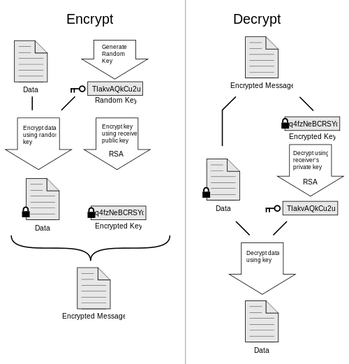

## PGP Encryption [Back](./qa.md)

- **PGP** (Pretty Good Privacy) is a data encryption and decryption computer program that provide **cryptographic privacy**(隱私加密術) and **authentication** for data communication.
- PGP is often used for signing, encrypting, and decrypting texts, e-mails, files, directories, and whole disk partitions(劃分) and to increase the security of e-mail communications. It was created by *Phil Zimmermann* in 1991
- Combinations: **hashing**, **data compression**, **symmetric-key cryptography**(鑰匙加密技術), and finally **public-key cryptography**(公鑰加密技術)

