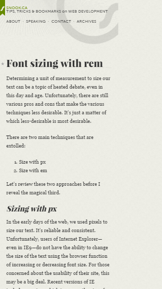

## How to use powerful rem with responsive web app development [Back](./qa.md)

### What is rem? and the difference between em?

**rem(font size of the root element)** is a relative unit of font size in the root element. In an other words, If the root element `html` in a HTML document has set the attribute `font-size` as follow:

```css
html {
    font-size: 100px;
}
```

then, 1 rem means 100px and 0.5 rem of course means 50px.

**em(font size of the element)** is also a relative unit of font size. The variety from rem is that em is relative to its parent elements. For example:

```html
<div class="box box__parent">
    <div class="box box__children">
    </div>
</div>
```

```css
.box__parent {
    font-size: 100px;
}
```

what you can see is that the font size of the parent box is 100x, and then 0.5em should be 50px for the children box.

### Powerful value in developing web app

Currently, there are many solutions about the problem of responsive web in a mobile. Some will directly set a absolute value of width in an element, and some will use percent value to set width and the height will be a fixed value. Anyway, here I will have a short description of these methods and have a comparison with rem.

#### Flow Layout

Set width with percent values and set height with fixed values

```css
.box__element {
    width: 28%;
    height: 20px;
}
```

Shortcut:

This solution will result in plenty of responsive problems, and limit the designers' design. With different width of screen, elements in this way should be scaled with different width, but have the same height. Therefore, designers should only consider about elemnts that can be stretched transversely like Amazon inc.


#### Fixed Width

Set the main container of the page site with a fixed width value.

Shortcut:

Websites will leave a blank area in the left or right or both parts.



#### Responsive

Consider all width and height with percent values.

Shortcut:

This solution should be a huge job, because it should consider a lot of percent values. Of course, it's hard to maintain code in this way, because you should consider all other values when changing one of them.

#### Chaging viewport

Change view port scale value directly based on 320px, and this is a solution of Tmall. And the max scale should be 1.3: **320px * 1.3 = 416px**.

Shortcut:

Images in this way should be blurred.

#### Powerful rem

CSS

```css
html {
    /** based on the width of iPhone 6: 375px */
    font-size: calc(100vw / 3.75);
}
```

JavaScript

```js
document.documentElement.style.fontSize = $(document.documentElement).width() / 3.75 + 'px';
$(window).on('resize', function () {
    document.documentElement.style.fontSize = $(document.documentElement).width() / 3.75 + 'px';
});
```

The value of 3.75 should depends on the designers. If designers design with iPhone 6 Plus, and you should set 4.14.

Then, 1px should be 0.01rem.
