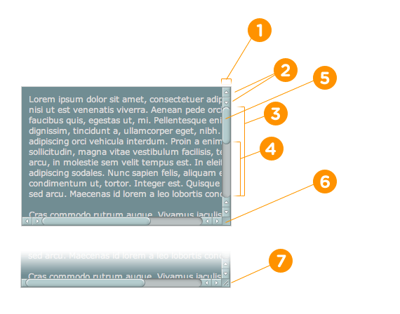
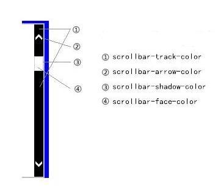

## How to write a new scroll bar with CSS [Back](./qa.md)

#### Chrome

```css
/** Webkit */
::-webkit-scrollbar {
    /** if you want to style your own scroll bar, this pseudo should be written */
    /** Part 1 */
}

::-webkit-scrollbar-button {
    /** Part 2 */
}

::-webkit-scrollbar-track {
    /** Part 3 */
}

::-webkit-scrollbar-track-piece {
    /** Part 4 */
}

::-webkit-scrollbar-thumb {
    /** Part 5 */
}

::-webkit-scrollbar-corner {
    /** Part 6 */
}

::-webkit-resizer {
    /** Part 7 */
}
```



#### IE

```css
/** ms */
body {
    /** Part 1 */
    scrollbar-track-color: #666;
    
    /** Part 2 */
    scrollbar-arrow-color: #000;
    
    /** Part 3 */
    scrollbar-shadow-color: #eee;
    
    /** Part 4 */
    scrollbar-face-color: #a10000;
}
```



#### Demo

<p data-height="266" data-theme-id="21735" data-slug-hash="xVgyKR" data-default-tab="result" data-user="aleen42" class="codepen">See the Pen <a href="http://codepen.io/aleen42/pen/xVgyKR/">xVgyKR</a> by aleen42 (<a href="http://codepen.io/aleen42">@aleen42</a>) on <a href="http://codepen.io">CodePen</a>.</p>
<script async src="//assets.codepen.io/assets/embed/ei.js"></script>
