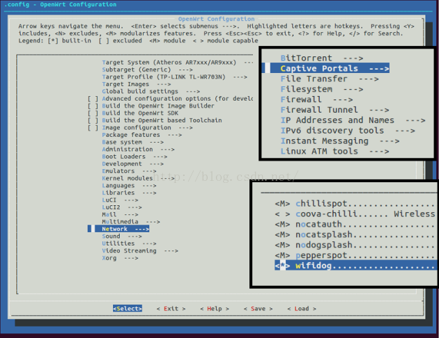

## Set up portal with WifiDog + AuthPuppy [Back](./qa.md)

- Router Firmware: **OpenWRT/DDWRT**
- Gateway: **WifiDog**
- Auth Server: **AuthPuppy**

### Process between the router and the server

1. Router: redirect to `/login?gw_id&gw_port&gw_address&url`
2. Server: access `192.168.1.1/wifidog/auth?token`
3. Router: redirect to `/auth?stage=login&mac&gw_id&ip&token`
4. Server: return `Auth: 5`
5. Router: redirect to `/auth?stage=counters&mac&gw_id&ip&token`
6. Server: return `Auth: 0` or `Auth: 1`

### Installation of AuthPuppy

i. Download AuthPuppy from https://launchpad.net/authpuppy

ii. Unzip the file

```bash
tar -zxvf authpuppy-1.0.0-stable.tgz
```

iii. Move `authpuppy/` to `/var/www`

```bash
mv authpuppy /var/www/
```

iv. Change authority owner

```bash
chown -R www-data:www-data /var/www/authpuppy
```

v. Create mysql

vi. Create Apache/Nginx

- Website Path: `/var/www/authpuppy/web/`

nginx setting:

```bash
server{
    listen 80;
    index index.php index.html index.htm;
    server_name authpuppy.soundtooth.cn;

    root /var/www/authpuppy/web/;

    set $subdomain "";

    if ( $host ~* (\b(?!www\b)\w+)\.\w+\.[a-zA-Z]+$ ) {
        set $subdomain /$1;
    }

    client_max_body_size 200M;

    location / {
        try_files $uri $uri/ /index.php?q=$uri&$args;
    }

    error_page 404 /404.html;

    error_page 500 502 503 504 /50x.html;

    location = /50x.html {
        root /usr/share/nginx/www;
    }

    # pass the PHP scripts to FastCGI server listening on 127.0.0.1:9000
    location ~ \.php$ {
        # With php5-fpm:
        fastcgi_pass unix:/var/run/php5-fpm.sock;

        fastcgi_index index.php;

        fastcgi_param  SCRIPT_FILENAME    $document_root$fastcgi_script_name;

        #fastcgi_param SCRIPT_FILENAME /var/www/$domain$subdomain$fastcgi_script_name;
        include fastcgi_params;
    }
}
```

vii. Open http://authpuppy.soundtooth.cn/ to start installation

### Create a new node for a router

Login to authpuppy to create nodes for each router:

- Name
- gw id: Gateway id
- Deployment status: deployed
- Optional

### Configuration of routers

i. Install WifiDog

- OpenWRT: `opkg install wifidog`

*Notice that: if your firmware does not have the package wifidog, you should re-build one. And choose wifidog in Network -> Captive Portals after `make menuconfig`.*



- DDWRT: has been installed by default

ii. Configure WifiDog

```bash
# vim /etc/wifidog.conf
AuthServer {
    Hostname auth.blackmagic.science
    SSLAvailable no
    Path /
}
```

iii. Start WifiDog

```bash
/etc/init.d/wifidog enable

# or

/etc/init.d/wifidog start
```
