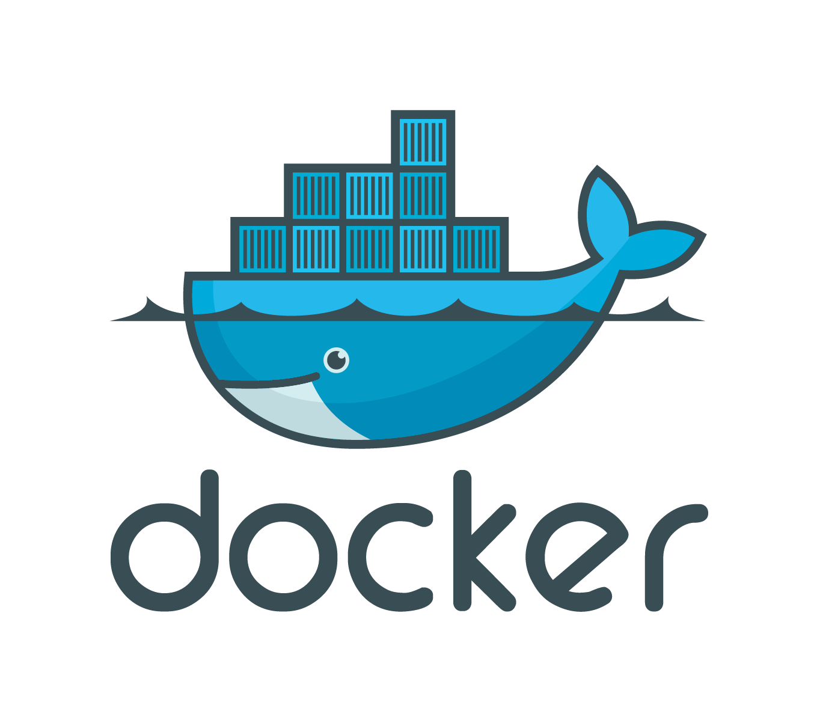

## Docker	[Back](./../summary.md)



### Othere Languages

- [**Chinese**](./zh.md)

### Menu

- [**1. Install**](#1)
- [**2. About images & containers**](#2)
- [**3. About finding the whalesay image**](#3)
- [**4. About building an image**](#4)
- [**5. About creating a repository**](#5)
- [**6. Tag, push and pull images**](#6)

<br />
<br />
<br />
<br />
<br />
<br />

<h3 id="1"> 1. Install</h3>

- i. Log into your Ubuntu installation as a user with `sudo` privileges.
- ii. Verify that you have `wget` installed.
	- Check
	```bash
$ which wget
```
	- If `wget` isn't installed, install it after updating your manager:
	```bash
$ sudo apt-get update
$ sdo apt-get install wget
```

- iii. Get the latest Docker package.
	- The system prompts you for your `sudo` password. Then, it downloads and installs Docker and its dependencies.
	```bash
$ wget -q0- https://get.docker.com/ | sh
```
	- **Note1:** If your company is behind a filtering proxy, you may find that the `apt-key` command fails for the Docker repo during installation. To work around this, add the key directly using the following:
	```bash
$ wget -qO- https://get.docker.com/gpg | sudo apt-key add -
```
	- **Note2:** Docker currently only supports 64bit platforms.

- iv: Verify `docker` is installed correctly:

	```bash
$ docker run hello-world
```
	```
	Unable to find image 'hello-world:latest' locally
latest: Pulling from library/hello-world
535020c3e8ad: Pull complete
af340544ed62: Pull complete
Digest: sha256:a68868bfe696c00866942e8f5ca39e3e31b79c1e50feaee4ce5e28df2f051d5c
Status: Downloaded newer image for hello-world:latest
```
	- The following message shows that your installation appears to be working correctly.
	```bash
Hello from Docker.
```
	- To generate this message, Docker took the following steps:
 		- 1. The Docker client contacted the Docker daemon.
 		- 2. The Docker daemon pulled the "hello-world" image from the Docker Hub.
 		- 3. The Docker daemon created a new container from that image which runs the executable that produces the output you are currently reading.
 		- 4. The Docker daemon streamed that output to the Docker client, which sent it to your terminal.

	- To try something more ambitious, you can run an Ubuntu container with:
	```bash 
$ docker run -it ubuntu bash
```
	- Share images, automate workflows, and more with a free Docker Hub account: [https://hub.docker.com](https://hub.docker.com)
	- For more examples and ideas, visit: [https://docs.docker.com/userguide/](https://docs.docker.com/userguide/)

<br />
<br />
<br />
<br />
<br />
<br />

<h3 id="2"> 2. About images & containers</h3>

- As the last step in your installation, you ran the docker run `hello-world` command. With this one command, you completed the core tasks to using Docker. The command you ran had three parts.


- A **container**: A container is a stripped-to-basics version of a Linux operating system.
- An **image**: An image is software you load into a container.
- When you ran the command, the Docker software:
	1. checked to see if you had the `hello-word` software image
	2. downloaded the image from the Docker Hub (more about the hub later)
    3. loaded the image into the container and “ran” it
- Depending on how it was built, an image might run a simple, single command and then exit. This is what `hello-world` did.
- A Docker image, though, is capable of much more. An image can start software as complex as a database, wait for you (or someone else) to add data, store the data for later use, and then wait for the next person.
- Who built the `hello-world` software image though? In this case, Docker did but anyone can. Docker lets people (or companies) create and share software through Docker images. Using Docker, you don't have to worry about whether your computer can run the software in a Docker image — a Docker container can always run it.

<br />
<br />
<br />
<br />
<br />
<br />

<h3 id="3"> 3. About finding the whalesay image</h3>

- People all over the world create Docker images. You can find these images by browsing the Docker Hub.

##### Step1: Locate the whalesay image

- i. Open your browser and browse to [**the Docker Hub**](https://hub.docker.com/?utm_source=getting_started_guide&utm_medium=embedded_Linux&utm_campaign=find_whalesay).
	- The Docker Hub contains images from individuals like you and official images
from organizations like RedHat, IBM, Google, and a whole lot more.
- ii. Click Browser & Search.
- iii. Enter the word `whalesay` in the search bar.
- iv. Click on the `docker/whalesay` image in the results.
	- Each image repository contains **information** about an image. It should include information such as **what kind of software the image contains** and **how to use it**. You may notice that the whalesay image is based on a Linux distribution called Ubuntu. In the next step, you run the whalesay image on your machine.

##### Step2: Run the Whalesay image

- i. Call the following comand in the terminal:
	- The first time you run a software image, the `docker` command looks for it on your local system. If the image isn't there, then `docker` gets it from the hub.
	```bash 
$ docker run docker/whalesay cowsay boo
```
- ii. Find what images you have by calling the following command:
	- When you run an image in a container, Docker downloads the image to your computer. This local copy of the image saves you time. Docker only downloads the image again if the image's source changes on the hub. You can, of course, delete the image yourself. (You'll learn more about that later)
	```bash 
$ docker images
REPOSITORY           TAG         IMAGE ID            CREATED            VIRTUAL SIZE
docker/whalesay      latest      fb434121fc77        3 hours ago        247 MB
hello-world          latest      91c95931e552        5 weeks ago        910 B
```

<br />
<br />
<br />
<br />
<br />
<br />

<h3 id="4"> 4. About building an image</h3>

##### Step1: Write a Dockerfile

- i. Make a new directory:

	```bash
$ mkdir mydocker build
```

- ii. Create a text file called `Dockerfile` in te new directory:
	- A Dockerfile describes the software that is “baked” into an image. It isn't just ingredients tho, it can tell the software what environment to use or what commands to run. Your recipe is going to be very short.
	```bash
$ cd mkdocker
$ vim Dockerfile
```
- iii. Add a line to the text file:
	- The FROM keyword tells Docker which image your image is based on. Whalesay is cute and has the `cowsay` program already, so we'll start there.
	```txt
FROM docker/whalesay:latest
```
- iv. Add the `fortunes` programe to the image:
	- The `fortunes` program has a command that prints out wise sayings for our whale to say. So, the first step is to install it. This line installs the software into the image.
	```bash
RUN apt-get -y update && apt-get install -y fortunes
```
- v. Once the image has the software it needs, you instruct the software to run when the image is loaded:
	- This line tells the `fortune` program to pass a nifty quote to the `cowsay` program.
	```bash
CMD /usr/games/fortune -a | cowsay
```
- vi. Save and close the text file.
- At this point, you have all your software ingredients and behaviors described in a Dockerfile. You are ready to build a new image

##### Step2: Build an image from your Dockerfile

- Now, build your new image by typing the `docker build -t docker-whale .` command in your terminal (don't forget the . period). (This proccess will take several seconds to run and reports its outcomd)
	
	```
Sending build context to Docker daemon 158.8 MB
...snip...
Removing intermediate container a8e6faa88df3
Successfully built 7d9495d03763
```

##### Step3: Learn about the build process

- The `docker build -t docker-whale .` command takes the `Dockerfile` in the current directory, and builds an image called `docker-whale` on your local machine. The command takes about a minute and its output looks really long and complex. In this section, you learn what each message means.
- First Docker checks to make sure it has everything it needs to build.
	
	```
Sending build context to Docker daemon 158.8 MB
```

- Then, Docker loads with the `whalesay` image. It already has this image locally as your might recall from the last page. So, Docker doesn't need to download it.
	
	```
Step 0 : FROM docker/whalesay:latest
 ---> fb434121fc77
```

- Docker moves onto the next step which is to update the `apt-get` package manager. This takes a lot of lines, no need to list them all again here.
	
	```
Step 1 : RUN apt-get -y update && apt-get install -y fortunes
 ---> Running in 27d224dfa5b2
Ign http://archive.ubuntu.com trusty InRelease
Ign http://archive.ubuntu.com trusty-updates InRelease
Ign http://archive.ubuntu.com trusty-security InRelease
Hit http://archive.ubuntu.com trusty Release.gpg
....snip...
Get:15 http://archive.ubuntu.com trusty-security/restricted amd64 Packages [14.8 kB]
Get:16 http://archive.ubuntu.com trusty-security/universe amd64 Packages [134 kB]
Reading package lists...
---> eb06e47a01d2
```

- Then, Docker installs the new `fortunes` software.
	
	```
Removing intermediate container e2a84b5f390f
Step 2 : RUN apt-get install -y fortunes
 ---> Running in 23aa52c1897c
Reading package lists...
Building dependency tree...
Reading state information...
The following extra packages will be installed:
  fortune-mod fortunes-min librecode0
Suggested packages:
  x11-utils bsdmainutils
The following NEW packages will be installed:
  fortune-mod fortunes fortunes-min librecode0
0 upgraded, 4 newly installed, 0 to remove and 3 not upgraded.
Need to get 1961 kB of archives.
After this operation, 4817 kB of additional disk space will be used.
Get:1 http://archive.ubuntu.com/ubuntu/ trusty/main librecode0 amd64 3.6-21 [771 kB]
...snip......
Setting up fortunes (1:1.99.1-7) ...
Processing triggers for libc-bin (2.19-0ubuntu6.6) ...
 ---> c81071adeeb5
Removing intermediate container 23aa52c1897c
```

- Finally, Docker finishes the build and reports its outcome
	
	``` bash
Step 3 : CMD /usr/games/fortune -a | cowsay
 ---> Running in a8e6faa88df3
 ---> 7d9495d03763
Removing intermediate container a8e6faa88df3
Successfully built 7d9495d03763
```

##### Step 4: Run your new docker-whale

- i. Check the new image you created:
	
	```bash
$ docker images
REPOSITORY           TAG          IMAGE ID          CREATED             VIRTUAL SIZE
docker-whale         latest       7d9495d03763      4 minutes ago       273.7 MB
docker/whalesay      latest       fb434121fc77      4 hours ago         247 MB
hello-world          latest       91c95931e552      5 weeks ago         910 B
```

- ii. Run your new image by typing `docker run docker-whale`:
	
	```bash
$ docker run docker-whale
```

<br />
<br />
<br />
<br />
<br />
<br />

<h3 id="5"> 5. About creating a repository</h3>

##### Step 1: Sign up an acount on Docker Hub
##### Step 2: Verify your email and add a repository

<br />
<br />
<br />
<br />
<br />
<br />

<h3 id="6"> 6. Tag, push and pull images</h3>

##### Step 1: Tag and push the image

- i. List the images you currently have:

	```bash
$ docker images
REPOSITORY           TAG          IMAGE ID            CREATED             VIRTUAL SIZE
docker-whale         latest       7d9495d03763        38 minutes ago      273.7 MB
<none>               <none>       5dac217f722c        45 minutes ago      273.7 MB
docker/whalesay      latest       fb434121fc77        4 hours ago         247 MB
hello-world          latest       91c95931e552        5 weeks ago         910 B
```

- ii. Find the `IMAGE ID` for your `docker-whale` image.
	- In this case, the id is `7d9495d03763`.
	- You'll notice that currently, the `REPOSITORY` shows the repository but not the namespace for `docker-whale`. You need to include the `namespace` for Docker Hub to associate it with your account.  The `namespace` is the same as your account name.
- iii. Use `IMAGE ID` and the `docker tag` command to tag your `docker-whale` image.


- iii. Type the `docker images` command again to see your newly tagged image.

	```bash
$ docker images
REPOSITORY                  TAG       IMAGE ID        CREATED          VIRTUAL SIZE
maryatdocker/docker-whale   latest    7d9495d03763    5 minutes ago    273.7 MB
docker-whale                latest    7d9495d03763    2 hours ago      273.7 MB
<none>                      <none>    5dac217f722c    5 hours ago      273.7 MB
docker/whalesay             latest    fb434121fc77    5 hours ago      247 MB
hello-world                 latest    91c95931e552    5 weeks ago      910 B
```

- iv. Use the `docker login` command to log into the Docker Hub from the command line.

	```bash
docker login --username=yourhubusername --password=yourpassword --email=youremail@company.com
```

- v. Type the `docker push` command to push your image to your new repository.

	```bash
$ docker push maryatdocker/docker-whale
The push refers to a repository [maryatdocker/docker-whale] (len: 1)
7d9495d03763: Image already exists
c81071adeeb5: Image successfully pushed
eb06e47a01d2: Image successfully pushed
fb434121fc77: Image successfully pushed
5d5bd9951e26: Image successfully pushed
99da72cfe067: Image successfully pushed
1722f41ddcb5: Image successfully pushed
5b74edbcaa5b: Image successfully pushed
676c4a1897e6: Image successfully pushed
07f8e8c5e660: Image successfully pushed
37bea4ee0c81: Image successfully pushed
a82efea989f9: Image successfully pushed
e9e06b06e14c: Image successfully pushed
Digest: sha256:ad89e88beb7dc73bf55d456e2c600e0a39dd6c9500d7cd8d1025626c4b985011
```

##### Step 2: Pull a new image

- In this last section, you'll pull the image you just pushed to hub. Before you do that though, you'll need to remove the original image from your local machine. If you left the original image on your machine. Docker would not pull from the hub — why would it? The two images are identical.
- i. Use the `docker rmi` to remove the `maryatdocker/docker-whale` and `docker-whale` images.
	- You can use an ID or the name to remove an image.
	```bash
$ docker rmi -f 7d9495d03763
$ docker rmi -f docker-whale
```

- ii. Pull a new image from your repository using the `docker pull` command.
	- The command you type should include your username from Docker Hub.
	```bash
$ docker pull yourusername/docker-whale
```
