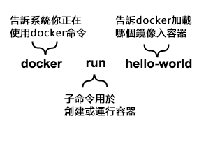
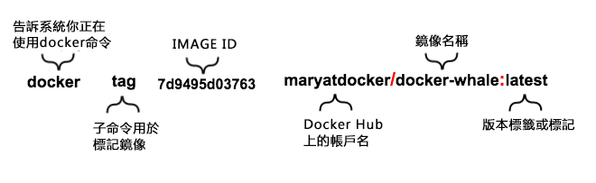

## Docker	[Back](./../summary.md)


### 其他語言

- [**英文**](./en.md)

### 目录

- [**1. 安裝**](#1)
- [**2. 關於鏡像和容器**](#2)
- [**3. 關於從Docker Hub找到鏡像**](#3)
- [**4. 關於創建鏡像**](#4)
- [**5. 關於建立倉庫**](#5)
- [**6. 標記, 推送, 回拉鏡像**](#6)

<br />
<br />
<br />
<br />
<br />
<br />

<h3 id="1"> 1. 安裝</h3>

- i. 在超級管理員權限下登錄Ubuntu, 或者用`sudo`執行命令
- ii. 保證你已經安裝`wget`
	- 檢測方式
	```bash
$ which wget
```
	- 如果`wget`沒有安裝, 則在更新安裝包管理器後安裝`wget`
	```bash
$ sudo apt-get update
$ sdo apt-get install wget
```

- iii. 獲取最新的docker安裝包.
	- 系統會索取你的`sudo`密碼. 然後, 它會下載並安裝Docker及其依賴包.
	```bash
$ wget -q0- https://get.docker.com/ | sh
```
	- **提醒1:** 如果公司使用了代理服務器, 那麼你可能會發現安裝過程會出現`apt-key`命令出錯. 為了解決問題, 直接通過下面的命令來添加這個鑰匙:
	```bash
$ wget -qO- https://get.docker.com/gpg | sudo apt-key add -
```
	- **提醒2:** Docker目前只支持64位系統

- iv: 確保 `docker` 安裝成功的方法:

	```bash
$ docker run hello-world
```
	```
	Unable to find image 'hello-world:latest' locally
latest: Pulling from library/hello-world
535020c3e8ad: Pull complete
af340544ed62: Pull complete
Digest: sha256:a68868bfe696c00866942e8f5ca39e3e31b79c1e50feaee4ce5e28df2f051d5c
Status: Downloaded newer image for hello-world:latest
```
	- 下面這條消息表示你已經成功安裝`Docker`.
	```bash
Hello from Docker.
```
	- `Docker`通過了下面的步驟來顯示這條信息
 		1. Docker客戶端連接了Docker虛擬機.
 		2. Docker虛擬機從Docker Hub上拉"hello-world"的鏡像到本地.
 		3. Docker虛擬機通過這個鏡像創建一個新的容器, 並通過這個容器運行可執行文件從而產生數據流.
 		4. Docker虛擬機把消息數據流發送到Docker客戶端, 然後由客戶端把消息顯示在終端上.

	- 如果想嘗試更野心的東西, 你可以通過下面的指令來運行一個Ubuntu容器
	```bash 
$ docker run -it ubuntu bash
```
	- 通過一個免費的Docker Hub帳號, 分享鏡像, 自動化工作流或其他東西: [https://hub.docker.com](https://hub.docker.com)
	- 更多例子和想法, 請瀏覽: [https://docs.docker.com/userguide/](https://docs.docker.com/userguide/)

<br />
<br />
<br />
<br />
<br />
<br />

<h3 id="2"> 2. 關於鏡像和容器</h3>

- 在上一部安裝中過程中, 你用Docke執行了`docker run hello-world`的指令. 其實這一過程已經完成了Docker的核心任務. 該條指令分為了三個部分:



- **容器**: Linux操作系統的最核心版本. (容器是由Linux內核提供的)
- **鏡像**: 可加載到容器的軟件.
- 如果你執行該條指令, Docker會進行下面的步驟:
	1. 檢測你是否擁有`hello-world`的鏡像
	2. 如果沒有, 則從Docker Hub上下載該鏡像下來 (後面會討論到Docker Hub)
	3. 把鏡像加載到容器中並執行
- 實際當中, 一個Docker鏡像可能只是像`hello-word`鏡像一樣執行一條簡單的, 單一的指令, 然後退出.
- 然而, 一個Docker鏡像可以承載更多的東西. 如一個鏡像可以啟動像數據庫一樣複雜的軟件, 然後進行操作數據並等待下一個人去操作數據.
- 那麼是誰創建了`hello-word`鏡像呢? 在這個例子中, 是Docker創建的, 而且我們也可以自己創建自己的鏡像. 如果使用Docker, 你就能運行所有Docker鏡像中能運行的軟件.

<br />
<br />
<br />
<br />
<br />
<br />

<h3 id="3"> 3. 關於從Docker Hub找到鏡像</h3>

- 來自四面八方的人都在創建鏡像, 而你可以通過Docker Hub來找到這些鏡像.

##### 步驟1: 定位你想要找的鏡像

- i. 打開瀏覽器並瀏覽[**Docker Hub**](https://hub.docker.com/?utm_source=getting_started_guide&utm_medium=embedded_Linux&utm_campaign=find_whalesay).
	- Docker Hub 包含私人鏡像以及像RedHat, IBM, Google或其他的.
- ii. 點擊搜索框`Browser & Search`.
- iii. 在搜索框輸入單詞 `whalesay`.
- iv. 在結果列表中點擊`docker/whalesay`鏡像.
	- 每一個鏡像倉庫都包含關於這個鏡像的信息. 這些信息應該包括**镜像中包含哪種類型的軟件**和**如何去使用這個鏡像**. 你會發現`docker/whale`鏡像是基於Linux的一個發行版, Ubuntu. 下一步將會介紹如何去運行這個鏡像.

##### 步驟2: 執行`Whalesay`鏡像

- i. 在終端執行下面的命令:
	- 第一次執行這個鏡像時, 這條指令會先查詢本地系統是否擁有這個鏡像. 如果鏡像不存在, `Docker`會從Docker Hub上下載到本地
	```bash 
$ docker run docker/whalesay cowsay boo
```
- ii. 通過執行下面的命令來查詢本地含有哪些鏡像:
	- 當你第一次在容器中執行一個鏡像且本地無該镜像时, Docker會下載該鏡像到你的電腦上. 這個本地的緩存將會大大節省你的時間. Docker只會在遠程的鏡像源產生改變時, 才會重新下載. 當然你也可以刪除你的鏡像. (刪除鏡像將會在後面介紹)
	```bash 
$ docker images
REPOSITORY           TAG         IMAGE ID            CREATED            VIRTUAL SIZE
docker/whalesay      latest      fb434121fc77        3 hours ago        247 MB
hello-world          latest      91c95931e552        5 weeks ago        910 B
```

<br />
<br />
<br />
<br />
<br />
<br />

<h3 id="4"> 4. 關於創建鏡像</h3>

##### Step1: 寫一個Dockerfile

- i. 創建一個新的文件夾:

	```bash
$ mkdir mydocker build
```
- ii. 在該文件夾新建一個文本文件叫`Dockerfile`:
	- 一個`Dockfile`用於描述備份在一個鏡像中的軟件, 可並不只是集成軟件. 它還可以繼承環境和命令, 且使得你的"烹飪菜單"也將會變得非常地簡短.
	```bash
$ cd mkdocker
$ vim Dockerfile
```

- iii. 在文本文件中添加一行文本:
	- `FROM`關鍵字是告訴Docker這個軟件是基於哪個鏡像的. 由於Whalesay輕量且已經含有`cowsay`程序, 所以我們將從它開始.
	```txt
FROM docker/whalesay:latest
```
- iv. 添加`fortunes`程序到鏡像中:
	- `fortunes`程序中有一條命令用於輸出. 因此, 我們先安裝該程序.
	```bash
RUN apt-get -y update && apt-get install -y fortunes
```
- v. 當鏡像含有它需要的軟件時, 就可以指示鏡像加載時執行該程序:
	- 這一行命令是告訴`fortune`去傳遞一段名言到`cowsay`程序中.
	```bash
CMD /usr/games/fortune -a | cowsay
```
- vi. 保存並退出該文本文件.
- 此時, 你已經把所有的軟件集成和行為描述放在`Dockfile`中.

##### Step2: 通過Dockfile來創建鏡像

- 現在, 通過在終端執行`docker build -t docker-whale .`命令來創建鏡像(不要忘記 . ). (這命令需要一定的時間來輸出結果)

	```
Sending build context to Docker daemon 158.8 MB
...snip...
Removing intermediate container a8e6faa88df3
Successfully built 7d9495d03763
```

##### Step3: 瞭解創建的過程

- 命令`docker build -t docker-whale .`會在當前文件夾獲取`Dockerfile`, 然後在本機創建一個叫`docker-whale`的鏡像. 該命令需要一點時間來輸出, 而且輸出結果較長且複雜. 下面, 我們將會瞭解每一條信息, 它們的含義是什麼.
- 首先, Docker會保證所有需要的文件都配置好

	```
Sending build context to Docker daemon 158.8 MB
```

- 然後, Docker會加載`whalesay`鏡像. 由於之前已經下載過該鏡像, 因此Docker將不會重新下載.
	
	```
Step 0 : FROM docker/whalesay:latest
 ---> fb434121fc77
```

- Docker下面會更新`apt-get`安裝包管理器. 由於輸出結果較長, 這裡將不顯示所有的結果.
	
	```
Step 1 : RUN apt-get -y update && apt-get install -y fortunes
 ---> Running in 27d224dfa5b2
Ign http://archive.ubuntu.com trusty InRelease
Ign http://archive.ubuntu.com trusty-updates InRelease
Ign http://archive.ubuntu.com trusty-security InRelease
Hit http://archive.ubuntu.com trusty Release.gpg
....snip...
Get:15 http://archive.ubuntu.com trusty-security/restricted amd64 Packages [14.8 kB]
Get:16 http://archive.ubuntu.com trusty-security/universe amd64 Packages [134 kB]
Reading package lists...
---> eb06e47a01d2
```

- 更新完安裝包管理器後, 將會安裝`fortunes`程序.
	
	```
Removing intermediate container e2a84b5f390f
Step 2 : RUN apt-get install -y fortunes
 ---> Running in 23aa52c1897c
Reading package lists...
Building dependency tree...
Reading state information...
The following extra packages will be installed:
  fortune-mod fortunes-min librecode0
Suggested packages:
  x11-utils bsdmainutils
The following NEW packages will be installed:
  fortune-mod fortunes fortunes-min librecode0
0 upgraded, 4 newly installed, 0 to remove and 3 not upgraded.
Need to get 1961 kB of archives.
After this operation, 4817 kB of additional disk space will be used.
Get:1 http://archive.ubuntu.com/ubuntu/ trusty/main librecode0 amd64 3.6-21 [771 kB]
...snip......
Setting up fortunes (1:1.99.1-7) ...
Processing triggers for libc-bin (2.19-0ubuntu6.6) ...
 ---> c81071adeeb5
Removing intermediate container 23aa52c1897c
```

- 最後, Docker完成創建並輸出結果
	
	``` bash
Step 3 : CMD /usr/games/fortune -a | cowsay
 ---> Running in a8e6faa88df3
 ---> 7d9495d03763
Removing intermediate container a8e6faa88df3
Successfully built 7d9495d03763
```

##### Step 4: 執行新的鏡像 - docker-whale

- i. 查看所創建的新鏡像:
	
	```bash
$ docker images
REPOSITORY           TAG          IMAGE ID          CREATED             VIRTUAL SIZE
docker-whale         latest       7d9495d03763      4 minutes ago       273.7 MB
docker/whalesay      latest       fb434121fc77      4 hours ago         247 MB
hello-world          latest       91c95931e552      5 weeks ago         910 B
```

- ii. 通過輸入命令`docker run docker-whale`來執行新的鏡像:
	
	```bash
$ docker run docker-whale
```

<br />
<br />
<br />
<br />
<br />
<br />

<h3 id="5"> 5. 關於建立倉庫</h3>

##### Step 1: 在Docker Hub上註冊一個帳號
##### Step 2: 驗證郵件並建立倉庫

<br />
<br />
<br />
<br />
<br />
<br />

<h3 id="6"> 6. 標記, 推送, 回拉鏡像</h3>

##### Step 1: 標記和推送鏡像

- i. 列出你現在本機有的鏡像:

	```bash
$ docker images
REPOSITORY           TAG          IMAGE ID            CREATED             VIRTUAL SIZE
docker-whale         latest       7d9495d03763        38 minutes ago      273.7 MB
<none>               <none>       5dac217f722c        45 minutes ago      273.7 MB
docker/whalesay      latest       fb434121fc77        4 hours ago         247 MB
hello-world          latest       91c95931e552        5 weeks ago         910 B
```

- ii. 查找docker-whale`鏡像對應的`IMAGE ID`.
	- 在這例子中, id為`7d9495d03763`.
	- 你會發現當前`REPOSITORY`字段顯示了`docker-whale`鏡像的repository, 但沒有顯示namespace. 你需要通過namespace來關聯帳戶.  `namespace`跟你的帳戶名相同.
- iii. 通過用`IMAGE ID`和執行`docker tag`命令來標記`docker-whale`鏡像.



- iii. 輸入`docker images`命令去查看新標記的鏡像.

	```bash
$ docker images
REPOSITORY                  TAG       IMAGE ID        CREATED          VIRTUAL SIZE
maryatdocker/docker-whale   latest    7d9495d03763    5 minutes ago    273.7 MB
docker-whale                latest    7d9495d03763    2 hours ago      273.7 MB
<none>                      <none>    5dac217f722c    5 hours ago      273.7 MB
docker/whalesay             latest    fb434121fc77    5 hours ago      247 MB
hello-world                 latest    91c95931e552    5 weeks ago      910 B
```

- iv. 輸入`docker login`命令去登錄Docker Hub.

	```bash
docker login --username=yourhubusername --password=yourpassword --email=youremail@company.com
```

- v. 輸入`docker push`命令去推送鏡像到倉庫.

	```bash
$ docker push maryatdocker/docker-whale
The push refers to a repository [maryatdocker/docker-whale] (len: 1)
7d9495d03763: Image already exists
c81071adeeb5: Image successfully pushed
eb06e47a01d2: Image successfully pushed
fb434121fc77: Image successfully pushed
5d5bd9951e26: Image successfully pushed
99da72cfe067: Image successfully pushed
1722f41ddcb5: Image successfully pushed
5b74edbcaa5b: Image successfully pushed
676c4a1897e6: Image successfully pushed
07f8e8c5e660: Image successfully pushed
37bea4ee0c81: Image successfully pushed
a82efea989f9: Image successfully pushed
e9e06b06e14c: Image successfully pushed
Digest: sha256:ad89e88beb7dc73bf55d456e2c600e0a39dd6c9500d7cd8d1025626c4b985011
```

##### Step 2: 回拉一個新的鏡像

- 回拉鏡像之前一定要刪除原來在本地存在的鏡像. 如果不刪除, Docker Hub將不會下載新的鏡像到本地 — 為什麼呢? 因為兩個鏡像是相同的.
- i. 使用命令`docker rmi`去刪除鏡像`maryatdocker/docker-whale`和`docker-whale`.
	- 你可以用鏡像的ID或名字去刪除一個本地的鏡像.
	```bash
$ docker rmi -f 7d9495d03763
$ docker rmi -f docker-whale
```

- ii. 使用`docker pull`的回拉鏡像.
	- 命令中一定要含有在Docker Hub上的用戶名
	```bash
$ docker pull yourusername/docker-whale
```

