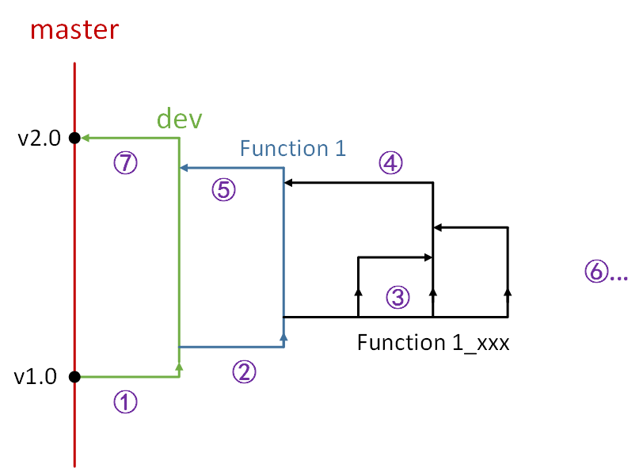

## Git 開發流程	[Back](./../summary.md)

### Branch(分支概念)



- **master**分支: 存放項目發行(Released)時代碼的分支
- **dev**分支: 從master分支衍生出來的一條用於Debug的分支. (當master分支開發到某個版本後, 基於該分支需要開發另一個版本, 那麼我們會有一條dev分支).
- **Function**分支(以**功能名**命名):
	- 從dev分支衍生出來, 特定用於開發一個功能.
		- 多個人協同開發: 像黑色分支, 建立屬於自己的開發分支(以**功能名+個人拼音**命名), 而有一個人作為主導開發(如黑色部分中間那條分支).
		- 單個人開發: 只需要一條黑色分支即可
	
<br />
<br />
<br />
<br />

### Developing Process(開發過程)

- **①**. 新版本**項目負責人**在服務器上新建一條dev分支

```bash
$ git checkout -b dev
```

或

```bash
$ git branch dev
$ git checkout dev
```

- **②**. **項目負責人**在服務器上基於基於dev分支在服務器上新建一條Function分支進行開發, **主導人**把Function分支拉到本地. (注: 以**Function_name**命名)

```bash
$ git checkout -b Function_name
```

- **③**. 針對開發情況:
	- 單人開發該功能: 只需要該條Function分支即可
	- 多人開發該功能: 需要在服務器上建立多條Function_xxx分支來開發. (注: 以**Function_name**+**Developer_name**命名, 各開發人員只需要拉屬於自己的分支下來本地進行開發, 並用該分支進行代碼上傳即可)
	```bash
	$ git checkout -b Function_name_xxx
```

- **④**. 功能開發完成後, **主導人**把幾個人協同開發的代碼合併到一條分支後, 統一推送到Function分支, 由**項目負責人**合併Function分支到dev分支.

```bash
$ git checkout Function_name
$ git merge Function_name_xxx
$ git pull origin Function_name					// origin: 通過 $ git remote 查看
$ git push origin Function_name:Function_name			// 冒號左邊為本地分支, 冒號右邊為遠程分支
```

- **⑤**. 當Function分支可運行並完成功能後, **主導人**提交並推送到Function分支的最終代碼, 然後由**項目負責人**進行合併操作.
	- Function分支的提交格式:
	```
Title:
Description:
		1.
		2.
		3.
Summary:
```

- **⑥**. 迭代②~⑤, 開發多個新功能
- **⑦**. **項目負責人**若測試dev分支正常運行且功能完成, 則可合併dev分支到master分支, 相應進行衝突處理.


<br />
<br />
<br />
<br />

### Some Basical Commands(基本命令)

### [**view**](./../../git/git.md)

