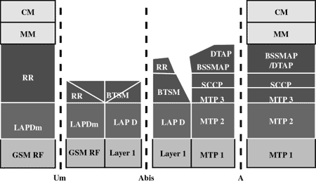

## Protocol Stack   [Back](./../gsm.md)

GSM architecture is a layered model that is designed to allow communications between two different systems. The lower layers assure the services of the upper-layer protocols. Each layer passes suitable notifications to ensure the transmitted data has been formatted, transmitted, and received accurately.

The GMS protocol stacks diagram is shown below:

#### MS(Mobile Station, 移动站) Protocols

Based on the interface, the GSM signaling protocol is assembled into three general layers:

- **Layer 1**: The physical layer. It uses the channel structures over the air interface.
- **Layer 2**: The data-link layer. Across the Um interface, the data-link layer is a modified version of the Link access protocol for the D channel (LAP-D) protocol used in ISDN, called Link access protocol on the Dm channel (LAP-Dm). Across the A interface, the Message Transfer Part (MTP), Layer 2 of SS7 is used.
- **Layer 3**: GSM signalling protocol's third layer is divided into three sublayers:
    - Radio Resource Management (RR)
    - Mobility Management (MM)
    - Connection Management (CM)

#### BTS(Base Transceiver Station, 基地收发机站) Protocols

The RR layer is the lower layer that manages a link, both radio and fixed, between the MS and the MSC. For this formation, the main components involved are the MS, BSS, and MSC. The responsibility of the RR layer is to manage the RR-session, the time when a mobile is in a dedicated mode, and the radio channels including the allocation of dedicated channels.

The MM layer is stacked above the RR layer. It handles the functions that arise from the mobility of the subscriber, as well as the authentication and security aspects. Location management is concerned with the procedures that enable the system to know the current location of a powered-on MS so that incoming call routing can be completed.

The CM layer is the topmost layer of the GSM protocol stack. This layer is responsible for Call Control, Supplementary Service Management, and Short Message Service Management. Each of these services are treated as individual layer within the CM layer. Other functions of the CC sub-layer include call establishment, selection of the type of service (including alternating between services during a call), and call release.

### BSC(Base Station Controller, 基站控制器) Protocols

The BSC uses a different set of protocols after receiving the data from the BTS. The Abis interface is used between the BTS and BSC. At this level, the radio resources at the lower portion of Layer 3 are changed from the RR to the Base Transceiver Station Management (BTSM). The BTS management layer is a relay function at the BTS to the BSC.

The RR protocols are responsible for the allocation and reallocation of traffic channels between the MS and the BTS. These services include controlling the initial access to the system, paging for MT calls, the handover of calls between cell sites, power control, and call termination. The BSC still has some radio resource management in place for the frequency coordination, frequency allocation, and the management of the overall network layer for the Layer 2 interfaces.

To transit from the BSC to the MSC, the BSS mobile application part or the direct application part is used, and SS7 protocols is applied by the relay, so that the MTP 1-3 can be used as the prime architecture.

### MSC(Mobile Switching Center, 移动交换中心) Prtocols

At the MSC, starting from the BSC, the information is mapped across the A interface to the MTP Layers 1 through 3. Here, Base Station System Management Application Part (BSS MAP) is said to be the equivalent set of radio resources. The relay process is finished by the layers that are stacked on top of Layer 3 protocols, they are BSS MAP/DTAP, MM, and CM. This completes the relay process. To find and connect to the users across the network, MSCs interact using the control-signalling network. Location registers are included in the MSC databases to assist in the role of determining how and whether connections are to be made to roaming users.

Each GSM MS user is given a HLR(Home Location Register, 归属位置寄存器) that in turn comprises of the user's location and subscribed services. VLR(Visiting Location Register, 访问位置寄存器) is a separate register that is used to track the location of a user. When the users move out of the HLR covered area, the VLR is notified by the MS to find the location of the user. The VLR in turn, with the help of the control network, signals the HLR of the MS's new location. With the help of location information contained in the user's HLR, the MT calls can be routed to the user.