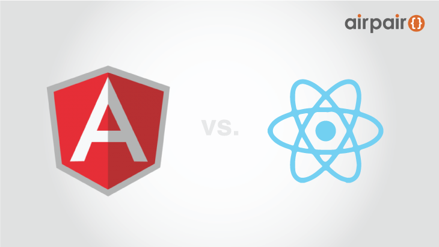

## Angular vs. React - the tie breaker - Angulr 对比 React - 决胜局 [**Back**](./../translation.md)

> * 原文链接 : [Angular vs. React - the tie breaker](https://www.airpair.com/angularjs/posts/angular-vs-react-the-tie-breaker)
> * 原文作者 : [Amit Kaufman](https://github.com/amitkaufman)
> * 译者 : [aleen42](https://github.com/aleen42) 
> * 校对者 : 暂无
> * 状态 : 待校对



## 1. 简介

&nbsp; &nbsp; &nbsp; &nbsp;在不久前，我们开发团队需要为 Wix 公司[<sup>[1]</sup>](#comment-1)的其中一个旗舰产品 —— html wysiwyg 网页编辑器，选定一种开发框架技术。该产品是一个大型的单页面应用。由于里面含有复杂的逻辑、大量与其他内敛框架（iframe）[<sup>[2]</sup>](#comment-2)和服务器之间的通信，以及许多的用户体验性操作，团队的开发人数多达40人。此前，我们对 ReactJS 和 AngularJS 都有一定的开发经验。但是，框架的选定却在两者间徘徊不定。这是因为，一方面，AngularJS 的声明式编程思想使得框架变得易于使用。另一方面，ReactJS 带给了我们开发的简易性。一系列的概念证明促使我们形成了这次的决胜局。下面，该文将带大家探讨一下两者之间的对决。

### 1.1 打包

&nbsp; &nbsp; &nbsp; &nbsp;打包（packaging）指的是一种能使得代码以预期方式运行并部署的方法。为了达到快速的加载，我们希望在前期只加载最低条件下所需要的代码，并在后期根据所需逐步加载。如果能这样的话，我们就不需要在开发新功能时，考虑是否会降低加载速度的问题。

&nbsp; &nbsp; &nbsp; &nbsp;对于这方面需求，AngularJS 只提供了少量限制的方法去实现（大部分是 html 模板），而且当我们尝试去实现的时候，我们发现我们其实只是在组装代码而已。

&nbsp; &nbsp; &nbsp; &nbsp;简而言之，Angular 框架太过于固执与死板。相反, React 并没有理会太多。它可以直接结合 plainJS[<sup>[3]</sup>](#comment-3) 使用，而我们只需要使用 requirejs，就能实现对部分代码的延迟加载。此外，React 还可以与其他像 webpack 的打包工具共同使用。

*胜者：React*

### 1.2 学习曲线

&nbsp; &nbsp; &nbsp; &nbsp;我相信每个人都知道，精通 Angular 之路颠簸且漫长：入门虽快，经久衰败，犹如婚姻……

&nbsp; &nbsp; &nbsp; &nbsp;至于 React，我们发现只需要花费大概一周的时间去学习，就能到达一个较高的层次。只需些许时间，我们就能习惯于该种单向的工作流程。尤其是对于 web 开发者来说，一旦你能花那么点时间去学习 React 的话，那么整个框架都会变得清晰易懂。

&nbsp; &nbsp; &nbsp; &nbsp;Angular 的生命周期是非常复杂的，倘若不去细致查看框架的代码，是无法达到精通的境界。在该框架的编译和链接期间，它并不能给到你一个直观的界面去查看详细的过程。正因为这样，在某种的情况下，如若遇到异常，你会感到无比疑惑（该异常有可能是来自编译时的大量递归或指令间的冲突）。相对的，React 只含有少量的生命周期方法，而且这些方法的定义都是不言而喻。所以，使用 React 其中一个最大的特征就是你并不需要去阅读它自身的代码。

*胜者：React*

### 1.3 代码抽象

&nbsp; &nbsp; &nbsp; &nbsp;好的代码抽象是无比重要的，因为代码抽象能为我们开发者抽象出便捷的开发接口并隐藏开发中不必要的细节。

&nbsp; &nbsp; &nbsp; &nbsp;我们发现，Angular 的抽象部分存在有一定的漏洞。这意味着只有在清楚地了解底层的模型后，我们才能真正地运用 Angular 所提供的抽象方法。这就是为何大量的开发者，在调试自身代码的过程中需要调试 Angular 框架内部的代码。

&nbsp; &nbsp; &nbsp; &nbsp;为了应对这些漏洞，Angular 为我们提供了类似指令优先级（directive priority）的概念。但是，我不禁要问道，“在使用第三方供应商所提供的指令时，我们该怎么去控制这些指令的优先级呢？况且，为什么我还要去考虑这些所谓的优先级呢？为什么同样在一个 html 节点上，不同的指令有时候会不起效用？为什么我们还要去理解汇编周期（digest cycle）[<sup>[4]</sup>](#comment-4)的概念呢？”

&nbsp; &nbsp; &nbsp; &nbsp;至于React 的抽象部分，在某些情况下限制了开发的灵活性。例如，我们不能往 html 标签或一个用于组合的标签上添加属性。针对这样的问题，React 所实现的混合类（mixins）[<sup>[5]</sup>](#comment-5)提供了解决办法（该混合类仅允许在生命周期方法上进行部分重叠，并拥有一个可预测的执行顺序）。而该解决办法并不会造成任何的代码漏洞（如前节所述，更重要的是我们并不需要再去查看 React 的内部代码）

*胜者：React*

### 1.4 模型复杂度

&nbsp; &nbsp; &nbsp; &nbsp;关于模型复杂度的问题，我意指我们该如何去设计 view 层所需要描绘的数据模型。

&nbsp; &nbsp; &nbsp; &nbsp;由于需要拷贝多份数据进行比较（copy-n-compare），Angular 在处理代码域时，其性能表现是极其敏感的。这就意味着，我们若使用 Angular，我们就不能设计有大型的数据模型。当然，凡事有两面。优点在于这样能使得代码变得简单易懂，且可测试性高；但缺点是你需要拆解平时习惯使用的方法，并重新构建（例如，拆解服务器请求）。

&nbsp; &nbsp; &nbsp; &nbsp;React 在这方面给予了很大的自由度。因为，你并不需要去考虑性能的问题。当然，模型是否复杂，其结果仍取决于你的代码质量好坏。

*胜者：平手*

### 1.5 调试

&nbsp; &nbsp; &nbsp; &nbsp;开发过程中，当有代码不起效用时，我们都会开启令人厌烦的调试工作。一般，我们团队都会把该步骤分成两种主要的方案：指出为何逻辑部分失效和理解是什么导致 HTML 输出的该结果。

&nbsp; &nbsp; &nbsp; &nbsp;Angular 是一个事件型驱动系统。该类系统易于编写，但难于调试。这是因为该类系统的异常堆栈跟踪（stack-traces）[<sup>[6]</sup>](#comment-6)，其里面的信息往往会比想象中要多且不同。尽管如此，Angular 还是提供了一种像服务层的逻辑结构。只要我们妥当使用，该结构就能使得代码易于测试和调试。当然，任何好的程序员都希望把代码和逻辑结构抽离分开，或者不依赖于任何的逻辑结构去调试代码。

&nbsp; &nbsp; &nbsp; &nbsp;当部分 Angular 指令无效时，其中一种办法就是去重新用不同的方式去编写该部分代码。这是因为，太多的逻辑依赖于该部分代码。而另一种办法就是去调试 Angular 本身的代码 —— 这是一个没有价值的工作。

&nbsp; &nbsp; &nbsp; &nbsp;React 框架自身只有两种主要的应用场景：更新数据模型/通过用户事件执行其他行为，以及经常相同的单向工作流程。这就意味着，我们开发者只需要调试少许的地，就能找到代码的漏洞。而且，异常堆栈跟踪中所记录的异常信息，针对 React 代码和我们所开发的代码，都有着明显的不同点可供区分。这些信息之间一般不会混淆起来。而且，React 只拥有少量的逻辑结构，且这些结构都集中在一个地方 —— vDom 比较器。该比较器虽是一个封闭的黑盒，但在使用过程中，我们发现它总能发挥起它应有的效用。

&nbsp; &nbsp; &nbsp; &nbsp;谈及到关于 HTML 的理解，我们回溯代码时往往发现事实与之前的截然不同。在 React 框架下，代码与生成的 HTML 文档之间往往很难对应地比较。即时是使用了 JSX 语法，情况也是相似的。因为，条件和循环控制流把 HTML 代码片段拆解成了极小块的模板，以至于很难作出比较。相反，在 Angular 下所生成的与 HTML 模板极其相似，以至于我们能易于比较。

*JS 调试胜者：React*

*HTML 调试胜者： Angular*

### 1.6 绑定

&nbsp; &nbsp; &nbsp; &nbsp;在 Angular 中，你只能绑定代码域。因此，在复杂的情况下，如需要绑定一个 服务器/异步 服务或绑定一个大型模型时，你就需要自己编写一个中间模型，并处理好汇编周期和显式监测期间所产生的问题。

&nbsp; &nbsp; &nbsp; &nbsp;相反地，React 仅提供一个用于绑定的语法糖。该语法糖称作 valueLink（“value”和“onChange”中都有的一个单一属性）。该概念看似简单以至于看起来它并没有产生任何作用，而它的确是工作了。因此，在创建属于自己的 linkState 或一个相似的函数去实现任何的绑定需求前，我们必须理解好 React 所提出的这个新概念。

*胜者：React*

### 1.7 性能调优

&nbsp; &nbsp; &nbsp; &nbsp;React 框架，使得我们能易于控制性能。当你实现了 shouldComponentUpdate 方法时，你就能选择一种你喜欢的比较方式 —— 模型层比较或展示层比较。当然，如果你的数据模型较为小型的话，你可以完全把比较的工作交给 React 的 vDom 比较器。可若是大型，或你要创建多个 DOM 元素的时候，你就可以通过自行实现该方法，来完成性能上的优化。因为在该方法里，你可以为“脏检查”（dirty-checking）[<sup>[7]</sup>](#comment-7)定义属于自己的有效机制。

*胜者：React*

### 1.8 代码复用

&nbsp; &nbsp; &nbsp; &nbsp;Angular 在出来的时候就含有了许多可重用的东西。然而，归咎于命名空间以及指令优先级的冲突现象，我们不得不使用从不同的提供方所获取到的 Angular 代码库。这是一种很不寻常的行为。而 React 则直接让你以自己喜欢的方式去管理代码的复用性问题。总的来说，Angular 仍拥有着市场的优势，并在市面上提供了许多可复用的代码库。


*胜者：平手*


### 1.9 模板

&nbsp; &nbsp; &nbsp; &nbsp;模板是我认为最为重要的一点，因此我把其放在了最后来讨论……尽管大部分关于 Angular 或 React 的文章都会讨论它们的指令或数据流，但事实上我们往往使用这些框架去构件在线服务时，约80%的工作都是在编写 UI。在这里，我把应用逻辑部分的构建模块称作为面板（panels）。这些面板包含有大量的信息以及自定义流程。它们的构建都是通过使用已经建好的模块，但往往我们很多已经构建好的模块却不能进行复用，可这些都是用户所能看到且进行交互的绝大部分，那怎么办？React 在这问题上的解决方法相当贫乏。当我们想写一个重复的模块时，代码将会像下面一样，非常冗长：

```js
var createItem = function (itemText) {
    return <li>{itemText}</li>;
};

return <ul>{this.props.items.map(createItem)}</ul>;
```

而在 Angular 里却变得非常清晰：

```html
<ul>
    <li ng-repeat="item in items">{{item}}</li>
</ul>
```

明显可见，Angular 在这方面是理所当然的胜者。

*胜者：Angular*

## 2. 决胜局 —— React 模板

&nbsp; &nbsp; &nbsp; &nbsp;讨论了那么多，我们该是时候决定这场辩论的胜者为 React 框架。可是，问题在于我们如何既利用好 React 的所有优点，又不缺少 Angular 重要的优势呢？针对该问题，我们决定放手一搏，并为 React 解决这些相对于  Angular 的劣势，并设计出一个工具。

&nbsp; &nbsp; &nbsp; &nbsp;该工具的设计所需要考虑到有：

- 任何有效的 HTML 文件大部分都可视为一个有效的 React 模板。我们需要像 React 一样用 camelCase 命名法保持这些事件记号的同时，也保持好那些无值属性的记号，如 disabled （true/false 两值决定这些属性是否出现在真正的 DOM 元素中）。
- 使用花括号和内部指令，把 html 文本转换成 js 文本。
- 上述转换并不会在代码运行时发生，以保证它不会影响性能。转换期间，不允许使用额外添加的对象，而仅使用 js 原生的构造体（闭包、方法以及原生表达式）去完成该转换功能。
- 尽可能地使得所生成的代码清晰易懂。
- 由于部分指令是仿照 Angular 所提供的方法，因此，这些指令必须按照既有的规则。
- 尽可能地使该工具变小且精简。添加的指令必须有其存在的合理理由（整个转换工具仅有350行代码）

&nbsp; &nbsp; &nbsp; &nbsp;最后，该工具指的就是[神奇的 React 模板（React templates）](http://wix.github.io/react-templates/)。通过该工具，我们把 Angular 以及 React 的优点都结合在了一起。此外，面板的展示层、逻辑层以及陈述语句部分间都得到了完全的分离。为了使得该工具能更加的有效，我们还添加组件加载的支持（不管是 AMD，还是 CommonJS），使得用户能复用他们所使用的模板中其他的组件。下面让我来举几个例子来说明该工具是何等的简易：

### 2.1 集合迭代（Collection iteration）

```html
<ul>
    <li rt-repeat="item in items">{item} at index {itemIndex}</li>
</ul>
```

&nbsp; &nbsp; &nbsp; &nbsp;*需要注意的是：`itemIndex` 是由 `item` 派生出来，以使得可以使用嵌套中继器的索引。*

### 2.2 条件语句

```html
<label rt-if="this.hasError()">{this.getError()}</label>
```

&nbsp; &nbsp; &nbsp; &nbsp;*需要注意的是：这是一个真正的 `if` 语句。这就意味着如果表达式的值为假时，该节点不会被解析器解析。*

### 2.3 语法糖 —— rt-class、rt-scope和属性中的表达式

```html
<div rt-scope="this.getUserDetails() as theUser" title="{theUser.loginName}">
    Real Name: {theUser.firstName} {theUser.lastName}<br/>
    Login: {theUser.loginName}
    Last paid at: <span rt-class="{status:true, overdue:this.isUserOverdue(theUser)}">{theUser.lastPaid}</span>
</div>
```

&nbsp; &nbsp; &nbsp; &nbsp;*需要注意的是：为了能保持代码的简单，我们应尽量减少使用那个该语法糖。只有当对象含有大量的值时，才考虑使用该语法糖。*

### 2.4 嵌套包含（Transclusion）

```html
<div>{this.props.children}</div>
```

&nbsp; &nbsp; &nbsp; &nbsp;*需要注意的是：何等简洁。*

### 2.5 事件处理

```html
<div>
    <div rt-repeat="task in tasks" style="font-weight:{task.selected ? 'bold' : 'normal' }" onClick="() => this.toggleTask(task)">{task.title}</div>
    <button onClick="{this.save}">Save</button>
</div>
```

&nbsp; &nbsp; &nbsp; &nbsp;*需要注意的是：这是 React 模板中提供的一种最好的使用方式之一。在每个对象中，我们都为你生成了一个方法。因此你并不需要在 DOM 中存放任何的东西或进行任何的索引操作。而只需要把逻辑代码放在该方法里。如上面 DOM 元素的 onClick 事件处理中，我们提供了两种可用的选项：直接填写 lambda 表达式或如果使用 `{}` 记号的话，该记号会直接返回指向我们定义的函数的指针。最后，请记着任何用于自定义控制的自定义属性，只要是以 camelCase 来命名事件，那么，都可以采用以上两种方法来调用事件处理函数。*

### 2.6 从模板中加载资源

```html
<rt-require dependency="./utils/translate" as="tr"/>
<rt-require dependency="./comps/colorPicker" as="colorPicker"/>
<form>
    {tr('Enter_Your_Name')}: <input type="text" valueLink="{this.linkState('name')}"/><br/>
    {tr('Choose_Favorite_Color')}: <colorPicker valueLink="{this.linkState('favColor')}"/>
</form>
```

### 2.7 其他特性

&nbsp; &nbsp; &nbsp; &nbsp;style 属性只能在 html 中使用。这就意味着我们并不需要以 camelCase 的形式来命名 style 中的所有主键（这在 React 中是需要的）。当然，你也可以通过 `{}` 在任何的地方插入表达式。这对于 class 属性来说也是一样的（不需要通过“className”调用该类）。

## 3. 总结

&nbsp; &nbsp; &nbsp; &nbsp;React 和 Angular 都是令人称赞的两个框架，以至于我们往往很难在两者中选择一个来使用。Angular 本身是非常固执的，只有当它符合你的开发情景，才能为你所用。而 React 给到你的是一种开发的自由以及建议，但它却给不到像 Angular 一样强大的陈述能力给你。因此，React 模板是你能综合两者优点使用的一个工具。对于那些擅长使用 VanillaJS 的人来说，如果你有一个复杂的项目需要完成，且需要考虑文件的打包以及框架的使用，那么，React 模板将是你一个较佳的选择。

#### 注解

<p id="comment-1">[1]：<strong>Wix 公司</strong>是一家成立于2006年的软件公司，其在美国、巴西等国家都设立有属于自己的办公地。</p>

<p id="comment-2">[2]：<strong>iframe 元素</strong>会创建包含另外一个文档的内联框架（即行内框架）。该元素是 HTML 中常用的一种标签之一</p>

<p id="comment-3">[3]：<strong>plainJS</strong> 是一个寻常的 JavaScript 代码库，可用于构件强大的网页级应用。</p>

<p id="comment-4">[4]：<strong>汇编周期（digest cycle）</strong> 是 Angular 框架提出的一个新的概念。它意指 Angular 检查的所有受监控变量变动的一个循环周期。在 Controller 定义受监控变量可通过 <code>$scope.varName</code> 来进行定义。</p>

<p id="comment-5">[5]：<strong>混合类（mixins）</strong> 在面向对象编程语言中指的是一种类。该类为其他类提供了一种特殊的方法以供调用。其他类在调用该特殊方法时，并不需要成为该类的子类才能访问到该方法。具体的访问形式取决于不同的语言所实现的机制。</p>

<p id="comment-6">[6]：<strong>异常堆栈跟踪（stack-traces）</strong> 指的是计算机在某时刻关于当前内存堆栈的异常信息所作出一份跟踪报告。一般，通过该报告的描述，程序开发者能了解一个异常是如何在各种嵌套的程序中抛出，以快速定位出现异常的代码。</p>

<p id="comment-7">[7]：<strong>脏检查（dirty-checking）</strong>也称作“digest cycle”，与其含义是一样的。</p>