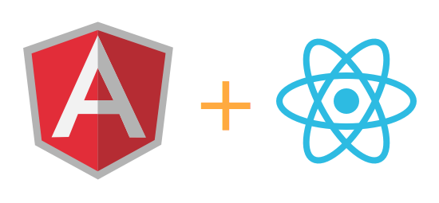
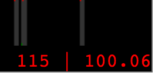
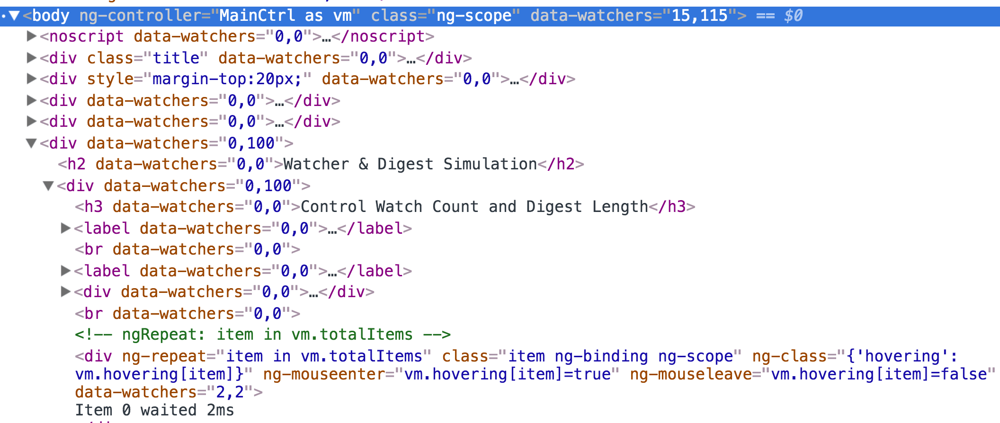

## Improve Angular Performance with React - 通过 React 来提高 Angular 的性能 [**Back**](./../translation.md)

> * 原文链接 : [Improve Angular Performance with React](https://daveceddia.com/improve-angular-performance-with-react/?utm_campaign=0712ngreact)
> * 原文作者 : [DAVE CEDDIA](https://daveceddia.com/timeline-for-learning-react/)
> * 译者 : [aleen42](https://github.com/aleen42)
> * 校对者 : 暂无
> * 状态 : 待校对



如果你遇上了由大量的访问或毫无预测的重复渲染[<sup>[1]</sup>](#comment-1)（re-render）所产生 Angular 性能问题，那么，ngReact 可以帮到您。

如果你已有一个 Angular 应用程序，但你又不想重写整个程序来尝试一下 React 的话，ngReact 在这方面也可以帮到您。

### 什么是 ngReact？

[ngReact](https://github.com/ngReact/ngReact) 是一个针对 React 的小型打包工具。（整个工具[大概只含有260行代码](https://github.com/ngReact/ngReact/blob/master/ngReact.js)）

有了它的话，你只需要创建好你的 Angular 程序。而 ngReact 在背后实际上会以 React 组件的形式渲染你的程序。它在传递给指令[<sup>[2]</sup>](#comment-2)（directives）的属性上设置了监控对象（watches），并在组件改变的时候，重新渲染该些组件。

### 它用于何处？

如果你有大量或嵌套的 `ng-repeat` 属性，那么，程序可能会因为页面上监控对象的数量拖慢了执行速度。

同样地，如果你在心底里采用着“把一切构造成组件（指令）”的思想，也有可能会导致同样的情况发生。就好比，一个表格若充满由自定义指令集所构成的单元，将会大幅增加页面上的监控对象。

就算现在你的程序运行起来足够的快速，但并不值得用 React 去重写部分的代码。此时，你首先需要去测量。

### 如何去测量监控对象的数目？

目前，我知道有两款工具能很好地去测量一个页面上监控对象的数目。

由 [@kentcdodds](https://twitter.com/kentcdodds) 开发的 [ng-stats](https://github.com/kentcdodds/ng-stats) 能够在一个小小的图像中，显示最近的一个汇编周期[<sup>[3]</sup>](#comment-3)所产生的监控对象数量。这对于我来说是一个很好的概括。



然后，如果你想再往深一层挖掘的话，你可以收藏 [Jason Stitt 所写的这篇博文](http://jasonstitt.com/angular-js-count-watchers)于书签栏中。该文中，作者为页面上的每一个元素都注解有一个“data-watchers”属性。因此，你可以通过使用审查元素（Inspect Element）去查出到底有多少个监控对象被创建出来。



这种方式的好处在于，你可以从`<body>`标签钻进含有最多监控对象的元素，并考虑优化或用 React 重写这些指令。

### 编写 React 组件

现在，你已然把造成问题的范围缩小至一个指令上。因此，你可以编写一个 React 组件去替换该指令。

请先根据 [ngReact 页面](https://github.com/ngReact/ngReact)的教程去安装它，并把它作为一个依赖引进到项目中。

```js
angular.module('yourApp', ['react'])
    ...
```

然后，这里有两种方式去往一个 Angular 项目中添加一个 React 组件：一种是把组件当作是真正的指令；另一种则是使用由 ngReact 提供的 `react-component` 指令。虽然他们的文档都有详细说明，但在这里我们还是讲述一下如何当作“真正的指令”去添加一个 React 组件。

首先，我们需要添加 `reactDirective` 服务。然后，再使用它去打包你的 React 组件：

```js
var BigList = React.createClass({
    // Defining propTypes is important!
    propTypes: {
        items: React.PropTypes.array
    },
    render: function() {
        return (
            <ul>
                {this.props.items.map(item =>
                    <li key={item.id}>{item.name}</li>
                )}
            </ul>
        );
    }
});

app.directive('bigList', function(reactDirective) {
    return reactDirective(BigList);
});
```

这样，你就可以像其他 Angular 指令一样使用 `bigList` 组件：

```js
<big-list items="parentCtrl.items"></big-list>
```

### 需要留意的是

1. React 组件并不能包含有 Angular 元素。如果你想把转换一个含有多层嵌套的指令，你需要沿着树结构把这些嵌套的指令一并转换。
2. ngReact 会根据 React 组件上的 `propTypes` 去决定监控哪些属性。如果你去掉了该属性，那么，ngReact 会忽略整个组件的属性，以至于你的组件不会产生任何的渲染。

如果你不能轻易地设置好 protoTypes 属性（比如你要返回一个更高优先级的组件），那么你可以像这样传递一个数组，以供 ngReact 监控：

```js
app.directive('fancyDragDropThing', function(reactDirective) {
    var wrapped = WrapperComponent(YourComponent);
    return reactDirective(wrapped, ['items']);
});
```

### 总结

这篇文章是一个快速高度概括的文章，以介绍如何使用 React 去提升一个 Angular 程序的性能。在这里，如果你想了解更多关于 React 的知识，你可以阅读一下以下的文章：

- [**逐渐去掌握 React（作为一名 Angular 开发者）**](https://daveceddia.com/to-react-from-angular/)
- [React 快速入门（不需任何的构建）](https://daveceddia.com/test-drive-react/)
- [**Angular 指令与 React 之间的映射关系**](https://daveceddia.com/angular-directives-mapped-to-react/)
- [为你指定的 React 学习路线](./../your_timeline_for_learning_react/your_timeline_for_learning_react.md)
- [学习原生的 React：轻松地精通基础部分（一本即将发行的书）](https://daveceddia.com/learn-pure-react/)

**注解**：

<p id="comment-1">[1]：<strong>重新渲染（re-render）</strong> 指的是页面上如有数据变动将会以新的数据重新展示在屏幕上的这一过程。</p>

<p id="comment-2">[2]：<strong>指令（directive）</strong> 在 AngularJS 中通常指的是小组件，具体的介绍可看《<a href="https://hairui219.gitbooks.io/learning_angular/content/zh/chapter05.html" target="_blank">深入学习AngularJS - Directive</a>》</p>

<p id="comment-3">[3]：<strong>汇编周期（digest cycle）</strong> 是 Angular 框架提出的一个新的概念。它意指 Angular 检查的所有受监控变量变动的一个循环周期。在 Controller 定义受监控变量可通过 <code>$scope.varName</code> 来进行定义。</p>