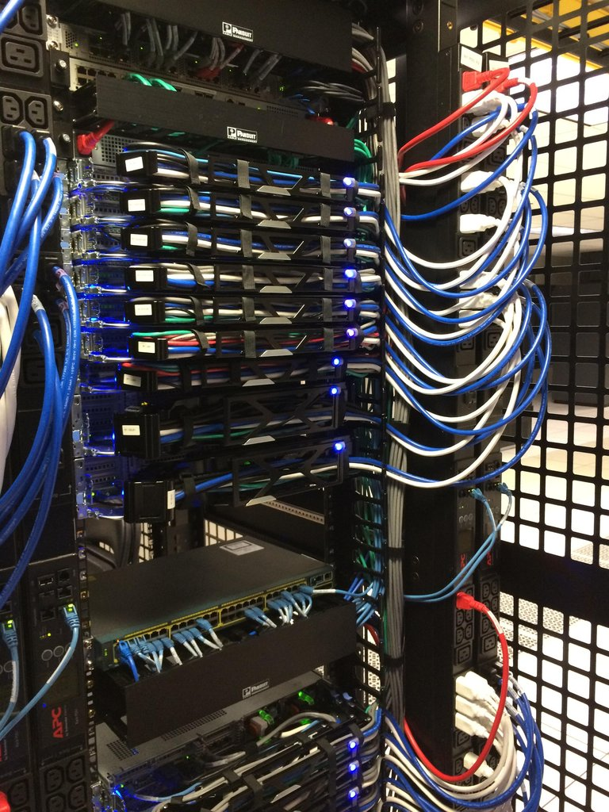
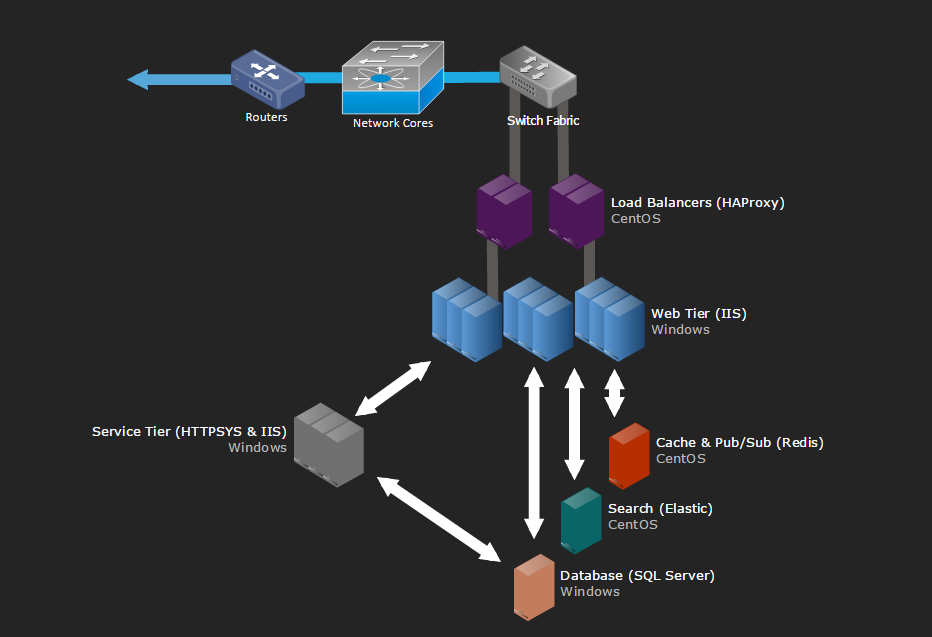
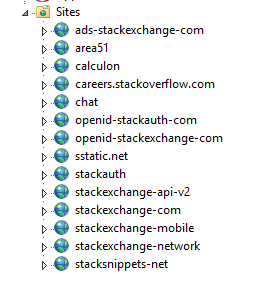
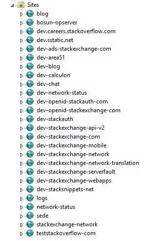
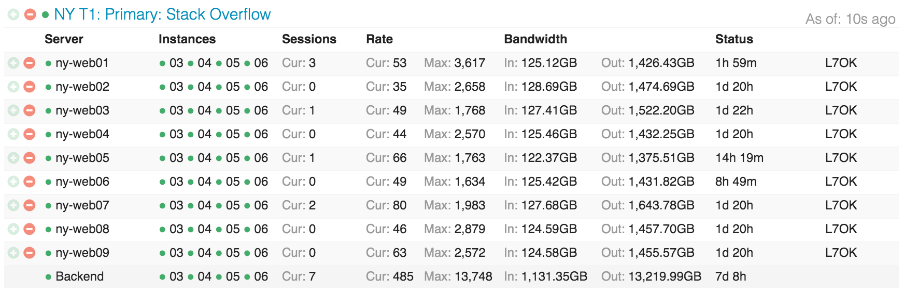
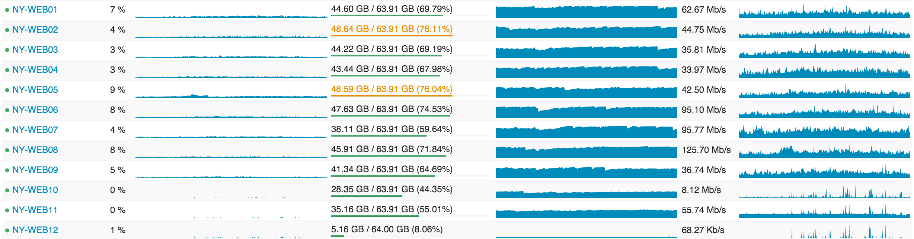
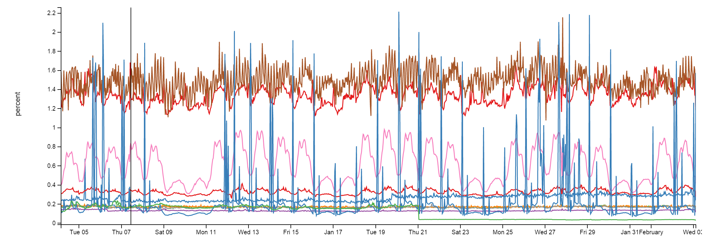
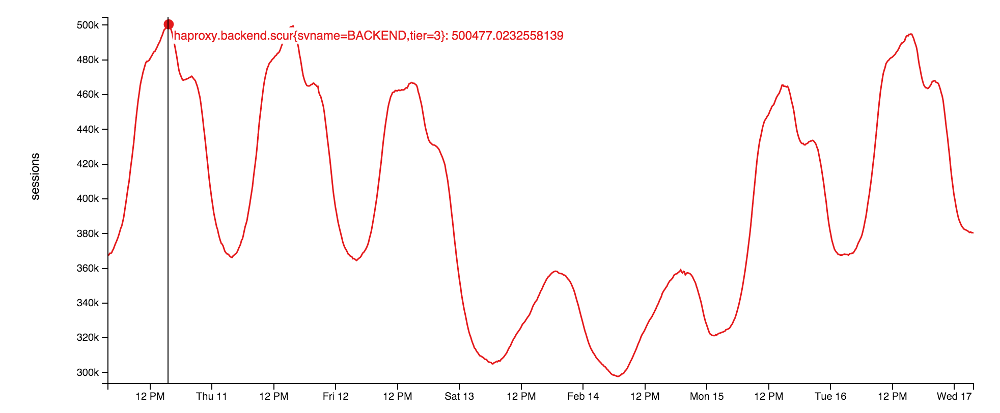
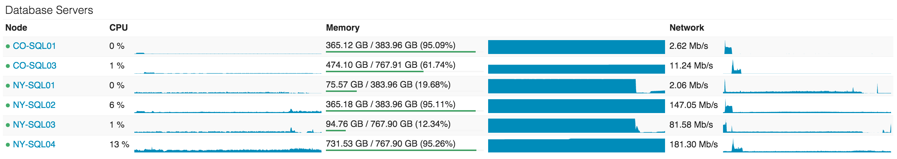

## Stack Overflow: The Architecture - Stack Overflow的系统架构 [**Back**](./../translation.md)

> * 原文链接 : [Stack Overflow: The Architecture - 2016](http://nickcraver.com/blog/2016/02/17/stack-overflow-the-architecture-2016-edition/)
> * 原文作者 : [Nick Craver](https://github.com/NickCraver)
> * 译者 : [aleen42](https://github.com/aleen42) 
> * 校对者: 暂无
> * 状态 :  待校对

&#160; &#160; &#160; &#160;为了弄明白我要说的这些东西到底是在“做”什么，我一开始将会以 Stack Overflow 更新的数据作出说明。与之前[2013年11份的数据](http://nickcraver.com/blog/2013/11/22/what-it-takes-to-run-stack-overflow/)相比，这里有一份2016年2月9日的统计数据及之间的数据差异。
- **209,420,973**（+61,336,090）HTTP 请求到达我们的负载均衡器
- **66,294,789**（+30,199,477）属于页面加载
- **1,240,266,346,053**（+406,273,363,426）字节（1.24 TB）的 HTTP 流量被发送
- **569,449,470,023**（+282,874,825,991）字节（569 GB）的数据被接收
- **3,084,303,599,266**（+1,958,311,041,954）字节（3.08 TB）的数据被发送
- **504,816,843**（+170,244,740）的 SQL 查询（仅仅通过 HTTP 请求）
- **5,831,683,114**（+5,418,818,063）的 Redis 命中数
- **17,158,874**（在2013年的数据中并没有跟踪该项）的 Elasticsearch 使用数
- **3,661,134**（+57,716）的标签引擎（Tag Engine）请求数
- **607,073,066**（+48,848,481）毫秒（168 小时）用于执行 SQL 查询
- **10,396,073**（-88,950,843）毫秒（2.8 小时）用于 Redis 的命中
- **147,018,571**（+14,634,512）毫秒（40.8 小时）用于处理标签引擎（Tag Engine）的请求
- **1,609,944,301**（-1,118,232,744）毫秒（447 小时）用于 ASP.Net 的处理
- 平均**22.71**（-5.29）毫秒（在ASP.Net是19.12毫秒）用于49,180,275页面的呈现
- 平均**11.80**（-53.2）毫秒（在ASP.Net是8.81毫秒）用于6,370,076首页的呈现

&#160; &#160; &#160; &#160;也许，此刻你会在思考与2013年相比，为什么在每天有6100万以上请求数的情况下，ASP.Net 的处理时间仍然会有明显的减少现象（减少了757小时）。这是因为我们[在2015年早期做了硬件升级](http://blog.serverfault.com/2015/03/05/how-we-upgrade-a-live-data-center/)，并且在应用级中对应用作出了大量的性能协调。请不要忘记，[性能这一点仍然起着重要的作用](http://www.codinghorror.com/blog/2011/06/performance-is-a-feature.html)。听过我将要传达的信息后，如果你想知道更多关于硬件的细节——不用怕。我将会在下一次更新博文的时候，把关于所有正在运行的服务器，它们的硬件详情写在附录里。（而且只要它们还在运行，我都会更新这些详情）

&#160; &#160; &#160; &#160;那么，到底过去的两年发生了什么呢？除了更换部分的服务器和网络装置，没有其它。这里有一份现在还在运行的顶层硬件列表（并且指明了与2013年时的差别）：

- 4台使用 Microsoft SQL Server 的服务器（其中两部是新设备）
- 11台使用 IIS Web Server 的服务器（新设备）
- 2台使用 Redis 的服务器（新设备）
- 3台使用 Tag Engine 的服务器（其中三分之二是新设备）
- 3台使用 Elasticsearch 的服务器（没改变）
- 4台使用 HAProxy 的负载均衡器（其中新添置两台用于服务CloudFlare公司）
- 2个网络（每一个都使用 Nexus 5596 Core + 2232TM Fabric Extenders ，并且每处的宽度速率都提升到10Gbps）
- 2台使用 Fortinet 800C 的防火墙（替换了原来的 Cisco 5525-X ASAs）
- 2台使用 Cisco ASR-1001 的路由器（替换了原来的 Cisco 3945 路由器）
- 2台使用 Cisco ASR-1001-x 的 Routers（新设备！）

&#160; &#160; &#160; &#160;现在我们**需要**什么去运行 Stack Overflow 呢？这个与2013年相比并没有改变得太多，但归咎于性能的优化和上述的设备，我们至少还**需要**一台Web服务器。无意中，我们已经成功地测试了这台服务器几次。需要声明的是：我指的是它可以工作，但不是说这是一个好的方案。

&#160; &#160; &#160; &#160;既然有了用于构思的一些基准数字，那么我们来看看我们是怎么实现这个精致的网页。现在的系统几乎不会处于完全分离状态（我们的也不例外），如果架构师不用一副巨大的图像去展示如何将把部分组装成整体，那么他的决定往往不会起到作用。[后续的博文](https://trello.com/b/0zgQjktX/blog-post-queue-for-stack-overflow-topics)将会对特定的领域深入挖掘，而这里只是对需要强调的硬件设备作出逻辑性的概览。下次博文的更新将会有硬件的详情介绍。

&#160; &#160; &#160; &#160;为了能让你看看如今设备都是怎么样，这里有 A 架在2015年2月份更新期间的一些照片（它有一个对应的 B 架）

……如果你要深入这种东西，[这里有这周的全部256张图的图集](http://imgur.com/a/X1HoY)。谈及到布局，我们要展示一张主要系统部分的逻辑概览图：

### 基本法则

&#160; &#160; &#160; &#160;这里有一些为人熟知的法则，我就不一一去重复它们：

- 所有的东西都需要备份
- 所有服务器及网络设备都起码需要2 x 20Gbps 的连接能力
- 所有服务器都需要两个电力供应点，而每个供应点都需要配额有两个 UPS 单元，而这些 UPS 单元都需要两个发电机和两个辅助设备供应。
- 所有服务器都有一组的备份：A 架和 B 架
- 所有服务器都要备份多一个数据中心（位于科罗拉多州（Colorado））
- 所有的东西都需要备份！

### 因特网

&#160; &#160; &#160; &#160;首先你必须能找到我们——那就是通过[DNS](https://en.wikipedia.org/wiki/Domain_Name_System)。为了让你能快速地找到我们，我们（目前）把该业务外包给了[CloudFlare](https://www.cloudflare.com/)公司。原因在于他们在全世界分布着几乎能覆盖每一个人的 DNS 服务器，而我们只需要通过 API 去更新我们的 DNS 记录，然后把 DNS 的 host 查询交给他们。但是，根深蒂固的诚信问题仍然会烦扰着我们，因此我们也必须要有着属于自己的 DNS 服务器。末日将至（或许由GPL、[Punyon](https://twitter.com/JasonPunyon)或高速缓冲存储器导致），人类仍想着程序能脱离人类有着自己独立的思考。我们要推翻这种思想。

&#160; &#160; &#160; &#160;当你发现我们的秘密所在后，就会发现 HTTP 流量是会通过我们四台因特网服务提供者（ISP）中的其中一台（Level3、Zayo、Cogent 和在纽约的 Lightower）并经过我们四台边缘路由器的其中一台。对应着 ISP，我们会使用 [BGP](https://en.wikipedia.org/wiki/Border_Gateway_Protocol)（相当标准）。目的是为了控制访问流并提供几种访问途径使得你们可以有效地把我们搜索出来。[ASR-1001](http://www.cisco.com/c/en/us/products/routers/asr-1001-router/index.html) 和 [ASR-1001-X](http://www.cisco.com/c/en/us/products/routers/asr-1001-x-router/index.html) 路由器都是采用对的形式，而且每一对都以 active/active 的形式服务于两个 ISP ——这就是我们的备份所在。虽然这两种路由器都是处于同样的10Gbps 速率的网络当中，但是外部的访问都是分配在连接着负载均衡器的外部 [VLAN](https://en.wikipedia.org/wiki/Virtual_LAN) 当中。当经过路由器后，我们就会看到一个负载均衡器。

&#160; &#160; &#160; &#160;我认为是时候要告诉你们的是我们已经在两个数据中心之间建立了带有10Gbps 能力的 [MPLS](https://en.wikipedia.org/wiki/Multiprotocol_Label_Switching)，但它并不是直接用于服务。在我们遇到突发事件的情况下，我们会使用它来进行数据的拷贝和快速的恢复。或许，你会说“Nick，这并不是数据备份”。在技术上来说，你的观点是正确的（[最佳的正确](https://www.youtube.com/watch?v=hou0lU8WMgo)），因为在这策略上存在着单点失效的严重问题。但是我需要补充的是，我们还维护着两台以上具有故障转移能力的[OSPF](https://en.wikipedia.org/wiki/Open_Shortest_Path_First)路由器（MPLS 只是其中的一台）经过我们的 ISP。上述所涉及的所有这些东西，它们每一个都连接着位于科罗拉多（Colorado）对应的集，并在故障转移的情况下，对流量进行负载均衡处理。我们可以做的就是把各组集都连接在一起，并形成四个路径，然而，这个工作仍在继续。

### 负载均衡器（[HAProxy](http://www.haproxy.org/)）

&#160; &#160; &#160; &#160;负载均衡器是在 [CentOS 7](https://www.centos.org/) 上运行 [HAProxy](http://www.haproxy.org/) 的1.5.15版本，因为 CentOS 7 是我们较为喜欢的 Linux 版本。至于 TLS（SSL）的流量，最终也会停留在 HAProxy 上。而 Haroxy 的 1.7 版本中支持 HTTP/2 的新特性是我们最为期待的。

&#160; &#160; &#160; &#160;与其他那些带有双10Gbps LACP 网络连接的服务器不同的是，每一个负载均衡器都有两对的10Gbps 网络接口：一个用于外部网络连接，而另一个则用于与隔离网络（DMZ）的连接。为了更有效地处理 SSL 协商，这些负载均衡器至少会使用64GB 的内存。使用缓存时，越能命中更多内存中的 TLS 段去重用，我们在后面连接到同一个客户端时就越不需要再进行重新计算。这就意味着我们能更快更廉价地回到某一段中。只要 RAM 以美元计算足够的便宜，那么这就是一很好的方案。

&#160; &#160; &#160; &#160;其实，负载均衡器本身就是一种非常简单的装置。我们监听着不同的 IP 地址（大部分是为了确保安全和 DNS 的管理）并在 host 头的基础上路由至不同的后端服务器。这是因为我们有一件事情需要完成。那就是进行流量控制和对部分被写入 [HAProxy 系统日志的信息](https://cbonte.github.io/haproxy-dconv/configuration-1.5.html#3.1-log)，其 HTTP 头部进行获取（从我们的网络层发出）。通过这样，我们就能记录每一条请求，它们的性能指标。具体的细节我们[在后面会谈及到](https://trello.com/c/1Oc9cC6u/11-monitoring)。

### 网络层（IIS 8.5、ASP.NET MVC 5.2.3 和 .Net 4.6.1）

&#160; &#160; &#160; &#160;负载均衡器把流量分发到我们指定的9台主要服务器（01~09）和两个设备/元网络服务器（10~11， 我们搭建的环境）。除了 [meta.stackoverflow.com](http://meta.stackoverflow.com/) 和 [meta.stackexchange.com](http://meta.stackexchange.com/) 这两个页面是运行在后面的两台网络服务器之外，像 Stack Overflow、Careers 和所有的 Stack Exchange 页面都是运行在我们的主要服务器上。至于主要的 Q&A 应用，它本身是一个多架构的应用。这就意味着一个独立的应用就能服务于所有来自 Q&A 页面的请求。换句话说，那就是我们能用一个仅仅配有一台服务器的应用去运行整个 Q&A 网络。而其他的运用，像 Careers、API v2、Mobile API 等，它们都是相互独立的。下面的图片展示了在 IIS 上我们的主要层和设备层是怎么分布的：

&#160; &#160; &#160; &#160;这张是展示 Stack Overflow 如何把穿梭在网络层的服务器分布式存储在 [Opserver](https://github.com/Opserver/Opserver)（我们的内部镜像面板）：

……还有一张是展示这些服务器的利用效率是怎样的：

&#160; &#160; &#160; &#160;后面的文章我会提及为什么我们会如此过度供应，但是目前最应该考虑的应该是：滚动构建、净空值以及冗余度。

### 服务层（IIS、ASP.Net MVC 5.2.3、.Net 4.6.1 和 HTTP.SYS）

&#160; &#160; &#160; &#160;在这些网络服务器后是一层十分相像的“服务层”。它也是运行安装在 Windows 2012R2 上的 IIS 8.5 版本。该层会运行内部服务以支持网络层和其他内部系统的使用。其中，基于 `http.sys`（不是 IIS 服务之后）运行着标签引擎的 “Stack Server” 和 Providence API（基于 IIS ）分别扮演着重要角色。有趣的是，其实我们还需要为这两个处理器都设置锁定关系。这是为了能使数据降落于互相隔离的 socket 上。因为，Stack Server 每两分钟刷新问题列表时，都会给 L2 和 L3 缓存造成巨大的压力。

&#160; &#160; &#160; &#160;这些服务器通过引擎标签和后端 API 进行着繁重的数据提取操作，而这些后端 API 我们都需要进行备份，但并不需要进行九倍的备份。例如，在加载所有的 post 文章和它们的标签时并不是一件非常容易的事情，而且这些东西在数据库中每 `n` 分钟就会改变一次（目前平均是两分钟）。因此我们不想在网络层加载九次这些数据；三次便已足够，并且数据通过三次读取能足够安全地传达到我们的手里。另外，我们还为了能更好的根据不同的计算性加载操作时标签引擎的特点和弹性索引工作特点（这项工作也是在该层进行）进行优化，对这些服务器进行了硬件层面上不同的配置。“标签引擎”本身就是一个相当复杂的话题，因我们将会专门为其[写文讨论](https://trello.com/c/DqklJDSF/29-tag-engine)。基本来说就是：当你访问 `/questions/tagged/java` ,你就是正在使用标签引擎去查看哪个问题匹配上。因为它会在文件 `/search` 外对所有的标签进行一次遍历匹配，因此我们的[新型导航](http://meta.stackoverflow.com/questions/308875/new-navigation-release-candidate)等应用都是全部使用这个服务去获取数据。

### 缓存 & 发布/订阅（[Redis](http://redis.io/)）

&#160; &#160; &#160; &#160;在这里，我们使用[Redis](http://redis.io/)去完成一些事情。那是因为，Redis 其坚如磐陀。尽管每个月需要处理1600亿的操作，但是每个 Redis 实体都只是占用了不到2%的 CPU 资源。而且更多时候是比这个要少得多：

&#160; &#160; &#160; &#160;我们有一个配有 Redis 的 L1/L2 缓存系统。“L1" 用于缓存网络服务器上的 HTTP 缓存，或者是任何一个正在运行的应用其缓存。”L2" 则用于回落到 Redis 去取出所需要的值。我们的值是通过使用 Marc Gravell 发明的 [protobuf-dot-net](https://github.com/mgravell/protobuf-net) 组成 [Protobuf 格式](https://developers.google.com/protocol-buffers/)存储起来。对于客户端来说，我们会使用 [StackExchange.Redis](https://github.com/StackExchange/StackExchange.Redis) ——内部编写并开源。当一部网络服务器不能从 L1 和 L2 中获取到缓存时，它会从数据源（通过数据库查询、API调用等）取出所需要的值，并把该值存储在本地缓存以及 Redis 中。这样的话，即使下一个服务器从 L1 中获取不到想要的值，也能从 L2 或者 Redis 中找到，并存下一条数据库查询或 API 调用的记录。

&#160; &#160; &#160; &#160;由于我们还运行了许多的 Q&A 页面，因此每个页面都需要有自己的 L1/L2 缓存：在 L1 通过 Key 前缀查找；在 L2/Redis 通过数据库 ID 查找。这些我们会在[后面的文章](https://trello.com/c/OztwfkG7/16-caching-Redis)深入讨论。

&#160; &#160; &#160; &#160;除了两台主要Redis服务器（master/slave）用于运行所有的页面之外，我们还有一个机器学习的实体，在两台以上的专门设备间来回切换（主要是在内存区）。这个设备主要是为了使得首页的推荐问题算法其匹配度更高等。这个设备平台叫Providence，[由Kevin Montrose在这里介绍](http://kevinmontrose.com/2015/01/27/providence-machine-learning-at-stack-exchange/)。

&#160; &#160; &#160; &#160;每个主要的 Redis 服务器都会有256GB 的 RAM（其中大约90GB 是处于使用中），而 Providence 具有384GB 的 RAM(其中125GB 是在使用当中)。

&#160; &#160; &#160; &#160;其实，Redis 并不仅仅可以用于缓存。它还有一个发布订阅机制，可使得服务器能发布一条消息到所有其他的订阅者——包括带有 Redis 的下游客户端。因此，当一台网络服务器进行去除一致性操作时，我们会使用这种机制来清除其他服务器上 L1 缓存。除此之外，该机制还能巧妙地用于另一个东西：网络套接字（websockets）。

### 网络套接字（[网络监控系统 NetGain](https://github.com/StackExchange/NetGain)）

&#160; &#160; &#160; &#160;我们使用网络套接字来推送实时更新的信息到用户手上，例如像顶栏的通知、票选统计、新导航统计、新答案和新评论，以及一些其他的东西。

&#160; &#160; &#160; &#160;socket 服务器本身是采用运行在网络层的原生 socket 。它在我们的开源库上是一个非常轻量的应用：[`StackExchange.NetGain`](https://github.com/StackExchange/NetGain)。在峰值期，我们会有大约50万的并发网络套接字连接打开。这代表着这里有非常多的浏览器。有趣的是，其实部分浏览器已经打开超过18个月的时间。对此，我们并不知道其中的缘由。或许，某人应该去检查一下这些开发者是否还存在。在这里有一张图，显示了这周并发网络套接字的统计图：

&#160; &#160; &#160; &#160;为何要使用网络套接字呢？那是因为在如此打的规模下，使用网络套接字比使用轮询更有效。通过网络套接字，我们用更少的资源就能推送更多的数据，而且还能即时到达用户手上。使用套接字虽说不会有问题，但是在负载均衡器上如何去处理短暂的端口以及文件才不会耗尽资源则成了一个有趣的问题。这个问题，[我们会在后面讨论](https://trello.com/c/7nv66g78/58-websockets)。

### 搜索（弹性搜索 [Elasticsearch](https://www.elastic.co/products/elasticsearch)）

&#160; &#160; &#160; &#160;剧透：这里并没有许多能让你感到兴奋的东西。网络层正在使用 Elasticsearch 1.4 版本以下，并使用一个非常轻便且高性能的 `StackExchange.Elastic` 客户端去做非常优雅的搜索。不同于之前所探讨的是，我们并没有打算去简单地对这部分进行开源。因为，它仅仅揭露出我们正在使用的API其中的一个非常小的子集。而且，我们深信的是如果将其发行，对于开发者来说将会是弊大于利。目前，我们是使用弹性的方法去搜索 `/Search`、计算相关的问题以及在问该问题时所提供的建议答案。

&#160; &#160; &#160; &#160;每一个弹性组件（每个数据中心都会有一个）拥有三个节点，而且每个网站页面都会有它对应的索引存在。Careers 网站则会有一些另外的索引存在。在这个弹性的世界，我们有些地方并没有按照标准来进行配置的原因在于：我们的三个服务器组件比平均标准要更健硕。它们拥有 SSD 存储、192GB 的 RAM 以及每一个服务器组建都有自己独立的10Gbps 网络。

&#160; &#160; &#160; &#160;同样是应用层（没错，我们在这里被 .Net 的核心给吓倒了），为标签引擎提供服务的 Stack 服务器也会继续在弹性搜索中索引条目。在此，我们会作出一些追踪。例如，将在 [SQL 服务中的时间戳列（ROWVERSION）](https://msdn.microsoft.com/en-us/library/ms182776.aspx)与在 Elastic 中，存于“最后位置”的文档作比较。既然 ROWVERSION 是像序列一样，那么，我们就可以简单地抓取并索引任何那些从上次传值到现在，发生了改变的任何条目。

&#160; &#160; &#160; &#160;我们之所以使用弹性搜索而不使用全文本 SQL 搜索的原因在于弹性搜索具有良好的扩展性，而且我们还能对成本进行更好地分配。相对来说，使用 SQL 时，CPU 的购置将是件非常昂贵的事情。况且，Elastic 不仅便宜，而且它在这些日子已经具有了更多的特性可供使用。此时，你或许会问为什么我们不使用[全文检索（Solr） ](http://lucene.apache.org/solr/)呢？其实，我们所想做的是跨越全网，进行搜索（一次会产生大量的索引）。而且在作出决定的时候，全文检索（Solr）并不支持这样的工作。至于，我们还没使用 Elastic 2.x 版本的原因在于我们需要[对“类型”作出巨大改变](https://github.com/elastic/elasticsearch/issues/8870)，这就意味着我们需要对所有的东西进行重新的索印，才能更新版本。况且，我们还没足够的时间对所需的改变以及迁移作出详细计划。

### 数据库（SQL 服务）

&#160; &#160; &#160; &#160;SQL 服务是我们数据的单一真实源。所有在 Elastic 以及 React 的数据都是从 SQL 服务中获取。因此，我们会以高可用性的方式去运行了两个 SQL 服务组件。每一个组件都配备有一台主机（负责几乎所有的数据加载）以及一台在纽约的从机。此外，它们还配备有一台从机，放在了科罗拉多州（我们的数据中心）。需要注意到是，所有的这些从机都并不是与主机数据同步备份的。

&#160; &#160; &#160; &#160;第一个组件是一组 Dell R720xd 服务器，每一个服务器都带有384GB 的 RAM、4TB 的 PCIe SSD 空间和 2x12 个核。Stack Overflow、Sites（这是一个很烂的名字，稍后我会作出说明）、PRIZM和移动端数据库都是由该组组件提供服务。

&#160; &#160; &#160; &#160;第二个组件是一组 Dell R730xd 服务器，每一个服务器都带有768GB 的 RAM、6TB 的 PCIe SSD 空间和 2x8 个核。该组件负责运行其他的所有东西包括 [Careers](http://careers.stackoverflow.com/)、[Open ID](https://openid.stackexchange.com/)、[Chat](https://chat.stackoverflow.com/)、[我们的异常日志](https://github.com/NickCraver/StackExchange.Exceptional)和其他每一个 Q&A 网页（[Super User](http://superuser.com/) 和 [Server Fault](http://serverfault.com/)等）

&#160; &#160; &#160; &#160;对于 CPU 在数据库层的利用率，我们希望可以保持在很低的一个水平。然而，由于一些我们正在寻址的计划缓存问题，导致其利用率目前仍存在一个较高的位置。在现在看来，NY-SQL02 和 0 会作为我们的主机，而01 和 03 则作为我们的从机。其中 01 和 03 在我们今天进行部分 SSD 更新时才重启过系统。这是我们过去24小时所看到这些服务器的情况：

&#160; &#160; &#160; &#160;我们对 SQL 的使用其实非常简单。简单才会快，这是铁一般。即时有些查询看起来非常的复杂，但我们与 SQL 本身的交互间可是相当的优雅。我们有部分查询是遗留的 [Linq2Sql](https://msdn.microsoft.com/en-us/library/bb425822.aspx)，但所有目前的新开发，我们都会采用 [Dapper](https://github.com/StackExchange/dapper-dot-net) 以及我们那个使用了 [POCO](https://en.wikipedia.org/wiki/Plain_Old_CLR_Object) 的开源项目，Micro-ORM。换句话说，在数据库层面，Stack Overflow 只采用了一个程序去存储数据，并且我们倾向于把遗留的代码重新写入新的部分。

### 相关库

&#160; &#160; &#160; &#160;现在，我们把话题转向那些对你可能会更直接、更有用的的东西。其中一些，虽然我已经在上文有所提及，然而我还是会列出更多我们正在使用的开源 .Net 库以供参考。我们开源它们，是因为它没有任何的核心商业秘密，而且还能帮助许许多多的开发者。今天，我希望你能找到你需要的东西：

- [Dapper](https://github.com/StackExchange/dapper-dot-net)（.Net 作为核心）—— 高性能 Micro-ORM 用于 ADO.Net
- [StackExchange.Redis](https://github.com/StackExchange/StackExchange.Redis) —— 高性能 Redis 客户端
- [MiniProfiler](http://miniprofiler.com/) —— 我们使用在每一个页面的轻量级分析工具（还支持 Ruby、Go 和 Node）
- [Exceptional](https://github.com/NickCraver/StackExchange.Exceptional) —— 用于 SQL、JSON、MySQL等的错误日志记录工具
- [Jil](https://github.com/kevin-montrose/Jil) —— 高性能 JSON （反）串行器
- [Sigil](https://github.com/kevin-montrose/sigil) —— 一个 .Net CIL 生成帮助工具（使用这个是因为 C# 性能上还不足够快）
- [NetGain](https://github.com/StackExchange/NetGain) —— 高性能的网络套接字服务器
- [Opserver](https://github.com/opserver/Opserver/tree/overhaul) —— 用于直接轮询大部分系统的监控面板。并且，它能从 Orion、Bosun 或者 WMI 导出数据
- [Bosun](http://bosun.org/) —— 后端监控系统。它是由 Go 编写的

&#160; &#160; &#160; &#160;下一次博文的更新将会列出目前运行我们代码的硬件及其详情。其后，我们会沿着列表继续讲下去，请继续留意。

