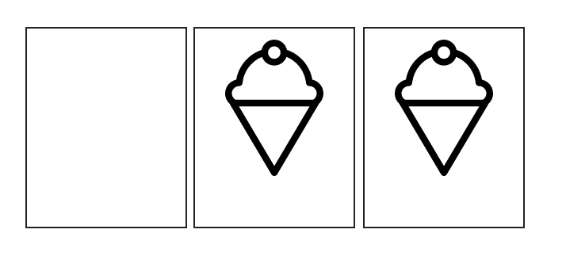

## Styling SVG &lt;use&gt; Content with CSS - 使用 CSS 来制定 SVG &lt;use&gt; 元素中内容的样式 [**Back**](./../translation.md)

> * 原文链接 : [Styling SVG &lt;use&gt; Content with CSS](http://tympanus.net/codrops/2015/07/16/styling-svg-use-content-css/)
> * 原文作者 : [Sara Soueidan](https://github.com/SaraSoueidan)
> * 译者 : [aleen42](https://github.com/aleen42)
> * 校对者 : 暂无
> * 状态 : 待校对


图标系列（icon system）是 SVG 图形最为常用的例子之一。除此之外，使用 [SVG 元素来“实例化”文档中任何图标](https://css-tricks.com/svg-sprites-use-better-icon-fonts/)，也是 SVG 所常用的 Sprite 技术，其其中的一种用法。

我们可以通过 `<use>` 元素去实例化图标、其他任何的 SVG 元素以及图像。然而，在制定它们的样式时往往会遇到了部分问题。因此，本文的目的在于为你提供部分可行的方法来绕开 `<use>` 元素所带来的局限性。

但在开始之前，我们还是来一起快速审视一下 SVG 的结构化和编组元素。然后，才逐渐地去深入了解 `use` 元素及其影子 DOM。最后，我们会回到如何使用 CSS 去制定样式的话题上。除此之外，本文还会带你仔细地研究制定样式过程中所遇到的种种问题，以及绕开它们的方法。

### 关于 SVG 结构化、编组以及引用（重用）元素的概述

在 SVG 中主要有四种元素用于定义、结构化和引用文档中 SVG 节点。它们使重用变得更为简单的同时，保持了代码的整洁性及可阅性。正因为 SVG 所具有的本质特性（nature），部分元素与图形编辑器中的一些命令都会提供有相似的功能。

用于编组及引用的这四种主要元素分别是：`<g>`、`<defs>`、`<use>` 和 `<symbol>`.

首先，`<g>` 元素（简称“编组（group）”）是用于逻辑上归类相关图形元素的集合。在像 Adobe Illustrator 这样的图形编辑器里，`<g>` 元素所提供的服务类似于“编组对象（Group Objects）”的功能。此外，在 AI 中一个图层就是一组的元素。因此，你也可以把编组理解成图层的概念

把元素编在一组当中，有利于把样式制定于组中的所有元素。当你想为组中的元素制定动画且需要同时保持之间的空间关系时，尤为有效。

其次，`<defs>` 元素是用于*定义*后面希望被重用的元素。其有助于你创建“模板（template）”并能在文档中使用多遍。值得注意的是，定义在 `<defs>` 中的元素并不会被渲染于画布上。除非，你在文档的某处“召唤”了它。

虽然，`<defs>` 可用于定义大量的元素。但是，其最主要的用途之一是去定义像渐变阴影（gradient pattern）这样的范式（patterns）。举个例子，该范式可被引用到其他 SVG 元素的描边及填充当中。除此之外，该范式还能被运用到画布上任何需要渲染的引用元素中。

再且，`<symbol>` 元素是集 `<defs>` 和 `<g>` 两者之大成。不仅能定义在文档中随处可被引用的模板，还能将这些模板编组在一起。与 `<defs>` 不同的是，`<symbol>` 并不常用于定义范式。其主要用途在于定义像图标这样的符号，且可在文档中被引用。

与前两者相比，`<symbol>` 元素有着一个重要的优势：它可接受一个 `viewBox` 属性，使得所引用的元素缩放以适合视窗（viewport）的大小。

最后，`<use>` 元素则是用于引用文档中任何已被定义好的元素。它使得你可以重用任何已存在的元素，并让你可以像在图形编辑器中一样，随意复制粘贴某个元素。也就是说，它可以用于重用一个单一元素或一组由 `<g>`、`<defs>` 或 `<symbol>` 所定义的元素。

为了重用某特定元素，你需要把元素的 ID 传至 `use` 的 `xlink:href` 属性当中，并通过 `x` 和 `y` 属性来设定放置的地方。除此之外，你也可以把样式应用于该 `use` 元素中，而该样式同时也会被应用于 `use` 元素中的所有内容。

可 `use` 元素中的内容到底指的是什么呢？这些内容都被克隆到哪里了？以及 CSS 是如何把样式应用到这些内容上的？

在我们回答这些问题之前，这里有一些文章值得我们先去阅读一下。通过阅读，我们可以对上述元素，以及关于 `<symbol>` 元素中所使用到的 `viewBox` 属性有着更为充分的了解：

- [SVG 中的结构化、编组和引用 —— `<g>`、`<use>`、`<defs>` 和 `<symbol>` 元素](http://sarasoueidan.com/blog/structuring-grouping-referencing-in-svg/)
- [了解 SVG 的坐标系（第一部分）： 视窗、`viewBox` 属性和 `PreserveAspectRatio` 属性](http://sarasoueidan.com/blog/svg-coordinate-systems)

### SVG 中的 &lt;use&gt; 元素及影子 DOM（The Shadow DOM）

当你使用 `<use>` 来引用一个元素时，代码可能会看起来像这样：

```html
<symbol id="my-icon" viewBox="0 0 30 30">
    <!-- icon content / shapes here -->
</symbol>

<use xlink:href="#my-icon" x="100" y="300" />
```

在屏幕中所渲染的是一个图标。虽然，它的内容被定义在 `<symbol>` 里面。然而，所渲染的却是 `<use>` 元素中的拷贝内容，而非*该*元素中的内容。

可我们只看到一个自闭的 `<use>` 元素 —— 其开闭标识符内并没有任何的相关内容。那么，从 `<symbol>` 所拷贝出来的内容到底在哪里呢？

答案是：**影子 DOM**。（有时，我也不知道为什么影子 DOM 总会让我想起蝙蝠侠。)

#### 影子 DOM 为何物？

影子 DOM 大体与普通的 DOM 相似。不同处在于，普通的 DOM 是作为主文档子树（the main document subtree）中的一部分所存在，而影子 DOM 中的节点则是属于特定的一个*“文档片段（document fragment）”*。该片段大体上就是另一棵用于存放节点的子树。只不过，该子树下的节点并不能像普通的节点一样，轻易被脚本和样式所访问到。也就是说，这为编程人员在创建模块化组件时，封装和指定脚本及样式的作用域，提供了一种方法。若您曾经使用过 HTML5 的 `video` 元素或范围型 `input` 元素如 `input[type="number"]`，那么你应该会想到这样的问题：视频的控制区或范围的选取组件到底是来自哪里？也许，这时你就会交叉地接触到影子 DOM。

在 `<use>` 元素这种情况中，所引用的元素其内容就是被克隆至一段文档片段当中，而该片段的“主人”就是相关的 `<use>` 元素。所以，`<use>` 元素有时亦被称作为一名*影子主人（Shadow Host）*。

至此，也就是说 `<use>` 元素中的内容（包括所引用元素的任何克隆或拷贝）是被展示在一个影子文档片段当中。

换句话说，它们的确是在*彼处*，可却无法被看见。宛如普通 DOM 的内容，而又无法被主文档中的“高级” DOM，以 CSS 选择器或 JavaScript 的方式所触及。这其实就是因为，它们被拷贝到了一份独立的文档片段当中，而该片段的主人就是该 `<use>` 元素。

如今，若是一位设计师的您也许会想：“好的，我清楚了这点。但是否有一种方式可以去审查该子文档，并真正地*看到*它们的内容呢？”答案是：可以的！你可以通过使用 Chrome 浏览器的开发工具去预览影子 DOM 的内容。但是，你事先需要在审查工具设置面板的“（一般）General” 选项中允许影子 DOM 的审查（可通过点击齿轮图标）。在此，若你找不到选项，方可在网上查一下如何去允许。本文在此不会再细说（Firefox 浏览器暂未支持）。

一旦你在开发工具中允许了影子 DOM 的审查，你就可以像审查普通 DOM 元素一样，在元素面板中看到所克隆的元素。以下图片所展示的就是 `<use>` 元素引用 `<symbol>` 元素内容的一个例子。需要注意的是，“#shadow-root” 所展开的片段就是 `<symbol>` 元素的一份拷贝内容。

> 

> 通过使用 Chrome 的开发者工具，你可以审查到影子 DOM 中的 &lt;use&gt; 元素（请查看一下灰色字的“#shadow-root”）。该截图中所审查的 Codrops 商标就是来自我们下一节的一个例子。

通过审查到的代码，我们会发现影子 DOM 与普通的 DOM 太过于相似。其两者的不同点只在于，处理从主文档所引用的 CSS 和 JavaScript 文件时，所呈现出的不同特征。当然，它们两者之前还有其他的不同之处，但在此处我们并不会去涵盖到每一点。因为，影子 DOM 实在是一个太大的概念。若你想阅读并学习更多的相关知识，这里推荐有部分文章，可供参考：

- [谈影子 DOM ](http://code.tutsplus.com/tutorials/intro-to-shadow-dom--net-34966)
- [影子 DOM 到底是何方神圣？](http://glazkov.com/2011/01/14/what-the-heck-is-shadow-dom/)
- [影子 DOM 101](http://www.html5rocks.com/en/tutorials/webcomponents/shadowdom/)
- [关于影子 DOM 的介绍（视频）](http://webcomponents.org/articles/introduction-to-shadow-dom/)

对于我来说，影子 DOM 完全可被视作为普通的 DOM。只是因为考虑到影子 DOM 在交互上所带来的限制，因此我们在使用 CSS 渲染样式（以及 JavaScript）而导致要访问元素时，需要作出不同的处理。这一点对于我们这些 SVG 开发者来说是非常重要的：正因为我们希望能改变 `<use>` 元素中内容的样式，我们必须要明白这些存在于影子 DOM 的内容，当其样式产生了改变时，是如何影响到其本身。而也正因为使用 `<use>` 元素的意义在于，它可以对一个元素创建出不同的“拷贝”。因此，在很多场合下，我们都希望能为每一份拷贝制定出不同的样式。例如，一个图标可以有两种样式（反转的颜色风格）或多种颜色的图标可以各自有自己的主题等。因此，若能使用 CSS 来实现的话，这对于我们来说是莫大的意义。话虽如此，但在之前我早已提及，影子 DOM 的内容并不像普通的 DOM 一样，能轻易被 CSS 所触及。因此，我们该怎样*去*为其内容制定样式呢？事实上，我们并不能像这样去为 `<use>` 元素中的路径制定样式：

```css
use path#line {
    stroke: #009966;
}
```

这是因为，我们并不能通过常规的 CSS 选择器去访问到影子 DOM。

尽管目前已经有大量特殊的选择器，使你可以突破影子 DOM 的边界去为里面的内容制定样式，可是，这些选择器不仅得不到浏览器很好的支持，而且对比于那些用于选择及渲染常规 DOM 元素样式的选择器来，其局限性太大了。

再且，我们希望的是使用一种更为简单的方式，去为一个 SVG `<use>` 元素中的内容制定样式，而不需要为了影子 DOM 而沾染双手 —— 也就是说，仅使用简单的 CSS 及 SVG。

为了实现这样的目的，并更为有效地控制 `<use>` 中内容的样式，我们需要换个角度去思考。然后，从影响 CSS 的层叠关系开始，利用其继承能力（inheritance capabilities）来解决问题。

### 层叠样式（The Style Cascade）

既然 SVG 元素可以使用 CSS 的三种方式来进行样式的制定：外部 CSS 样式（来源于一个外部样式层叠表）、内部样式块（`<style>` 元素）及内敛样式（来源于 `style` 属性），那么，我们理应要了解层叠是如何去决定这些元素的样式。

除了 CSS 属性之外，SVG 元素还可以通过使用 *presentation 属性*来制定样式。 尽管，该属性是一种 CSS 属性的简写。但是，我们还是把其当作是一种特殊的样式属性吧。因为，它们本质上虽是使其样式层叠于层叠样式上，然而往往会差强人意。

下面的代码小片段简单地展示了一个填充有粉色的圆形，及带有黄色的描边。`stroke`、`stroke-width` 和 `fill` 等这些属性都属于 presentation 属性。

```html
<svg viewBox="0 0 100 100">
    <circle fill="deepPink" stroke="yellow" stroke-width="5" cx="50" cy="50" r="10"></circle>
</svg>
```

在 SVG 中，任何一个属于 CSS 属性的子集，或许能被一个 SVG 属性所设定，反之亦然。这就意味着，并非所有的 CSS 属性都可在一个 SVG 元素中被设定为 presentation 属性。反之，并非所有 SVG 中的 presentation 属性都可用于 CSS 中（只是**大部分**可用！）。

在 SVG 规格说明书所详细列出的 SVG 属性当中，并非所有的都可用于 CSS。部分属性是属于两者共用的（即也可以在 CSS 中使用的属性），例如其中的 `opacity` 和 `transform`。而部分则非如此，如其中的 `fill`、`stroke` 和 `stroke-width`。

相比于 SVG 1.1，SVG 2 还多添加了 `x`、`y`、`width`、`height`、`cx`、`cy` 及部分其他的 presentation 属性等这些可用于 CSS 的属性。具体新的属性列表可查看于 SVG 2 的规格说明书。

假如你像我一样，那么，你就会想这些 presentation 属性相比起其他样式声明来说，是否能拥有更高的特异性（specificity）？就像外部的样式可被样式块中的内部样式所重写，而内部样式会被内敛样式所重写一样。又好比所获取的样式越为“内部”，其特异性越高。若能这样，就意味着当元素获取了其自身的属性时，该属性就能强大到重写任何其他的样式声明。可是，这*仍*只是一个设想，而实际上并非如此。

事实上，presentation 属性只是被认定为低级别的“编程人员层叠样式”，并可被任何其他的声明样式所重写：外部层叠样式、文档层叠样式以及内敛样式。而其唯一的能力，只是能重写元素中所继承的样式。总的来说，presentation 属性只能重写元素的继承样式而会被其他任何的样式声明所重写。

那好，既然我们弄清楚这点，那么就回到 `<use>` 元素及其内容上。

我们目前知道，我们不能简单地通过使用 CSS 选择器来为 `<use>` 中的元素制定样式。

我们也知道，所应用于 `<use>` 的样式与 `<g>` 元素一样，会被所有的后代所继承（即在影子 DOM 中的后代节点）

因此，我们首先就要尝试一下通过改变 `<use>` 元素自身的填充颜色，来使其被继承。从而，去改变 `<use>` 中一个元素其 `fill` 属性的颜色。

然而，结果却带给了我们两个问题：

1. 填充颜色会被 `<use>` 中*所有*的后代所继承，而有些你却并不希望如此。（当然如果 `<use>` 中只含有一个元素，那么这并不是一个问题）
2. 如果你已经从一个图形编辑器中导出和/或导入来自一个设计师的 SVG，而由于种种原因却无法触碰到 SVG 的代码。那么这时候，这些已被定义好 presentation 属性的 SVG 元素，就会被你所制定在 `<use>` 的样式所重写（除非，你在导出的时候特意说明，而这又是另一个话题）。那么，现在我假设如果你想在 `<use>` 中定义样式，并*希望*让其被后代所继承。此时， presentation 属性就会造成种种的不便。

就算，你*能*访问 SVG 代码，且*可以*避免这些 presentation 属性所带来的问题。但**我还是强烈地建议不要使用该种方法**。这是因为：

1. 这些带来问题的属性在移除后，往往会被重置成浏览器的初始值。而大多数情况下，（举个例子，如果我们是讨论颜色的话）初始值往往会是黑色的填充及描边。
2. 由于所有的值已被重置，因此你需要为各个属性重新去强制制定样式。因此，除非你想这样做，不然，你是不会希望去避开那些已被定义好的 presentation 属性。
3. 对于当外部的样式由于某种原因而无法使用的时候，这些初期被设定好的 presentation 属性将会是一个很好的回退机制。也就是说，倘若 CSS 由于部分问题而无法加载。那么，你的图标至少还会是处于初始的默认样式。因此，我强烈地建议你能保留这些 prensetation 属性。

可现在我们有这些属性的同时，还是希望能为不同的实例去制定不同的样式，比如说图标，那该怎么办？

方法就在于，保证能*强迫*把已定义好的 presentation 属性保留在所继承的样式里，或找到一种方法来绕开它们，以重写其值。为了做到*这样*的效果，我们需要利用上 CSS 的层叠关系。

让我们从简单的例子入手，并逐步走往更复杂的场景来讨论吧。

### 通过 CSS 来重写 Presentation 属性

由于，Presentation 属性可被任何其他的样式声明所重写。因此，我们可以利用这点，来通过使用一个外部的样式声明，强迫 presentation 属性去继承 `use` 中重写的对应值。

通过使用 CSS 的 [`inherit` 关键字](http://tympanus.net/codrops/css_reference/inherit)将使这变得非常简单。请看一下下面的例子。该例子中有一个雪糕，而该雪糕只由一种路径所描绘。但是，我希望能改变该路径的填充颜色。该图标是由 Erin Agnoli 制作于项目 [Noun Project](http://tympanus.net/codrops/2015/07/16/styling-svg-use-content-css/thenounproject.com)。

```html
<svg>
    <symbol id="ic">
        <path fill="#000" d="M81,40.933c0-4.25-3-7.811-6.996-8.673c-0.922-5.312-3.588-10.178-7.623-13.844  c-2.459-2.239-5.326-3.913-8.408-4.981c-0.797-3.676-4.066-6.437-7.979-6.437c-3.908,0-7.184,2.764-7.979,6.442  c-3.078,1.065-5.939,2.741-8.396,4.977c-4.035,3.666-6.701,8.531-7.623,13.844C22.002,33.123,19,36.682,19,40.933  c0,2.617,1.145,4.965,2.957,6.589c0.047,0.195,0.119,0.389,0.225,0.568l26.004,43.873c0.383,0.646,1.072,1.04,1.824,1.04  c0.748,0,1.439-0.395,1.824-1.04L77.82,48.089c0.105-0.179,0.178-0.373,0.225-0.568C79.855,45.897,81,43.549,81,40.933z   M49.994,11.235c2.164,0,3.928,1.762,3.928,3.93c0,2.165-1.764,3.929-3.928,3.929s-3.928-1.764-3.928-3.929  C46.066,12.997,47.83,11.235,49.994,11.235z M27.842,36.301c0.014,0,0.027,0,0.031,0c1.086,0,1.998-0.817,2.115-1.907  c0.762-7.592,5.641-13.791,12.303-16.535c1.119,3.184,4.146,5.475,7.703,5.475c3.561,0,6.588-2.293,7.707-5.48  c6.664,2.742,11.547,8.944,12.312,16.54c0.115,1.092,1.037,1.929,2.143,1.907c2.541,0.013,4.604,2.087,4.604,4.631  c0,1.684-0.914,3.148-2.266,3.958H25.508c-1.354-0.809-2.268-2.273-2.268-3.958C23.24,38.389,25.303,36.316,27.842,36.301z   M50.01,86.723L27.73,49.13h44.541L50.01,86.723z"/>
    </symbol>
</svg>
```

雪糕图标的内容（该 `path`）是被定义于一个 `<symbol>` 元素当中。这就意味着，它不会被直接渲染到 SVG 的画布当中。

然后，我们通过使用 `<use>` 来渲染出多个不同的图标实例。

```html
<svg class="icon" viewBox="0 0 100 125">
    <use class="ic-1" xlink:href="#ic" x="0" y="0" />
</svg>
<svg class="icon" viewBox="0 0 100 125">
    <use class="ic-2" xlink:href="#ic" x="0" y="0" />
</svg>
```

可以看到，图标的宽度和高度是制定于 CSS 中。而两实例的 `viewBox` 属性，其维度值也被设置成相同。当然，这并非需要完全相同。然而，为了避免 SVG 中任何额外空位所产生的影响，我们还是保证两者能拥有相同的分辨率。

```css
.icon {
    width: 100px;
    height: 125px;
}
```

运行上面的代码，可以得到下述的结果：



要注意的是，我为每一个 SVG 元素都添加有一条黑色的边界以便区分。而第一个 SVG 元素中只是定义了图标内容，但没有被渲染出来。这说明了一点：**SVG 文档仍然会把你定义 `symbol` 的地方给渲染出来。即便，其内容并没有被渲染出形状**。为了避免这样的问题，你必须保证把第一个 SVG 元素设置成 `display: none`。不然，尽管你不设置任何的维度值，浏览器仍然会以 CSS 中对于不可替换元素所设定的默认值300px比150px的分辨率，去渲染该元素，以至于你看到了一个空白的非预料区域。

现在，我们尝试一下去改变每一个图标实例的填充颜色：

```css
use.ic-1 {
    fill: skyblue;
}

use.ic-2 {
    fill: #FDC646;
}
```

可以发现，填充颜色并为发生任何改变。因为，该理应被继承的颜色值被 `path` 元素中的 `fill="#000"` 所重写。为了避免这种状况，我们要强迫 `path` 去继承我们所定义的值：

```css
svg path {
    fill: inherit;
}
```

瞧！我们在 `<use>` 元素所定义的颜色被应用到了每一个对应的 `path` 当中。当然，你也可以通过下面所展示的一个 Demo，随意地去添加图标并更改成你所喜欢的颜色：

<br />

<iframe height='300' scrolling='no' src='//codepen.io/aleen42/embed/wzxWxR/?height=300&theme-id=21735&default-tab=result&embed-version=2' frameborder='no' allowtransparency='true' allowfullscreen='true' style='width: 100%;'>See the Pen <a href='http://codepen.io/aleen42/pen/wzxWxR/'>wzxWxR</a> by aleen42 (<a href='http://codepen.io/aleen42'>@aleen42</a>) on <a href='http://codepen.io'>CodePen</a>.
</iframe>

<br />

如今，当你想强迫 `<use>` 元素中的内容去继承所设定的样式时，你就可以通过使用上述的方法来完成。但在绝大部分情况下，这也许并非你确切想要的。那么，往后再看看其他的场景下，我们想要的到底是什么。

#### 通过 CSS 的 `all` 属性来订制 `<use>` 中内容的样式

过去有那么一次，我在使用 `use` 元素来引用图标的时候，曾希望其中的一个元素能继承所有制定在 `<use>` 上的样式，如 `fill`、`stroke`、`stroke-width`、`opacity` 乃至 `transform` 属性。更确切地说，就是想要控制所有的这些属性，并同时保持 markup 文档中 presentation 属性的值以便回退。

若你遇到过同样的情况时，也许你会发现用上述的方法在 CSS 中实现，会是一件非常耗时的事情：

```css
path#myPath {
    fill: inherit;
    stroke: inherit;
    stroke-width: inherit;
    transform: inherit;
    /* ... */
}
```

通过上面的代码片段，我们可以看到，在这个范式中，若能把*所有*的这些属性组合成一个新的属性，并赋值为 `inherit`，那该多好。不然，如此耗时的实现将会变得毫无意义。

幸运的是，CSS 中的 `all` 属性帮我们解决了这样的问题。虽然，在“[CSS 所引用的属性词条](http://tympanus.net/codrops/css_reference/all/)”一文中，我早已谈及如何去使用 `all` 属性来制定 SVG `<use>` 元素中内容的样式。但是，在此我们还是回顾一下吧。毕竟，我们是在重点地讨论此话题。

有了 `all` 属性，我们就可以像这样去实现：

```css
path#myPath {
    all: inherit;
}
```

该代码对于所有支持 `all` 属性的浏览器来说，是没有问题的（详情请参考属性词条一文）。但是，有一点我们需要记住的是：**该声明会把元素中的*所有*属性都设置成所赋的字面值，以继承其祖先的值**，甚至包括那些你并不想得到继承的属性。因此，除非你希望为*所有*的属性都制定样式，不然，你并不能这么做 —— 毕竟，这是一个**极端的手段**。它只针对于控制元素的整个骨架及其样式的指定，而这手段并不过于常见。若你非要使用该声明，而又没有为所有的属性声明其值。那么，这些属性将会沿着继承的关系，往上追溯并找到浏览器中来自默认用户层叠样式表中的默认样式。

注：该属性是会影响 CSS 中的所有属性，而不仅仅是 SVG 的属性。也就是说，只要一个属性能在 CSS 中生效，那么它就会被设置为 `inherit`。相反，则不会。

---

强迫 presentation 属性去继承 `<use>` 样式的方法的确非常强大。可若你有一个图标包含有不同的元素且*不*希望*所有*的这些元素都去继承 `use` 中的 `fill` 颜色值，那该怎么办？若你想对不同的 `use` 后代赋予不同的填充颜色，那又该怎么办？毕竟，在 `use` 中只制定一个样式这样的方法已然不再奏效。针对这样的状况，我们需要其他的方法来帮助我们把正确的颜色传递到正确的元素上。

### 使用 CSS 的 `currentColor` 变量来制定 `<use>` 元素中内容的样式

通过使用 CSS 的 [`currentColor` 变量](http://tympanus.net/codrops/css_reference/color_value/#section_currentColor)，连同上述的方法，我们就可以在一个元素中声明两种不同的颜色，而不仅仅一种。在不到一年前，Fabrice Weinberg [在他的 Codepen 博客上早已就相关的技术写了一篇文章](http://codepen.io/FWeinb/blog/quick-tip-svg-use-style-two-colors)，在这里可供我们参考。

该技术的想法是要在 `<use>` 元素上同时使用 `fill` 和 `color` 两种属性。然后，通过利用 `currentColor` 属性的特性使得这些颜色能被 `<use>` 元素中的内容所继承。下面，让我们来直接看看一个代码例子中，是如何使用这种方法的。

假设我们希望使用两种不同的颜色，去为下面的 Cordrops 小图标制定样式 —— 分别定制前面和后面的。


首先，我们先来看看上述截图的代码：我们会使用 `symbol` 来包含图标的内容定义。然后，每一个图标实例都会对应着一个 `<use>` 实例。

```html
<svg style="display: none;">
<symbol id="codrops" viewBox="0 0 23 30">
    <path class="back" fill="#aaa" d="M22.63,18.261c-0.398-3.044-2.608-6.61-4.072-9.359c-1.74-3.271-3.492-5.994-5.089-8.62l0,0   c-1.599,2.623-3.75,6.117-5.487,9.385c0.391,0.718,0.495,1.011,0.889,1.816c0.143,0.294,0.535,1.111,0.696,1.43   c0.062-0.114,0.582-1.052,0.643-1.162c0.278-0.506,0.54-0.981,0.791-1.451c0.823-1.547,1.649-2.971,2.469-4.33   c0.817,1.359,1.646,2.783,2.468,4.33c0.249,0.47,0.513,0.946,0.791,1.453c1.203,2.187,2.698,4.906,2.96,6.895   c0.292,2.237-0.259,4.312-1.556,5.839c-1.171,1.376-2.824,2.179-4.663,2.263c-1.841-0.084-3.493-0.887-4.665-2.263   c-0.16-0.192-0.311-0.391-0.448-0.599c-0.543,0.221-1.127,0.346-1.735,0.365c-0.56-0.019-1.095-0.127-1.599-0.313   c1.448,3.406,4.667,5.66,8.447,5.78C19.086,29.537,23.469,24.645,22.63,18.261z"/>
    <path class="front" fill="#ddd" d="M6.177,11.659c0.212,0.367,0.424,0.747,0.635,1.136c0.164,0.303,0.333,0.606,0.512,0.927   c0.683,1.225,1.618,2.898,1.755,3.937c0.144,1.073-0.111,2.056-0.716,2.769c-0.543,0.641-1.315,1.014-2.186,1.067   c-0.87-0.054-1.643-0.43-2.186-1.067c-0.604-0.713-0.858-1.695-0.715-2.771c0.137-1.036,1.072-2.712,1.755-3.936   c0.18-0.32,0.349-0.623,0.513-0.927C5.752,12.404,5.964,12.026,6.177,11.659 M6.177,5.966L6.177,5.966   c-1.02,1.649-2.138,3.363-3.247,5.419c-0.932,1.728-2.344,3.967-2.598,5.88c-0.535,4.014,2.261,7.09,5.846,7.203   c3.583-0.113,6.379-3.189,5.845-7.203c-0.255-1.912-1.666-4.152-2.598-5.88C8.314,9.329,7.196,7.617,6.177,5.966L6.177,5.966z"/>
</symbol>
</svg>
<svg height="90px" width="69px">
    <use xlink:href="#codrops" class="codrops-1"/>
</svg>
<svg height="90px" width="69px">
    <use xlink:href="#codrops" class="codrops-2"/>
</svg>
<svg height="90px" width="69px">
    <use xlink:href="#codrops" class="codrops-3"/>
</svg>
```

此时，若我们在 `<use>` 元素中都只设置 `fill` 颜色值的话，那么，颜色将会被每一个路径所继承以至于最后呈现出同样的颜色，而这并不是我们想要的。

因此，除了声明 `fill` 颜色之外，我们还会使用 `currentColor` 变量来保证上层的图标能得到一个不同的颜色值：该值需要通过使用 `color` 属性来声明。

首先，我们先把 `currentColor` 插入到我们希望被应用的地方；然后让其继承颜色至 `<symbol>` 元素中对图标所定义的内容。因此，代码将会变成：

```html
<svg style="display: none;">
	<symbol id="codrops" viewBox="0 0 23 30">
		<path class="back" fill="#aaa" d="..."/>
		<path class="front" fill="currentColor" d="..."/>
	</symbol>
</svg>
```

然后，我们需要把其他图标中的 `fill` presentation 属性移除。然后，让其从 `use` 中继承 `fill` 的颜色值而并不需要使用 `inherit` 的技术。

倘若使用了 `inherit` 关键词去强迫 presentation 属性继承 `use` 中的值，那么，两条路径都会继承同样的值，而 `currentColor` 则不起效果。因此，在该方法中，我们需要移除 CSS 中我们所希望设置的属性，而只保留使用 `currentColor` 属性所设置的值。

```html
<svg style="display: none;">
	<symbol id="codrops" viewBox="0 0 23 30">
		<path class="back" d="..."/>
		<path class="front" fill="currentColor" d="..."/>
	</symbol>
</svg>
```

现在，我们就可以通过使用 `<use>` 中的 `fill` 和 `color` 属性来制定图标的样式：

```css
.codrops-1 {
    fill: #4BC0A5;
    color: #A4DFD1;
}
.codrops-2 {
    fill: #0099CC;
    color: #7FCBE5;
}
.codrops-3 {
    fill: #5F5EC0;
    color: #AEAFDD;
}
```

每一个 `<use>` 元素将会得到属于其自己的 `fill` 和 `color` 值。对于它们自身来说，`fill` 颜色值将会被继承到第一个没有设置 `fill` 属性的路径，而 `color` 属性的值则会被用作于第二个路径中的 `fill` 属性。

这到底发生了什么事呢？其实，通过使用 `currentColor` 变量，当前的颜色值被“渗透”到 `<use>` 元素的内部。这难道不是一种非常简洁的做法吗？

下面列出上述代码的 Demo，以供参考：

<br />

<iframe height='300' scrolling='no' src='//codepen.io/aleen42/embed/vXaKvR/?height=300&theme-id=21735&default-tab=result&embed-version=2' frameborder='no' allowtransparency='true' allowfullscreen='true' style='width: 100%;'>See the Pen <a href='http://codepen.io/aleen42/pen/vXaKvR/'>vXaKvR</a> by aleen42 (<a href='http://codepen.io/aleen42'>@aleen42</a>) on <a href='http://codepen.io'>CodePen</a>.
</iframe>

<br />

对于这种简单的双颜色图标来说，双颜色变量这种方法的确非常有效。在 Fabrice 的文章中，他也是通过改变文本和背景的颜色，为 Sass 图标创建了三个不同的变量。

目前，`currentColor` 关键字的局限在于它只能在 CSS 中可用。而关键的问题在于，若我们有多个变量，我们可以渗透多个值到 `<use>` 的内容中吗？的确，这是可以的。Ameila Bellmay-Royds 在近一年内，也就相关技术书写了[一篇文章在 Codepen 的博客上](http://codepen.io/AmeliaBR/thoughts/customizable-svg-icons-css-variables)。让我们来看看，他到底是怎么样去渗透。

### 未来：通过 CSS 自定义属性（即 CSS 变量）来制定 &lt;use&gt; 中内容的样式

通过使用 [CSS 自定义属性（即 CSS 变量）](http://www.w3.org/TR/css-variables/)，我们可以在为 `<use>` 中的内容制定样式的同时，不必强迫浏览器去重写任何 presentation 属性的值。

正如 [MDN 所定义](https://developer.mozilla.org/en-US/docs/Web/CSS/Using_CSS_variables)的一样，CSS 变量是编程人员或用户在文档中定义的一个网页实体，并用于包含特定的值。它是由自定义属性所设定，并通过一个特殊的函数标识符 `var()` 所访问的。虽然，它与 CSS 预处理器（像 Sass）中的变量相似，但是，其具有更大的灵活性，且可以做[一些预处理器变量所完成不了的事情](http://www.sitepoint.com/css-variables-can-preprocessors-cant/)。（CSS 变量该词条将会很快被加入到 Codrops 所写“CSS 引用的属性词条”一文当中。因此，请继续关注我们的动态。）

尽管变量（也就是 CSS 变量或预处理器变量）可以有多种的用法。但是，主题化（颜色）却是其中最为常用的一种。在这一节，我们将会讨论如何使用它去为 SVG 制定样式。

首先，这里有一张通过 `symbol` 元素定义的图片并通过 `use` 所实例化。下面，我们将仅对该图采用上述的技术；当然，若你喜欢的话，也可以为更多的元素进行样式上的制定。

然后，假定我们采用的是一张[由 Freepik 所设计](http://www.freepik.com/free-vector/cute-vector-hipster-robot-character_714905.htm)的插图。该图中画有一部既可爱又时髦的机器人。

<a href="./1.png"></a>

下面的代码包含了其颜色组成的定义。

```html
<svg style="display: none">
    <symbol id="robot" viewBox="0 0 340 536">
        <path d="..." fill="#fff" />
        <path d="..." fill="#D1312C" />
        <path d="..." fill="#1E8F90" />
        <path d="..." fill="#1E8F90" />
        <path d="..." fill="#fff" />
        <path d="..." fill="#6A4933" />
        <path d="..." fill="#1E8F90"  />
        <path d="..." fill="#6A4933" />
        <path d="..." fill="#fff" />
        <path d="..." fill="#6A4933" />
        <path d="..." fill="#F2B42B" />
        <path d="..." fill="#fff" />

        <!-- rest of the shapes -->
    </symbol>
</svg>
```

现在，我们并*不是*使用 CSS 变量直接作为 `fill` 属性的值；而是作为 CSS 中的 `fill` *属性*的值，并固定起来。这是因为，**该属性可作为一种回退机制，以防浏览器不支持 CSS 变量**。若有了回退的机制，即便变量无法工作起来，图片也仍然会展示其初始的模样。

添加 CSS 变量后，上述的代码将会变成：

```html
<svg style="display: none">
    <symbol id="robot" viewBox="0 0 340 536">
        <path d="..." fill="#fff" />
        <path d="..." fill="#D1312C" />
        <path d="..." fill="#1E8F90" style="fill: var(--primary-color)" />
        <path d="..." fill="#1E8F90" style="fill: var(--primary-color)" />
        <path d="..." fill="#fff" />
        <path d="..." fill="#6A4933" style="fill: var(--tertiary-color)" />
        <path d="..." fill="#1E8F90" style="fill: var(--primary-color)" />
        <path d="..." fill="#6A4933" style="fill: var(--tertiary-color)" />
        <path d="..." fill="#fff" />
        <path d="..." fill="#6A4933" style="fill: var(--tertiary-color)" />
        <path d="..." fill="#F2B42B" style="fill: var(--secondary-color)" />
        <path d="..." fill="#fff" />

        <!-- rest of the shapes -->
    </symbol>
</svg>
```

既然，内敛 `style` 标识符会重写 presentation 属性。那么，支持 CSS 变量的浏览器也将会采用该变量来作为形状的填充颜色。相反，对于那些不支持的浏览器则只会采用 `fill` 属性的值。

接下来，我们需要在 CSS 中定义该变量。首先，使用 `use` 来实例化插图：

```html
<svg width="340" height="536">
    <use xlink:href="#robot" id="robot-1" />
</svg>
```

然后，在 `use` 中定义该变量以使得其可被 `use` 中的内容所继承。因为，为变量所选择的颜色均决定了该插图的颜色体系。因此，将会有三种主颜色体系来组成图片。我在这分别把它们称作 primary、secondary 和 tertiary。

```css
#robot-1 {
    --primary-color: #0099CC;
    --secondary-color: #FFDF34;
    --tertiary-color: #333;
}
```

当然，你也可以在使用这些变量的同时，使用 `fill` 和 `color` 属性。但是，我认为你并不必要且无需费神。给定上述的颜色定义后，机器人将会变成：

<a href="./2.png"></a>

若你喜欢的话，也拷贝多张图片，并为每一张中的 `use` 都定义一组不同的颜色，以实现不同的颜色主题。若要为一个图标在不同内容中制定不同的样式，或有着其他相似的需求时，这种方法将会变得特别有效。

既然，我们知道若浏览器不支持 CSS 变量，该图片将会回退至起初定义在 presentation 属性的样式，而若支持，则会采用变量重写该值。好，那如果浏览器*是*支持 CSS 变量，可编程人员却没有为特定的变量给定值，或所给定的值无效，那会发生怎样的事情？我们可以测试一下。

对于我们这里的时髦机器人来说，我们定义有三个变量，而仅有部分元素没采用到它们。那么，现在若我们在一个支持 CSS 变量的浏览器上展示图片（目前只有 Firefox），且移除 CSS 中的变量声明。我们会得到怎样的结果：

<a href="./3.png"></a>

可以发现，若值没有被设定或所设定的值无效时，浏览器会采用其默认的颜色。通常在 SVG 中，填充和描边的默认颜色会是黑色。

为了避免该情况，我们需要另一种方式。那就是，为**支持的浏览器提供另一个颜色的回退机制**。实际上，CSS 变量的访问语法中提供有一种方法：那就是往 `var()` 中提供两个由逗号分隔的参数，而不仅仅是一个变量名：变量名和一个回退的颜色值 —— 在我们这个例子中指的是 presentation 属性的值。

把代码修改后，会变成：

```html
<svg style="display: none">
    <symbol id="robot" viewBox="0 0 340 536">
        <path d="..." fill="#fff" />
        <path d="..." fill="#D1312C" />
        <path d="..." fill="#1E8F90" style="fill: var(--primary-color, #1E8F90)" />
        <path d="..." fill="#1E8F90" style="fill: var(--primary-color, #1E8F90)" />
        <path d="..." fill="#fff" />
        <path d="..." fill="#6A4933" style="fill: var(--tertiary-color, #6A4933)" />
        <path d="..." fill="#1E8F90" style="fill: var(--primary-color, #1E8F90)" />
        <path d="..." fill="#6A4933" style="fill: var(--tertiary-color, #6A4933)" />
        <path d="..." fill="#fff" />
        <path d="..." fill="#6A4933" style="fill: var(--tertiary-color, #6A4933)" />
        <path d="..." fill="#F2B42B" style="fill: var(--secondary-color, #F2B42B)" />
        <path d="..." fill="#fff" />

        <!-- rest of the shapes -->
    </symbol>
</svg>
```

没错，就是这样。对于任何不能加载其值或无值的 CSS 变量，浏览器都会回退至定义在 markup 文档上的颜色。这方法真的是太美妙了。

通过这样的技术，如今在任何地方，你都可以使用 `<use>` 来引用机器人，并在 CSS 中为每一个新的实例定义一组不同的变量值。这样的话，每一个实例，就会有着不同的颜色主题。

当然，你可以通过下面的 Demo 去测试一下，可你这次需要保证所使用的是 Firefox 浏览器。因为，在写该文时，Firefox 是唯一一个能支持 CSS 变量的浏览器：

<br />

<iframe height='495' scrolling='no' src='//codepen.io/aleen42/embed/rrArWW/?height=495&theme-id=21735&default-tab=result&embed-version=2' frameborder='no' allowtransparency='true' allowfullscreen='true' style='width: 100%;'>See the Pen <a href='http://codepen.io/aleen42/pen/rrArWW/'>rrArWW</a> by aleen42 (<a href='http://codepen.io/aleen42'>@aleen42</a>) on <a href='http://codepen.io'>CodePen</a>.
</iframe>

<br />

若你是在 Firefox 上浏览该 Demo，那么你将会看到的是一个蓝 + 黄版本的机器人。请查看一下在 Chrome 中，该机器人是否回退到初始的颜色（绿版本），并尝试在 Firefox 中清除一下通过 CSS 定义变量，然后看看回退的效果。

### 总结

咂。已经写了这么多东西了，是时候该总结一下。

通过利用 CSS 的继承关系，我们可以为 `<use>` 的内容轻易地制定样式 —— 即便该内容是在影子 DOM 中。而通过 CSS 变量（也可以是 `currentColor` 属性或自定义属性），我们可以渗透到影子 DOM 的字里行间，并根据我们的喜好制定属于自己的图片。同时，还提供有较好的回退机制以防出错。

个人而言，我对 CSS 变量 + SVG 这样的组合是感到极其的兴奋。因为，我喜欢它们在一起所产生出的强大力量，尤其是给定了一种美妙的回退机制。**即便如我所述，目前只在 Firefox 中支持。但是，若你想让其得到其他浏览器的广泛支持，你完全可以为其在 [MS Edge User Voice 论坛](https://wpdev.uservoice.com/forums/257854-internet-explorer-platform/suggestions/6261292-css-variables)上投票**。

也许在将来，我们会找到其他的方法去制定 `use` 的内容。毕竟，关于使用 CSS 变量作为 SVG 参数的话题，已经存在有相关的讨论。因此，文章虽长，可未必会涵盖到该话题的方方面面。若您有任何的意见或看法，请不要拘谨。直接把你的想法通过下面的评论分享出来。

关于处理 SVG 元素中被重用的内容，已然成为众多 SVG 话题中的一个。许多人看似因为克隆代码的表现及其位置特性，而沉陷于困难之中。尽管，话题受人追捧。但是，由于与本文无关，因此，我就不在此细说。

希望你能享受这篇文章，并发现其可用之处。感谢您的阅读。
