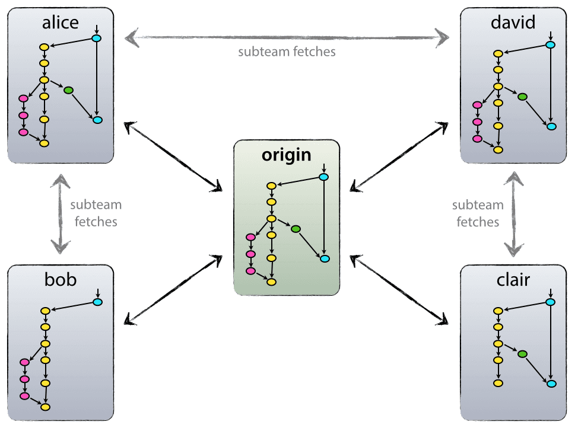
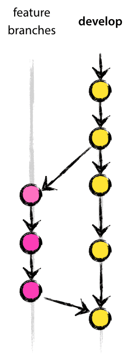
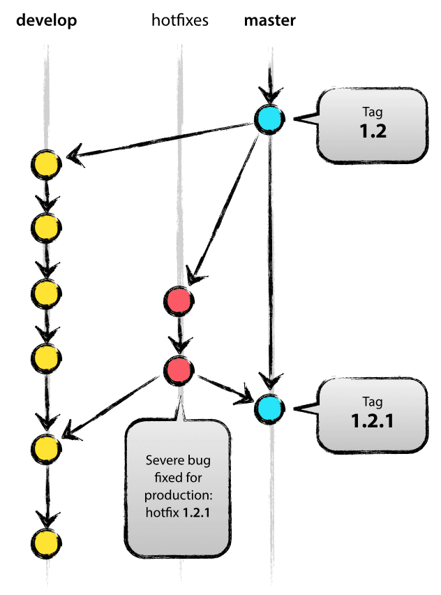

## A successful Git branching model - 一个成功的Git建立分支模型 [**Back**](./../translation.md)

> * 原文链接 : [A successful Git branching model](http://nvie.com/posts/a-successful-git-branching-model/)
> * 原文作者 : [Vincent Driessen](http://nvie.com/about/)
> * 译者 : [aleen42](https://github.com/aleen42) 
> * 校对者: 暂无
> * 状态 :  待校对

&#160; &#160; &#160; &#160;在这篇博文中，我将展示大概一年前我的一些项目（包括工作或者私人的项目）中，使用的建立分支开发模型。结果发现，这个模型的确是非常成功的一个模型。因此，我想把其记录成文档，但直到现在才腾出了时间去完成。在这篇文章中，我并不会探讨项目的细节。我们将要讨论的将是建立分支的策略以及代码版本的控制。


&#160; &#160; &#160; &#160;该模型将会使用 [Git](http://git-scm.com/) 作为工具，去对我们的源代码进行版本标记。（顺便一说的是，如果你对 Git 有兴趣，我们公司 [GitPrime](http://gitprime.com/) 会为你提供一些令人惊叹的实时数据分析工具，用于软件工程性能的分析）

### 为什么选择 Git？

&#160; &#160; &#160; &#160;因为我们通过集中几个源代码管理系统，就 Git 的优点以及缺点方面进行了彻底地讨论，详细可以[参考](http://whygitisbetterthanx.com/)我们的[网站](http://git.or.cz/gitwiki/GitSvnComparsion)。在这个问题上的斗争，可以说是非常的激烈。当今，作为一位开发人员，相比使用其他的工具，我更倾向于使用 Git。这是因为 Git 真正改变了开发人员对合并分支（merging）以及建立分支（branching）的思考。从经典的并发版本控制系统（CVS）/子系统（Subversion）世界过来的我，总是认为合并分支/建立分支是何等的吓人（“请小心合并分支时产生的冲突，因为它是会随时咬你的”）。而且，这又是你等会将需要做的唯一事情，而这事情又是你每次都需要做的。

&#160; &#160; &#160; &#160;然而，自从有了 Git 后，这一切的动作都将变得如此简单和便捷。而且，这一动作也将成为你日常工作流中的重要环节之一。举个例子来说，在并发版本控制系统/子系统的[相关书籍](http://svnbook.red-bean.com/)中，建立分支和合并分支都只是在最后的章节作出首次的提及（对于需要高级操作的用户有用），然而在[每一个讲述 Git 的书籍](http://pragprog.com/titles/tsgit/pragmatic-version-control-using-git)中，这将会在第三个章节就会被提及到（作为基础部分）。

&#160; &#160; &#160; &#160;作为简洁和自然重复的结果，建立分支与合并分支不再是一种可怕的存在。而版本控制工具则应该去协助建立分支/合并分支的操作。

&#160; &#160; &#160; &#160;讲述完工具，我们来谈谈相关的开发模型。这里我将展示的模型基本上仅是每一个团队成员都需要遵行的一组过程。这是为了能够达到一个被管理的软件，其开发的过程。

### 集中却分散

&#160; &#160; &#160; &#160;那些能配置使用且能有效使用这个建立分支开发模型的仓库，必须是那些有着一个中心化且“真实的”仓库。注意的是，该仓库仅仅是中心的那一个（然而既然 Git 是一个分布式版本控制系统（DVCS），那么从技术层面上来说，就不应该有这样一个东西去承担中心仓库的角色）。下面，我们会把该仓库称作原始仓库（origin），而且对于所以的 Git 用户来说，这样的命名最熟悉不过。



&#160; &#160; &#160; &#160;每一个开发人员都需要从原始仓库下拉以及上推代码。但是，除了这种中心化下拉-上推关系之外，每一个开发人员为了形成一个子团队，都可能需要从其他的同伴下来更新的代码。举个例子来说就是，如果两个或多个的开发者同时在一个大的新项目上协同工作时，在过早提交代码到原始仓库之前，从伙伴下拉更新的代码就会显得非常有用。上图所示，这里有着一个由 Alice 和 Bob、Alice 和 David 以及 Clair 和 Davi 三种关系组成的子团队。

&#160; &#160; &#160; &#160;技术上来说，这就意味着比起 Alice 去定义一个远程的 Git 项目并命名成 bob，然后指向 Bob 的仓库会来说，也没有太大的意义，反之亦是。

### 主分支


&#160; &#160; &#160; &#160;这开发模型的核心部分，其形成主要是受到上图所存在的模型所启发。中心仓库持有两条生命期无限期的分支：

- 主分支（**master**）
- 开发分支（**develop**）

&#160; &#160; &#160; &#160;在原始仓库中，每一个 Git 用户对 **master** 分支应该都稍有了解。而与 **master** 分支平行的有一条分支，叫作 **develop** 分支。

&#160; &#160; &#160; &#160;我们把 **origin/master** 作为一条主分支，而该主分支上的源代码，其头指针 **HEAD** 总是指向一个生产就绪（production-ready）的状态。

&#160; &#160; &#160; &#160;而我们把 **origin/develop** 作为另一条主分支。该分支上的代码，其头指针则总是指向最新一次交付的开发更新版本。该版本用于下一个次版本的发行。有些人会称这条分支为“集成分支（integration branch）”。那是因为，这条分支也是每一晚代码自动构建的来源地方。

&#160; &#160; &#160; &#160;当在 **develop** 分支上的源代码到达了一个相对稳定的点并能发行的时候，所有该分支上的修动部分都应该被合并回 **master** 分支上，并用一个新的发行号来标记它。至于具体怎么做，我们接下来会更加深入去讨论。

&#160; &#160; &#160; &#160;所以，每一次当修动部分被合并回 **master** 分支时，确实这就意味着一个新的产品已经被发行出来。在这定义上，我们更倾向于严格要求。因为只有这样，在理论上我们每一次提交代码到 **master** 分支时，才能使用 Git 的钩子脚本（hook script）去自动构建或回滚我们的软件，并部署于产品服务器。

### 支承分支

&#160; &#160; &#160; &#160;在 **master** 和 **develop** 分支下，我们的开发模型使用了不同的支承分支去帮助团队成员之间的平行开发、缓解特征的追踪、为产品发行作准备以及协助快速解决“现场”产品所带来的问题。不同于两个主要分支的是，这些支承分支总是有一个有限的生命周期。这是因为，它们会被最终移除。

&#160; &#160; &#160; &#160;我们或许会使用不同类型的支承分支有：

- 特征分支（Feature branches）
- 发行分支（Release branches）
- 热补丁分支（Hotfix branches）

&#160; &#160; &#160; &#160;每一种分支，都必须有其特定的目的，并绑定有其严格的要求。这是因为随着时间推移，某些分支可能会成为这些分支的原始分支以及某些分支可能会成为这些分支的合并对象。若干分钟后，我们会探讨它们的区别。

&#160; &#160; &#160; &#160;其实，这些分支比起一些科学领域来说，一点都不“特殊”。它们的分类都是根据我们怎么使用它来区分。当然,它们都是相当旧式的 Git 分支。

#### Feature 分支



&#160; &#160; &#160; &#160;从以下分支分离出来：

- **develop**

&#160; &#160; &#160; &#160;会合并到以下分支：

- **develop**

&#160; &#160; &#160; &#160;**Feature** 分支（有时称作话题分支（topic branches））是用于对未来即将要来或者是一个不一样的发行版开发新的功能。我们在开发新功能的时候，并不知道该新功能将来会在哪个版本发行。因此，**Feature** 分支的本质就在于，只要该新功能仍处于开发阶段，那么该分支就会一直存在。然而，最终当功能开发完成时，该分支还是会被合并到 **develop** 分支（确实要添加这新功能到该发行版的时候）或者被抛弃（当然这是在不满意的情况下发生）。

&#160; &#160; &#160; &#160;一般地，**Feature** 分支是只存在于开发者的仓库，而并不会存在于原始仓库。

###### 创建一条 Feature 分支

&#160; &#160; &#160; &#160;当开始开发一个新功能时，从 **develop** 分支分离出来。

```bash
git checkout -b myfeature develop
# Switched to a new branch 'myfeature'
```

###### 合并一条已经完成的 Feature 分支到 develop 分支

&#160; &#160; &#160; &#160;完成了的功能需要合并到 **develop** 分支，以确切把其添加到下一个要发行的版本中。

```bash
git checkout develop
# Switched to branch 'develop'

git merge --no-ff myfeature
# Updating ea1b82a..05e9557
# (Summary of changes)

git branch -d myfeature
# Deleted branch myfeature (was 05e9557).

git push origin develop
```

&#160; &#160; &#160; &#160;标志位 **--no-ff** 表示每次合并分支时总要去生成一个新的提交对象，即使该合并表现为一个快进（fast-forward）状态。通过设置其就可以避免丢失一些信息，包括一个 **Feature** 分支的历史存在记录。而且还可以整合所有的关于这次功能添加的提交记录。这个我们可以通过下图来对比一下：


在后一种情况下，我们可能可以通过翻看到 Git 的历史纪录，知道哪些提交对象是共同用于完成一个功能的 —— 但你需要手动去读取所有的日志消息。况且，倘若需要回滚整个功能（例如一组的提交），那么在后一种情况将是一个令人头疼的事情，而当我们使用 **--no-ff** 标志就可以轻松解决这个问题。

&#160; &#160; &#160; &#160;没错，这种情况下会新增加一些（可能空的）提交对象。然而，这是一种利大于弊的做法。

#### Release 分支

&#160; &#160; &#160; &#160;从以下分支分离出来：

- **develop**

&#160; &#160; &#160; &#160;会合并到以下分支：

- **develop** 和 **master**

&#160; &#160; &#160; &#160;该分支的命名规范：

- **release-***

&#160; &#160; &#160; &#160;**Release** 分支用于为新产品的发行作准备。它只允许在最后的几分钟对产品进行一些修修补补的工作。更深一层来说就是，这些分支只允许微小漏洞的修复以及为一次发行准备元数据（版本号，构建日期等）。通过在一个 **Release** 分支上完成这些工作，**develop** 分支就可以获准接收所需要的新功能用于下一次较大的发行。

&#160; &#160; &#160; &#160;当开发工作（大部分）显示该是时候进行一次新的发行，那么我们就认为此时应从 **develop** 分支分离出一条新的 **Release** 分支。但是，至少所有被标志为该发行版本需要具备的功能点，其开发都已经被全部合并到 **develop** 分支。而其他后续发行版本所需要的功能点则只能等到该 **Release** 分支完成合并，才能继续后续的工作。

&#160; &#160; &#160; &#160;即将发行的版本就是恰恰在一条 **Release** 分支开始建立的时候获得一个通过分配的版本号 —— 不早不迟。此时，**develop** 分支就会显示该发行版本的修动部分。但是，它并不确定该发行版本最终是以0.3还是1.0发行，而直到该 **Release** 分支建立起来后才真正确定。版本号是在 **Release** 分支建立开始时所决定，并会由项目在版本号条目的规则所决定采用。

###### 创建一条 Release 分支

&#160; &#160; &#160; &#160;**Release** 分支定义上是由 **develop** 分支分离出来的。比如说，版本1.1.5是当前产品的发行版本而我们有有一个大的版本即将推出。此时，**develop** 分支已经准备好发行新的版本，而我们决定这个版本是1.2（而不是1.1.6或者2.0）。那么我们就会从 **develop** 分支分离一条 **Release** 分支，并给其一个名字用于展示指定的新版本号。

```bash
git checkout -b release-1.2 develop
# Switched to a new branch "release-1.2"
./bump-version.sh 1.2
# Files modified successfully, version bumped to 1.2
git commit -a -m "Bumped version number to 1.2"
# [release-1.2 74d9424] Bumped version number to 1.2
# 1 files changed, 1 insertions(+), 1 deletions(-)
```

&#160; &#160; &#160; &#160;在创建新的分支并转到该分支后，我们会填入选定的版本号。在这里，**bump-version.sh** 是一个虚构的 shell 脚本。它用于修改代码备份中国的部分文件来显示新的版本（当然，这工作完全可以手动完成 —— 问题在于要找到这些文件）。然后，新填入的版本号就会被提交。

&#160; &#160; &#160; &#160;**Release** 分支会暂存一会，直到发行工作真正完成。在此段时间，部分漏洞的修改记录或许会记录在这条分支上（而不是在 **develop** 分支）。 倘若你想在此分支上添加新的大功能，那么这是会严格被禁止的。你所能做的只能在下一次大版本发行的时候，把该功能合并到 **develop** 分支。

###### 合并一条 Release 分支

&#160; &#160; &#160; &#160;当该 **Release** 分支到达能真正发行的状态时，我们就得进行接下来的部分操作。首先，**Release** 分支需要合并到 **master** 分支上（因为定义上，每一次在 **master** 分支的提交都代表着一次新的发行）。接下来，这次到 **master** 分支的提交必须简单地标记上这次版本号便于后面的查看。最后，在 **Release** 分支上所进行的改动都需要合并回 **develop** 分支，以保证以后的发行不会遗漏这些小漏洞的修复。

&#160; &#160; &#160; &#160;前两步的 Git 命令如下所示：

```bash
git checkout master
# Switched to branch 'master'
git merge --no-ff release-1.2
# Merge made by recursive.
# (Summary of changes)
git tag -a 1.2
```

&#160; &#160; &#160; &#160;此时，发行操作已然成功，并且标记上了可供以后查询的标记。

**注意**： 你可能会需要使用 `-s` 或者 `-u <key>` 去加密地签上标记

&#160; &#160; &#160; &#160;为了保存在 **Release** 分支上修改的部分，我们需要把其合并回 **develop** 分支：

```bash
git checkout develop
# Switched to ranch 'develop'
git merge --no-ff release-1.2
# Merge made by recursive
# (Summary of change)
```

&#160; &#160; &#160; &#160;这一步可能会导致有合并冲突的问题（或许，是因为我们改变了版本号的原因）。如果是这样，请修复并提交以解决冲突。

&#160; &#160; &#160; &#160;现在，我们已经真正完成了发行，并可以删除 **Release** 分支。因为，我们不再需要该分支：

```bash
git branch -d release-1.2
# Deleted branch release-1.2 (was ff452fe)
```

#### Hotfix 分支



&#160; &#160; &#160; &#160;从以下分支分离出来：

- **master**

&#160; &#160; &#160; &#160;会合并到以下分支：

- **develop** 和 **master**

&#160; &#160; &#160; &#160;该分支的命名规范：

- **hotfix-***

&#160; &#160; &#160; &#160;**Hotfix** 分支与 **Release** 分支非常相似的地方在于，尽管它不是计划之中的分支，但其也是为了新版本的发行作准备。在必要时候，它们会出现并快速地作用于一个非预期的现有产品版本。若当前产品有一个能导致灾害的漏洞必须得就快修复，那么一条 **Hotfix** 分支就会从 **master** 分支上，找到对应标记着当前产品版本的点并分离出来。

&#160; &#160; &#160; &#160;**Hotfix** 分支的精髓在于有一个成员去修复产品漏洞时，其他工作于 **develop** 分支的团队成员能继续其工作，而不互相产生影响。

###### 创建一条 Hotfix 分支

&#160; &#160; &#160; &#160;**Hotfix** 分支是从 **master** 分支上分离出来的一条分支。比如说，当前运行的产品处于1.2版本，但有一个十分严重的漏洞导致了问题的产生。然而，此时在 **develop** 分支上的修动代码仍不稳定。那么，我们就应该分离出一条 **Hotfix** 分支来开始修复该漏洞。

```bash
git checkou -b hotfix-1.2.1 master
# Switched to a new branch 'hotfix-1.2.1'

./bump-version.sh 1.2.1
# Files modified successfully, version bumped to 1.2.1.

git commit -a -m "Bumped version number to 1.2.1"
# [hotfix-1.2.1 41e61bb] Bumped version number to 1.2.1
# 1 files changed, 1 insertions(+), 1 deletions(-)
```

&#160; &#160; &#160; &#160;请不要忘记在分离分支后，要标上新的版本号。

&#160; &#160; &#160; &#160;然后，就可以开始修复漏洞并一次或多次提交修复的代码。

```bash
git commit -m "Fixed severe production problem"
# [hotfix-1.2.1 abbe5d6] Fixed severe production problem
# 5 files changed, 32 insertions(+), 17 deletions(-)
```

##### 合并一条 Hotfix 分支

&#160; &#160; &#160; &#160;当我们完成对漏洞的修复时，我们需要把修复的代码合并回 **master** 分支上，但同时也要记得把其合并回 **develop** 分支。这是为了保障下一次版本的发行不会掩盖掉修复的代码。这与合并 **Release** 分支是十分相似的。

&#160; &#160; &#160; &#160;首先，更新 **master** 分支并标记其发行：

```bash
git checkout master
# Switched to branch 'master'
git merge --no-ff hotfix-1.2.1
# Merge made by recursive.
# (Summary of changes)
git tag -a 1.2.1
```

**注意**： 你可能会需要使用 `-s` 或者 `-u <key>` 去加密地签上标记

&#160; &#160; &#160; &#160;然后，把修复的代码也合并回 **develop** 分支:

```bash
git checkout develop
# Switched to branch 'develop'
git merge --no-ff hotfix-1.2.1
# Merge made by recursive.
# (Summary of changes)
```

&#160; &#160; &#160; &#160;有一个需要再次说明一下的特例，那就是，当有一个 **Release** 分支存在时，**Hotfix** 分支应该合并到该 **Release** 分支，而不是 **develop** 分支。这是因为，把修复代码合并到 **Release** 分支后，最终当 **Release** 分支完成后，还是会把该代码合并到 **develop** 分支。（倘若，在 **develop** 分支上的代码继续该段修复代码，而不能等待 **Release** 分支的完成，那么你也可以小心地把代码合并到 **develop** 分支上）

&#160; &#160; &#160; &#160;最后，移除暂存的该条 **Hotfix** 分支：

```bash
git branch -d hotfix-1.2.1
# Deleted branch hotfix-1.2.1 (was abbe5d6).
```

### 总结

&#160; &#160; &#160; &#160;尽管，这个开发模型并没有什么令人震惊的东西。但是，这篇文章一开始的几张“大图”在我的项目中却非常有效。它们形成了一个既优雅又容易理解的思想模型。这一切，将使得团队成员对建立分支和发行版本的过程形成了共识。

&#160; &#160; &#160; &#160;关于这些图片的一个高质量 PDF 在这里可以找到。请继续观看，并把其放在随时能找到的地方。

&#160; &#160; &#160; &#160;**更新**：任何想要的人可以看这里：这里是主图的 [gitflow-model.src.key](http://github.com/downloads/nvie/gitflow/Git-branching-model-src.key.zip)（Apple Keynote）

<a href="http://nvie.com/files/Git-branching-model.pdf" target="_blank"></a>

